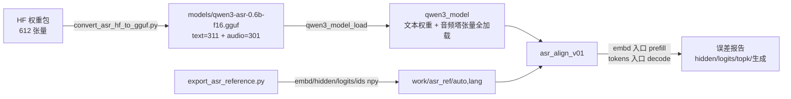

# asr/v0.1 —— 代码逐接口详解

> 本文按"**转换入口 → GGUF 契约 → 加载 → 构图 → 参考基线 → 对齐工具**"的顺序，逐个接口拆解 asr/v0.1 源码。
> 版本目标、验收标准与实施记录见 [design_asr_v0.x.md](design_asr_v0.x.md)；ASR 模型本身的架构背景见
> [Qwen3-ASR-0.6B_Model_Architecture_And_Configs.md](../qwen_model/Qwen3-ASR-0.6B_Model_Architecture_And_Configs.md)。
> 本文只讲"代码里每个接口做了什么、为什么这么写、有哪些坑"。

源码文件：

| 文件 | 职责 |
| --- | --- |
| [tools/convert_asr_hf_to_gguf.py](../../tools/convert_asr_hf_to_gguf.py) | HF 权重包 → 单文件 GGUF（独立脚本，不改动 LLM 转换） |
| [src/model.h](../../src/model.h) / [model.cpp](../../src/model.cpp) | `qwen3-asr` 架构识别 + 音频塔张量加载与形状校验 |
| [src/graph.h](../../src/graph.h) / [graph.cpp](../../src/graph.cpp) | Decoder 双入口（tokens / 外部 Embedding）+ 仅末位 LM Head + 逐层导出 |
| [tools/export_asr_reference.py](../../tools/export_asr_reference.py) | Python fp32 参考基线导出（音频塔复现 + Decoder 基线） |
| [examples/asr/api_test/asr_align_v01.cpp](../../examples/asr/api_test/asr_align_v01.cpp) | 数值对齐工具（读 GGUF + 参考数据，输出误差报告） |

---

## 0. 整体数据流



v0.1 的关键设计取舍：

1. **音频塔只加载不计算**：301 个音频张量全部进内存并校验形状（`asr.audio.*`），但不进计算图；计算留给 v0.2。
   音频特征由 Python 导出，C++ 通过外部 Embedding 入口消费——把"Decoder 数值正确性"和"音频计算"解耦。
2. **双入口共享层计算**：`tokens`（查表）与 `embd`（外部 F32 矩阵）只影响第 0 层输入的产生方式，28 层计算完全复用。
3. **仅末位 LM Head**：prefill 的 LM Head 从 `[n_vocab, S]` 缩为 `[n_vocab, 1]`。LLM 引擎只读末位 logits，行为不变；
   ASR 的 teacher forcing 每步也是单 token decode，天然只看末位。
4. **参考基线 fp32**：高于官方 bf16 推理精度，误差全部来自本工程的 F16 权重与 F16 KV cache，便于归因。

### 端到端执行步骤（从零跑通）

以下命令全部在工程根目录执行；`$MODEL_DIR` 为原始权重包（ModelScope snapshot）：

```bash
MODEL_DIR=~/.cache/modelscope/models/Qwen--Qwen3-ASR-0.6B/snapshots/master
```

**环境前提**：conda `llm` 环境（实测 Python 3.12.13、torch 2.12.1+cu130 —— 参考基线以 CPU 张量跑、transformers 4.57.6、numpy、safetensors）。
gguf 库使用工程内置的 `tools/gguf-py`（转换脚本自行 `sys.path.insert`），无需额外安装；C++ 侧仅依赖 CMake + ggml（third_party 内置）。

#### 步骤 1：转换 GGUF

```bash
conda run -n llm python tools/convert_asr_hf_to_gguf.py $MODEL_DIR \
    --outfile models/qwen3-asr-0.6b-f16.gguf \
    --mapping-out doc/asr/asr_v01_tensor_mapping.json
```

预期关键输出（张量数不符会直接报错退出，不产出残缺文件）：

```text
  612 tensors
mapping OK: 612 tensors (text=311, audio=301)
tokenizer: 151936 tokens, 151387 merges, 231 dummy, eos=151645, pad=151645
done: models/qwen3-asr-0.6b-f16.gguf (1795.3 MB)
tensor mapping report -> doc/asr/asr_v01_tensor_mapping.json
```

#### 步骤 2：导出参考基线（Python，CPU fp32）

```bash
conda run -n llm python tools/export_asr_reference.py $MODEL_DIR --out-dir work/asr_ref
```

预期输出（auto/lang 两案例各一行，含 A(T) 公式断言校验）：

```text
[auto] T=500 A=65 S=80 n_gen=4 gen_preview='language None<asr_text><|im_end|>'
[lang] T=500 A=65 S=83 n_gen=3 gen_preview='哦。'
reference data exported to work/asr_ref
```

产物：`work/asr_ref/{auto,lang}/` 下各 11 个 npy + test.wav + meta.json（清单见 §4.5）。

**可选：真人语音替代合成音频**（`--wav`，实测通过）：

```bash
conda run -n llm python tools/export_asr_reference.py $MODEL_DIR \
    --wav /path/to/speech.wav --out-dir work/asr_ref_wav
```

wav 要求：mono/立体声均可（立体声取平均）、8/16/32-bit PCM（24-bit 或 mp3 需先转 16-bit）、
采样率不限（非 16k 自动线性插值重采样到 16k，建议导出端直接选 16k）、时长 3~10 s 为宜。
不指定 `--out-dir` 时自动切到 `work/asr_ref_wav`，合成基线不被覆盖；
C++ 对齐只需把 `--ref-dir` 指过去（S/n_gen 全动态读取，工具零改动）。
实测：48kHz 立体声 8s wav → T=800 A=104 S=119/122 → 对齐 PASS。

#### 步骤 3：构建全工程

```bash
cmake -B build -DCMAKE_BUILD_TYPE=Release
cmake --build build -j$(nproc)
```

产物：`build/libfrostfall.so`、`build/examples/llm/api_test/infer_*`（4 个 LLM 示例）、
`build/examples/asr/api_test/asr_align_v01`（对齐工具）。

#### 步骤 4：运行数值对齐（验收主步骤）

```bash
./build/examples/asr/api_test/asr_align_v01 \
    --gguf models/qwen3-asr-0.6b-f16.gguf --ref-dir work/asr_ref/auto
./build/examples/asr/api_test/asr_align_v01 \
    --gguf models/qwen3-asr-0.6b-f16.gguf --ref-dir work/asr_ref/lang
```

可选参数 `--max-gen N`（默认 32，自由生成上限并决定 KV 预留）。**退出码 0 = PASS，非 0 = FAIL**。
预期输出（auto 案例，中间 28 行逐层误差略）：

```text
== asr/v0.1 alignment ==
  S(prefill)=80 n_gen_ref=4
-- prefill (embd entry, layer outputs on) --
  [layer_out_0] n=81920 max_abs=0.00121164 rmse=0.000133298 | ex-sink max_abs=0.00121164 rmse=0.000133532
  ...（28 层逐层误差，均带 ex-sink 统计）...
  [embd_input] n=81920 max_abs=0 rmse=0
  [prefill_logits] n=151936 max_abs=0.055469 rmse=0.0155598 top10_hit=10/10
-- teacher forcing (3 steps) --
  [decode_logits] steps=3 worst_max_abs=0.0322256 worst_top10_hit=10/10
-- free greedy generation --
  [free_gen] n=4 (ref 4) prefix_match=4/4
  [text] language None<asr_text><|im_end|>
== result: PASS (failures=0) ==
```

正式误差报告归档在 [asr_v01_align_report_auto.log](asr_v01_align_report_auto.log) / [asr_v01_align_report_lang.log](asr_v01_align_report_lang.log)，重跑后可 diff 对比。

#### 步骤 5：LLM 回归（确认共享代码未被破坏）

```bash
CONF=$PWD/build/examples/llm/api_test/llm_infer_conf.json
for ex in infer_nothink_stream infer_nothink_blocking \
          infer_yesthink_stream infer_yesthink_blocking; do
    ./build/examples/llm/api_test/$ex --config $CONF
done
```

预期：每个示例结尾打印 `Ran 3 tests (...)` 且退出码 0。

> **运行目录坑**：`--config` 的值与 conf 内的 `model_path` 都按**当前工作目录**解析。
> conf 被 configure_file 拷到 build 目录，但 `model_path: "models/..."` 是相对工程根写的，
> 所以必须在工程根运行并给 conf **绝对路径**（如上）；若在 build 目录里运行，conf 用相对路径即可但模型路径会解析错。

#### 步骤 6：转写文本怎么读（v0.1 特有）

对齐工具打印的生成文本是模型对合成音频的真实响应，不是转写质量基线：
auto 案例 `language None<asr_text>` 表示官方协议判断为无语音/未指定语言；lang 案例在 `language Chinese<asr_text>`
前缀约束下生成 `哦。`。v0.1 的验收信号是 **PASS 与 token 一致性**，文本内容本身无关紧要（§5.5）。

---

## 1. 转换入口（tools/convert_asr_hf_to_gguf.py）

### 1.1 四张映射表

| 表 | 条目数 | 说明 |
| --- | --- | --- |
| `TEXT_MAP` | 3 | 全局张量：`embed_tokens→token_embd`、`norm→output_norm`、`lm_head→output` |
| `TEXT_LAYER_SUB` | 11 | 每文本层的子模块 → `blk.{i}.<sub>`，与 convert_hf_to_gguf.py 的 Qwen3 映射一致 |
| `AUDIO_TOWER_MAP` | 13 | CNN/投影/ln_post → `asr.audio.*` 顶层命名空间 |
| `AUDIO_LAYER_SUB` | 16 | 每音频层的子模块 → `asr.audio.blk.{i}.<sub>` |

张量数校验闭环：3 + 28×11 = **311**（文本）、13 + 18×16 = **301**（音频），合计 **612**，与文档基线一致；
`main()` 里映射后计数不符直接报错退出，不产出残缺 GGUF。

### 1.2 conv 权重布局（为 v0.2 提前铺路）

PyTorch Conv2d 权重 `[out, in, KH, KW]` 是 contiguous 的，gguf-py 写入时把 shape 反转成 ggml `ne={KW, KH, in, out}`——
这**恰好**是 `ggml_conv_2d`/im2col 期望的 filter 布局。所以转换脚本对 conv 权重不做任何物理重排，直接原样写入；
`AUDIO_TOWER_MAP` 里每条 conv 映射都注明了这一点。v0.2 实现音频塔时无需再关心布局问题。

### 1.3 F32 保留规则（`is_f32_keep`）

```python
F32_KEEP_EXTRA = {"asr.audio.ln_post.weight"}

def is_f32_keep(gguf_name: str) -> bool:
    return (gguf_name.endswith(".bias") or gguf_name.endswith("norm.weight")
            or gguf_name in F32_KEEP_EXTRA)
```

- 全部 bias（音频层 attention/FFN bias、conv bias、proj bias）与全部 RMSNorm/LayerNorm 权重保留 F32；
- `ln_post.weight` 是不以 `norm.weight` 结尾的 LayerNorm 权重，走显式补充集合。
- **坑（实施中实际踩过）**：第一版用"裸子路径集合"（`{"attn_norm.weight", ...}`）做 `gguf_name in F32_KEEP` 判断，
  永远匹配不到带层前缀的完整名（`blk.0.attn_norm.weight`），norm 被静默转成 F16——GGUF 大小几乎不变、
  转换也不报错，直到 C++ 端跑起来才以 `binary_op: unsupported types` abort 的形式暴露。
  **教训**：dtype 规则要用对完整名成立的谓词（后缀匹配），不要用子路径清单。

为什么 norm 必须 F32：外部 Embedding 入口的主流动中间量是 F32（见 §3.3），ggml 二元 op 不做混合精度，
`mul(f32_rms_norm结果, f16_norm权重)` 直接崩溃。文本侧 LLM 路径中间量是 F16（get_rows 从 F16 embedding 出），
所以 LLM 的 GGUF 里 norm 是 F16 也能跑——**dtype 决策必须与计算图主流中间 dtype 联合验证**。

### 1.4 `convert_data`：F16 溢出防线

矩阵转 F16 前先检查 `amax > 65504`（F16 上限），超限直接抛错而不是静默截断成 inf。
本模型 BF16 权重 amax 远低于该值，检查是防御性的（防止将来换模型时静默产出坏 GGUF）。

### 1.5 `build_tokenizer`：词表三级来源与 dummy 补齐

1. `vocab.json`：151,643 个 NORMAL token 按 id 填入；
2. `tokenizer_config.json` 的 `added_tokens_decoder`：62 个，`special=true → CONTROL(3)`，
   非 special（如 `<asr_text>` id=151704）`→ USER_DEFINED(4)`；
3. 剩余空位（151,705 ~ 151,935 共 231 个）补空串 NORMAL——`embed_tokens` 有 151,936 行，词表必须等长对齐。

特殊 token 推导链：`eos/bos` 从 added tokens 里按内容反查；`pad` 依次尝试 `padding_token` →
vocab 里的 `<|endoftext|>` → eos 兜底（tokenizer_config 里没有 padding 字段，实际落到 151643）。

### 1.6 契约键写入（GGUF 元数据清单）

| 键组 | 内容 | 消费方 |
| --- | --- | --- |
| `{arch}.*`（= `qwen3-asr.*`） | 文本 Decoder 超参（embedding_length、attention.head_count 等） | `qwen3_model_load` 通用段 |
| `asr.audio_start/end/audio_token_id` | 151669 / 151670 / 151676 | v0.2 融合逻辑；加载时校验 |
| `asr.pad_token_id` | 151643 | v0.2+ |
| `asr.eos_token_ids` | `[151645, 151643]`（INT32 数组，来自 generation_config.json） | 生成停止判定 |
| `asr.chat_template` / `asr.support_languages` | 模板原文 / 语言列表 JSON | v0.2 prompt 构造 |
| `asr.audio.*` | 音频塔超参 17 项（d_model=896、encoder_layers=18、n_window=50、conv.kernel/stride/padding 等） | `qwen3_model_load` ASR 段 |
| `asr.mel.*` | Log-Mel 前处理契约（n_fft=400、hop=160、feature_size=128 等） | v0.3 C++ Log-Mel 对齐 |

注意文本超参键带的是**架构前缀**（`qwen3-asr.embedding_length`）：gguf-py 的 writer 按
`{arch}.xxx` 生成键名，所以 loader 侧超参读取必须用动态前缀（见 §2.3），不能写死 `qwen3.`。

### 1.7 产物与清单

写盘顺序：`write_header_to_file → write_kv_data_to_file → write_tensors_to_file → close`。
同时输出张量映射清单 JSON（`--mapping-out`）：`source`（来源目录/revision 信息）、`contract`（命名/dtype 契约）、
`summary`（text=311/audio=301、F16/F32 计数）、`mapping`（612 条：HF 名 → GGUF 名 → 层号 → dtype）。
正式副本在 [doc/asr/asr_v01_tensor_mapping.json](asr_v01_tensor_mapping.json)。

---

## 2. 模型加载（src/model.h / model.cpp）

### 2.1 新增数据结构

**`qwen3_asr_hparams`** —— 音频塔超参 + ASR 协议 token：

| 字段 | 值 | 说明 |
| --- | --- | --- |
| `n_audio_layer` / `d_model` / `n_head` / `n_ff` | 18 / 896 / 14 / 3584 | 音频 Transformer 主体 |
| `output_dim` | 1024 | 投影输出宽 = 文本 `n_embd`（加载时校验相等） |
| `num_mel_bins` / `n_window` / `n_window_infer` | 128 / 50 / 800 | 分块与注意力窗口（v0.2 用） |
| `conv_chunksize` / `max_source_positions` | 500 / 1500 | 卷积分块与正弦位置表长（v0.2 用） |
| `conv_channels` | 480 | **不在 config 里**，加载时从 `conv1.weight` 的 ne[3] 推导 |
| `conv_kernel/stride/padding` | 3 / 2 / 1 | 频率轴 128→64→32→16 的推导参数 |
| `audio_start/end/pad_token_id`、`eos_token_ids` | 151669 / 151670 / 151676 / [151645,151643] | 协议 token |

**`qwen3_asr_audio_layer`** —— 单个音频层的 16 个张量指针（attention 四投影 q/k/v/out 带 bias、
`self_attn_layer_norm`/`final_layer_norm` 两套 LayerNorm 带 bias、普通两层 FFN fc1/fc2）。

**`qwen3_model`** 扩展：`is_asr` 标志 + `asr_hparams` + 13 个 `a_*` 全局张量指针 + `asr_audio_layers`。

### 2.2 加载流程中的 ASR 分支（`qwen3_model_load`）

```
gguf_init_from_file(no_alloc=true)
  → arch 校验："qwen3" 或 "qwen3-asr"，否则报错退出
  → model.is_asr = (arch == "qwen3-asr")
  → 动态键前缀 P = arch + "."          // "qwen3.xxx" / "qwen3-asr.xxx" 通用读取
  → 文本超参 + 28 层权重（与 LLM 完全同路径）
  → if (model.is_asr):
      → 读 asr.* 元数据（audio token id、eos_token_ids INT32 数组）
      → 校验 output_dim == n_embd
      → conv1.weight 形状自检 + conv_channels 推导
      → get_a() 逐个取 13 个全局张量 + 18×16 个层张量，全部带形状校验
      → 任一缺失/形状不符 → 整体加载失败（不静默丢弃音频权重）
```

三个实现要点：

1. **`get_a` lambda 的形状校验**：期望形状以 `std::initializer_list<int64_t>` 传入，
   先比 `ggml_n_dims` 再逐维比 `ne[]`；失败时打印 want/got 完整形状串（如 `want 896x3584 got 3584x896`），
   而不是只报维度数——没有这个信息，§6 的 ne 方向坑几乎无法定位。
2. **mul_mat 权重的 ne 约定**：`ne[0]=in_features, ne[1]=out_features`（PyTorch `[out,in]` 经 gguf-py 写入后自动反转）。
   `fc1` 期望 `{896, 3584}`、`fc2` 期望 `{3584, 896}`、`proj2` 期望 `{896, 1024}`。
   注意对称矩阵（attn_q 等 896×896）写反也校验通过——**校验逻辑对不对称张量无区分度**，依赖转换侧正确性。
3. **conv 通道数自推导**：480 不在 config.json 中（Whisper 系传统硬编码），从 `conv1.weight` 的 `ne[3]` 读出，
   再用 `conv_out_len`（k=3/s=2/p=1 的输出长度公式）连算三次验证 `conv_out.weight` 的 ne[0] = 480×16 = 7680。
   超参与张量互为证据，转换或配置错误在加载期即暴露。

---

## 3. 计算图（src/graph.h / graph.cpp）

### 3.1 图输入/输出契约（相对 LLM v0.2 的变化）

| 宏 | 名字 | 类型/形状 | 状态 |
| --- | --- | --- | --- |
| `QWEN3_TENSOR_NAME_TOKENS` | `tokens` | I32 `[n_tokens]` | 保留（embd 入口时不创建） |
| `QWEN3_TENSOR_NAME_EMBD` | `embd` | F32 `[n_embd, n_tokens]` | **新增**，外部融合 Embedding |
| `QWEN3_TENSOR_NAME_POS` | `positions` | I32 `[n_tokens]` | 保留 |
| `QWEN3_TENSOR_NAME_MASK` | `kq_mask` | F32 `[n_kv, n_tokens]` | 保留 |
| `QWEN3_TENSOR_NAME_LOGITS` | `logits` | F32 `[n_vocab, **1**]` | 形状变化（原 `[n_vocab, n_tokens]`） |
| `QWEN3_TENSOR_NAME_LAYER_OUT_PREFIX` | `layer_out_{i}` | F32 `[n_embd, n_tokens]` | **新增**，`want_layer_outputs=true` 时存在 |

`embd` 与 `tokens` 互斥。注意 `embd` 的传入方式：**调用方**在 no-alloc ctx 里创建 F32 张量、`set_input`、
经 `qwen3_graph_params.embd` 传入，图内直接以它为第 0 层输入——不是"传裸指针数据、图内自建"，
也不需要事后按名字查找（调用方自己持有指针，alloc 后直接 `ggml_backend_tensor_set`）。

### 3.2 `qwen3_graph_params`

```cpp
struct qwen3_graph_params {
    int32_t n_tokens = 0;
    int32_t n_past   = 0;
    int     max_nodes = 0;
    struct ggml_tensor * embd = nullptr;  // 非空走外部 Embedding 入口
    bool logits_last_only   = true;       // 仅对最后位置执行 LM Head（默认开）
    bool want_layer_outputs = false;      // 导出每层残差输出（对齐工具用）
};
```

签名从 `qwen3_build_graph(ctx, model, kv, n_tokens, n_past, max_nodes)` 改为 params 结构体——
新增开关（embd/logits_last_only/want_layer_outputs）不再膨胀位置参数。

### 3.3 双入口的第 0 层输入

```cpp
struct ggml_tensor * tokens = nullptr;
if (!params.embd) { /* 创建 tokens 输入 */ }
struct ggml_tensor * embd_in = params.embd;          // 调用方创建的输入张量
...
struct ggml_tensor * x = params.embd ? embd_in
                                     : ggml_get_rows(ctx, model.tok_embd, tokens);
```

**dtype 传播差异**：LLM 路径 `x` 是 F16（`get_rows` 从 F16 embedding 查表），ASR embd 路径 `x` 是 F32
（外部输入本身就是 F32）。28 层计算对两种 dtype 都成立的前提是 §1.3 的 norm F32 规则——
`mul(任何中间量, f32_norm)` 都合法，反之 F16 中间量 × F16 norm 也合法，唯独 f32×f16 崩溃。

### 3.4 仅末位 LM Head（`logits_last_only`）

```cpp
if (params.logits_last_only) {
    struct ggml_tensor * x_last = ggml_view_1d(ctx, x, hp.n_embd,
            (int64_t)(n_tokens - 1) * hp.n_embd * ggml_element_size(x));
    logits = ggml_mul_mat(ctx, model.output, x_last);   // [n_vocab, 1]
}
```

- prefill S=80 时，LM Head 计算量从 151936×1024×80 缩减 80 倍，输出张量从 ~48MB 缩到 ~0.6MB；
- `x_last` 是 view（零拷贝），offset 指向内存里最后一个 token 的 1024 个 F32（`x` 内存 token 主序）；
- **对 LLM 行为无影响**：inference_engine 只读最后位置的 logits，原本就要丢弃其余 S-1 列；
  相应地 engine 读 logits 的偏移从 `(n_tokens-1)*n_vocab` 改为 **0**（logits 恒为 [n_vocab,1]）。
- ASR 侧唯一的例外消费者是"逐层 hidden 对齐"（want_layer_outputs 与 last_only 正交，互不干扰）。

### 3.5 逐层输出导出

```cpp
if (params.want_layer_outputs) {
    struct ggml_tensor * layer_out = ggml_cont(ctx, x);   // 拷贝一份，防后续层原地复用
    ggml_set_name(layer_out, (std::string(QWEN3_TENSOR_NAME_LAYER_OUT_PREFIX) + std::to_string(il)).c_str());
    ggml_set_output(layer_out);
    ggml_build_forward_expand(gf, layer_out);
}
```

三件事缺一不可：`ggml_cont` 固化（`x` 在下一层会被继续计算，若直接引用会读到最终值）、
`set_output` 标记、`build_forward_expand` 把它挂进图（否则 dead node 被 gallocr 忽略）。
语义与 transformers 的 `output_hidden_states` 对齐：`layer_out_{i}` = 第 i 层残差输出（final norm 之前），
即参考里的 `hidden_states[i+1]`。

KV cache 的读写路径（`cpy` 写 `[n_past, n_past+n_tokens)`、view 读 `[0, n_kv)`）与 LLM v0.2 完全一致，未改动。

---

## 4. 参考基线导出（tools/export_asr_reference.py）

### 4.1 测试音频：合成（`synth_audio`）与真人语音（`--wav`）

5 秒 16kHz：110~220Hz 慢扫描基频 + 2/3 次谐波 + 4Hz 音节包络 + 轻噪声（seed 固定）。
v0.1 验收目标是数值对齐，不追求可识别语音；合成信号保证 Mel 有效帧满 500（= 5 个完整 CNN 块，A=65），
落在单注意力窗口（v0.1 基线假设 A ≤ 104）内。

**真人语音入口**（`load_wav`）：`--wav path` 用真实语音替代合成音频——
单声道化（立体声取平均）、位宽归一（8/16/32-bit PCM → float32 [-1,1]）、非 16k 线性插值重采样。
其余全链路（mel → A 断言 → prompt → 生成 → 导出）对时长/内容完全动态；
`--max-new-tokens` 可放宽生成上限（真人语音转写比合成音频长，默认 32 可能截断）。
注意两点：① 环境无 librosa/soundfile，重采样是简单线性插值，TTS 端直接选 16k 输出质量最佳；
② 真人语音下 auto 案例会输出 `language Chinese<asr_text>` + 真实转写，与合成音频的 `language None` 不同。

### 4.2 音频塔 fp32 复现（`audio_tower_forward`）

逐行对齐官方 `modeling_qwen3_asr.py@7c6daf77`，全部 fp32：

1. **100 帧分块**：`chunk_num = ceil(T/100)`，尾块长度 `T % 100`（为 0 时补 100），`pad_sequence` 对齐；
2. **三层 Conv2d + GELU**（stride 2 / padding 1），`permute(0,3,1,2).view(b,t,c*f)` 按 **channel 再 frequency** 展平；
3. **局部正弦位置编码**：`sinusoids(1500, 896)` 截前 `x.shape[1]`，加在 padded 长度上（每个块从 0 重启）；
4. **`padded_mask_after_cnn` 挑出有效位置** → `[A, 896]`，并断言 `A == 13×⌊T/100⌋ + ⌈(T%100)/8⌉`；
5. **18 层**：LayerNorm → MHA（非因果无 mask，`scale=1/√64`）→ 残差 → LayerNorm → fc1 → GELU → fc2 → 残差；
6. **输出**：ln_post → proj1 → GELU → proj2 → `[A, 1024]`。

### 4.3 Prompt 与融合

`build_prompt`：官方 chat_template 结构（system 空 context + user 音频段 + assistant 尾），
`lang` 模式在 assistant 侧追加 `language Chinese<asr_text>` 前缀。融合是**替换**非相加：

```python
inputs_embeds = tok_embd[ids].float()          # [S, 1024] 行=token
inputs_embeds[audio_positions] = audio_features  # A 个 audio_pad 位置替换为音频特征
```

### 4.4 Decoder 基线的 tie_word_embeddings 决策

用 transformers `Qwen3ForCausalLM` 加载 ASR 文本子模型（与 Qwen3 同构；MRoPE 三轴相同退化为一维 RoPE，
官方 eager attention）。权重重映射 `thinker.model.* → model.*`、`thinker.lm_head.weight → lm_head.weight`。

关键点是 `tie_word_embeddings=False`：官方 config 里 tie=true，但 safetensors 里 embed 与 lm_head 是
**两份不同数据**（官方推理时 lm_head 覆盖 tie 张量）。若按 tie=true 加载，lm_head 数据会覆盖 embed_tokens，
与官方行为不一致。显式关掉 tie 让两份矩阵独立生效，与 GGUF（双份保留）和 C++ 侧（`output` 独立读取）一致。

### 4.5 导出产物（每案例 11 个 npy + wav/meta）

| 文件 | 形状 | 消费方（asr_align_v01） |
| --- | --- | --- |
| `pcm.npy` / `test.wav` | [80000] | 复现参考/人工检查 |
| `mel.npy` | [128, T] | v0.2 对齐 Mel |
| `ids.npy` | [S] | prefill 长度 S |
| `audio_positions.npy` | [A] | 校验 audio_pad 位置 |
| `embd.npy` | [S, 1024]（行=token） | **embd 入口数据**（与 ggml [n_embd, S] 内存布局一致） |
| `layer_hidden.npy` | [29, S, 1024] | 逐层 hidden 对比（[0]=embed 输出，[i]=第 i 层输出） |
| `prefill_logits.npy` / `prefill_topk_*.npy` | [vocab] / [10] | prefill 末位对比 |
| `decode_ids.npy` | [n_gen] | teacher forcing 输入 + 自由生成对比 |
| `decode_logits.npy` | [n_gen, vocab] | 每步 logits 对比 |
| `meta.json` | — | 案例参数（T/A/S/n_gen/Mel 参数） |

两个案例：`auto`（T=500, A=65, S=80, n_gen=4）与 `lang`（S=83, n_gen=3）。
用 `--wav` 真人语音时 T/A/S/n_gen 随音频变化（如 8s → T=800, A=104, S=119），meta.json 记录实际值。

---

## 5. 数值对齐工具（examples/asr/api_test/asr_align_v01.cpp）

### 5.1 `NpyArray`：最小 npy 读取器

只支持 v1.0 格式、fortran_order=false、`<f4`/`<i4`。**坑（实施中踩过）**：shape 是括号元组
（`'shape': (29, 80, 1024)`），不能像 descr 那样在第一个逗号处截断——截断后 `(80, 1024)` 只读到 `80`，
count 少算 1024 倍，后续按完整尺寸 `tensor_set` 时**越界读堆内存**，垃圾数据（NaN/FLT_MAX）灌满整个链路，
表象是"所有输出 NaN"而真因在读取器。修复：专门按括号界截取 shape 串。

### 5.2 误差统计（`ErrStats` / `topk_overlap`）

- `ErrStats`：max_abs / rmse / n / **has_nan**。NaN 单独标记的原因：`std::max(0.0, NaN)` 返回 0.0，
  NaN 会把 max_abs 伪装成 0，而 rmse=sqrt(NaN)=NaN——早期输出里 "max_abs=0 rmse=-nan" 这种矛盾组合
  正是全 NaN 数据的特征，显式标记后诊断不再歧义。
- `topk_overlap`：两个 logits 向量 top-10 集合的交集大小。**坑**：第一版比较器是"返回 lambda 的 lambda"
  （内层按引用捕获外层的形参，外层临时对象销毁后悬垂），叠加 NaN 破坏严格弱序导致 `partial_sort`
  内部堆操作越界段错误。修复：比较器直接捕获调用方指针（生命周期覆盖函数体）。

### 5.3 `Harness`：模型/KV/tokenizer + 单步 eval

```cpp
struct ggml_cgraph * eval(ggml_context * ctx, const int32_t * tokens,
                          const float * embd_in, int32_t n_tokens, int32_t n_past,
                          bool want_layers, std::vector<float> & logits_out);
```

- embd 入口：在 ctx 创建 `[n_embd, n_tokens]` F32 张量 → `set_input` → `gp.embd = ...` →
  alloc 后用自持指针灌数据；token 入口：按名取 `tokens` 灌 id。
- positions = `n_past + i`（增量 decode 的绝对位置）；mask = `[n_kv, n_tokens]` 下三角 -inf。
- 每步 `ggml_init/ggml_free` 新建临时 ctx（图形状随 n_tokens 变化），`allocr` 复用。
- `kv.n_past = n_kv` 由 eval 收尾维护。

### 5.4 三段验证

1. **prefill（embd 入口，逐层导出开）**：S 个 token 一次前向。
   对比 28 层 `layer_out_i` vs `hidden_states[i+1]`（`[0]` 是 embedding 输出，另做 embd 输入直通校验）；
   末位 logits vs `decode_logits[0]` + top-10 命中。
2. **teacher forcing**：第 i 步（i≥1）输入**参考序列**的 `dids[i-1]`、`n_past = S + i - 1`，
   对比 `decode_logits[i]`。参考与被测吃完全相同的 token 序列，把"数值误差"和"生成路径分叉"解耦。
3. **自由贪心生成**：`kv.n_past = 0` 重置后从 embd prefill 开始 argmax 循环（EOS 集合取自
   `asr_hparams.eos_token_ids`），对比 token 序列前缀完全一致，并打印 decode 后文本。
   `n_ctx = S + max_gen + 16` 用生成上限而非参考长度预留余量——**argmax 若分叉，
   生成会超过参考长度，n_ctx 不足时 view_1d 写 KV 越界 abort**（实施中实际发生过）。

### 5.5 容差与 attention sink（实测建立）

| 判定 | 阈值 | 实测（auto / lang） |
| --- | --- | --- |
| 逐层 hidden（**排除 token 0** 的 rmse，末层豁免） | ≤ 0.05 | ≤ 0.017 / ≤ 0.017 |
| prefill/decode logits max_abs | ≤ 0.5 | 0.055 / 0.032 |
| top-10 命中 | ≥ 9/10 | 10/10 |
| 自由生成 | 与参考完全一致 | 4/4、3/3 |

为什么这样设计（现象与依据详见 [design_asr_v0.x.md §2.6](design_asr_v0.x.md)）：
`<|im_start|>`（token 0）是 attention sink，hidden 达 10³ 量级，F16 KV 量化误差在该位置逐层放大
（全量 max_abs 最大约 400），但相对误差仅 ~0.15%，末位 logits 与生成不受影响。
全量 max_abs 判定必然误判 FAIL，所以：

- hidden 用**排除 token 0 后的 rmse**；
- 末层 hidden 不单独判定——`logits_last_only` 下它的唯一消费者是末位 logits，由 logits 判定覆盖；
- 功能正确性锚定在 logits/top-k/生成一致性上。

---

## 6. 实施中踩过的坑（速查表）

| # | 现象 | 根因 | 修复 |
| --- | --- | --- | --- |
| 1 | C++ 侧 `binary_op: unsupported types dst f32, src0 f32, src1 f16` abort | F32 保留清单用裸子路径匹配不到完整张量名，norm 全被转 F16；F32 embd 入口下 mul 混精度崩溃 | dtype 改后缀规则（`*.bias`/`*norm.weight`）+ 显式补充 |
| 2 | 加载期 `has unexpected shape` 但只有维度数 | `fc1/fc2/proj2` 期望形状按 `{out,in}` 写，实际 ne={in,out}；对称张量错而不报 | 按 ggml 约定修正 + 失败时打印 want/got 完整形状 |
| 3 | 对齐工具全链路 NaN、embd_input 对比出现 FLT_MAX | npy shape 元组在逗号处截断，count 少算 → tensor_set 越界读堆 | shape 按括号界解析 |
| 4 | `partial_sort` 段错误 | 嵌套 lambda 悬垂引用 + NaN 破坏严格弱序 | 比较器直接捕获调用方指针；NaN 显式标记 |
| 5 | 自由生成段 `ggml_view_1d` assert | argmax 分叉后生成超过参考长度，n_ctx 不足 → KV 写越界 | n_ctx 按 max_gen 预留 |
| 6 | sink 位置 hidden 偏差 0.5→400，全量 max_abs 判定必 FAIL | F16 KV 量化误差在 10³ 量级 sink 上逐层放大 | ex-sink rmse 判定 + 末层豁免 + 功能输出锚定 |

---

## 7. 与 LLM 代码的共享面（改动影响一览）

| 文件 | 改动 | 对 LLM 路径的影响 |
| --- | --- | --- |
| model.h / model.cpp | 新增 `is_asr` 分支、ASR 结构体、`arch` 校验放宽为二选一、超参键前缀动态化 | 无（qwen3 键名经 P 拼接结果不变） |
| graph.h / graph.cpp | 新增 params 结构体、embd 入口、last_only、逐层导出 | last_only 改变 logits 形状，engine 读偏移同步改为 0，行为等价（回归通过） |
| inference_engine.cpp | 适配新签名；logits 读取 offset 0 | 等价改写 |
| kv_cache / tokenizer / sampler / common / qwen3_chat | **零改动** | 无 |
| convert_hf_to_gguf.py | **零改动**（ASR 转换是独立脚本） | 无 |

回归证据：LLM 四类示例（nothink/yesthink × stream/blocking，各 3 测试）全部通过；
ASR 两案例对齐 PASS（报告见 [asr_v01_align_report_auto.log](asr_v01_align_report_auto.log) /
[asr_v01_align_report_lang.log](asr_v01_align_report_lang.log)）。

---

## 8. 后续演进（v0.2 的接入点）

| v0.2 需求 | v0.1 已备 | 待实现 |
| --- | --- | --- |
| 音频塔计算 | 301 张量已加载且布局按 im2col 兼容；conv 通道数/频率轴尺寸已推导 | ggml 图：分块 conv2d + GELU、channel/freq 展平、正弦位置、18 层双向注意力（非因果、无 mask） |
| Prompt/融合 | tokenizer 已含 `<asr_text>` 等 added tokens；`asr.*` 协议 token 就绪 | ChatML 拼装 + audio_pad 扩展 + embd 替换（复用 embd 入口） |
| 生成协议 | EOS 集合已进 `asr_hparams.eos_token_ids` | 语言前缀约束、`<asr_text>` 响应解析 |
| Mel 对齐 | `asr.mel.*` 契约键 + 参考 mel.npy | （v0.3）C++ Log-Mel |
