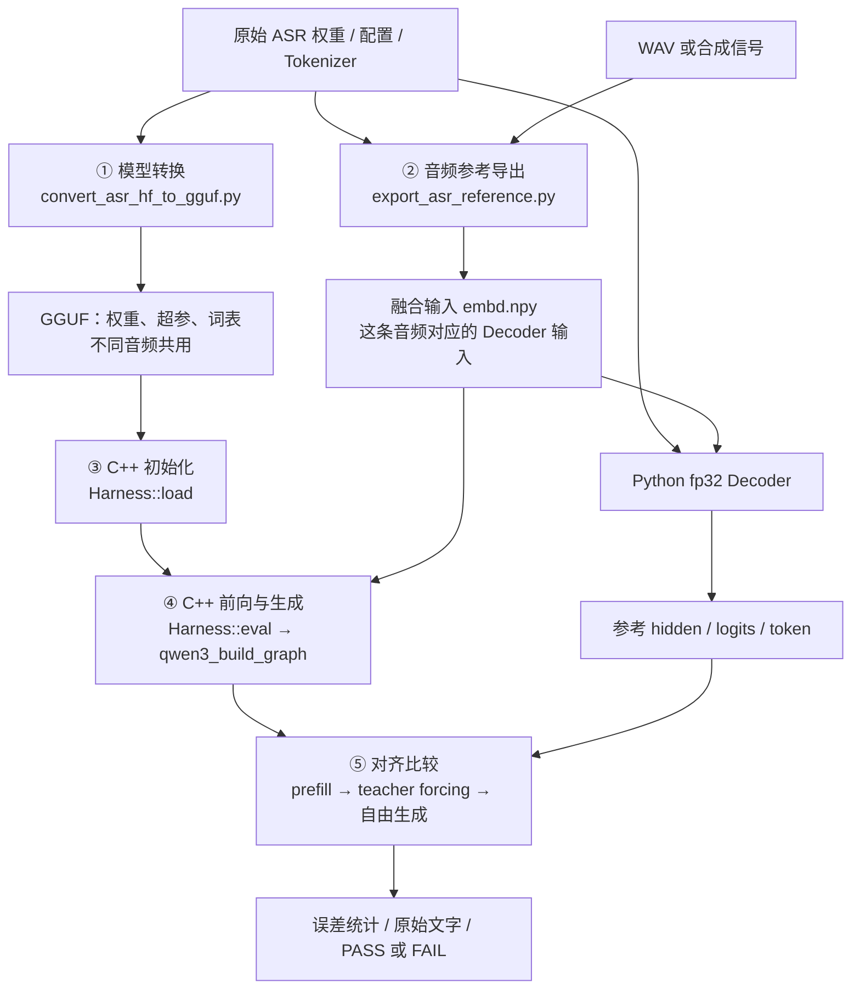
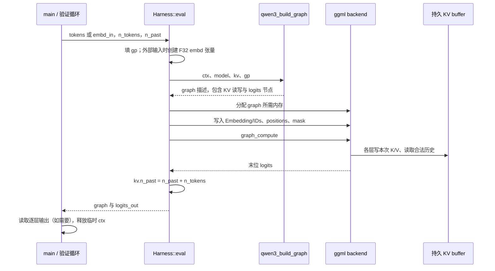

# asr/v0.1 代码分析：沿一条音频追踪数据与调用

本文解释当前代码如何从“模型 + 音频”走到 C++ 生成与数值对比，不再按每个结构体、宏和辅助函数逐项罗列。

- 想先跑起来：看 [README 的 ASR 使用步骤](../../README.md)。
- 想理解模型结构：看 [模型架构与推理流程](../qwen_model/Qwen3-ASR-0.6B_Model_Architecture_And_Inference.md)。
- 想了解交付范围与验收历史：看 [版本规划](design_asr.md)。

## 0. 整体数据流与源码阅读顺序

v0.1 验证的是：**给定相同的融合 Embedding，C++ Decoder 能否复现 Python 参考的计算和生成结果。**音频前处理、音频 Encoder 和特征融合在 Python 中执行；C++ 从 Decoder 输入开始独立计算。


```mermaid
flowchart TB
    Model["原始 ASR 权重 / 配置 / Tokenizer"] --> Convert["① 模型转换<br/>convert_asr_hf_to_gguf.py"]
    Convert --> GGUF["GGUF：权重、超参、词表<br/>不同音频共用"]
    Model --> Export["② 音频参考导出<br/>export_asr_reference.py"]
    WAV["WAV 或合成信号"] --> Export
    Export --> Embd["融合输入 embd.npy<br/>这条音频对应的 Decoder 输入"]
    Model --> PyDec["Python fp32 Decoder"]
    Embd --> PyDec
    PyDec --> Ref["参考 hidden / logits / token"]
    GGUF --> Load["③ C++ 初始化<br/>Harness::load"]
    Load --> Eval["④ C++ 前向与生成<br/>Harness::eval → qwen3_build_graph"]
    Embd --> Eval
    Eval --> Check["⑤ 对齐比较<br/>prefill → teacher forcing → 自由生成"]
    Ref --> Check
    Check --> Result["误差统计 / 原始文字 / PASS 或 FAIL"]
```

图中不是一个跨语言进程：两个 Python 脚本和 C++ 程序分别运行，通过 GGUF 和 `.npy` 文件交接。**换模型要重新准备 GGUF 和参考；仅换音频只需重新导出参考。**

| 阅读顺序 | 源码入口 | 输入 → 输出 | 本文位置 |
| --- | --- | --- | --- |
| ① 准备权重 | [转换脚本 main](../../tools/convert_asr_hf_to_gguf.py#L241-L419) | 原始权重 → GGUF、映射清单 | §1 |
| ② 准备输入和对照结果 | [export_case](../../tools/export_asr_reference.py#L223-L357) | PCM + 原始权重 → 融合 Embedding、参考数组 | §2 |
| ③ 进入 C++ | [对齐工具 main](../../examples/asr/api_test/asr_align_v01.cpp#L281-L323) | GGUF + 5 个 npy → 模型、参考数组和 KV | §3.1 |
| ④ 一次前向 | [Harness::eval](../../examples/asr/api_test/asr_align_v01.cpp#L214-L267)、[构图入口](../../src/graph.cpp#L9-L52) | Embedding 或 token IDs → 更新 KV、输出 logits | §3.2 |
| ⑤ 验证和生成 | [三段验证](../../examples/asr/api_test/asr_align_v01.cpp#L327-L471) | C++ 结果 + Python 参考 → 比较结论 | §3.3～§4 |

贯穿下文的记号：T 是有效 Mel 帧数，A 是音频向量数，S 是混合输入的位置数，G 是参考输出 token 数，V 是词表大小 151936。形状默认为 NumPy/PyTorch 顺序；ggml 的 `ne` 顺序另行注明。

## 1. 准备模型：哪些数据写入 GGUF，C++ 如何拿到权重

### 1.1 转换脚本只处理模型，不处理音频

[convert_asr_hf_to_gguf.py](../../tools/convert_asr_hf_to_gguf.py) 的主线是：

```text
读取 config.json 与 model.safetensors
 → map_tensor_name：原始名字映射为 GGUF 名字
 → convert_data：矩阵 F16，norm/bias F32
 → 检查未知名字、重复映射、缺失张量和总数 612
 → build_tokenizer：整理词表、merges 和 Added Tokens
 → 写入 GGUF 元数据与张量
 → 输出张量映射清单
```

| 原始模块 | GGUF 中的去向 | 当前用途 |
| --- | --- | --- |
| `thinker.model.embed_tokens.weight` | `token_embd.weight` | C++ 单 token decode 的 Embedding 查表 |
| `thinker.model.layers.*` | `blk.*`，28 层 | Decoder 主体计算 |
| `thinker.model.norm.weight` | `output_norm.weight` | 最终 RMSNorm |
| `thinker.lm_head.weight` | `output.weight` | hidden → 词表 logits |
| `thinker.audio_tower.*` | `asr.audio.*`，301 个张量 | C++ 加载与形状校验，v0.1 不执行音频计算 |

文本侧为 `3 + 28×11 = 311` 个张量，音频侧为 `13 + 18×16 = 301` 个，总计 612。完整名字、dtype 和形状见 [映射清单](asr_v01_tensor_mapping.json)，无需在本文复制所有条目。

转换的几个约束决定后续能否正确计算：
- **Embedding 与 LM Head 独立保存。**不能仅凭 `tie_word_embeddings` 配置删掉其中一份；Python 参考也以 `tie_word_embeddings=False` 分别加载。
- **精度规则按完整名字匹配。**`is_f32_keep` 保留所有 `.bias`、以 `norm.weight` 结尾的权重，以及 `asr.audio.ln_post.weight`；其他权重转 F16 前检查数值范围。
- **布局命名与内存重排不是一回事。**矩阵 PyTorch `[out,in]` 对应 ggml `ne=[in,out]`；卷积 `[out,in,KH,KW]` 对应 `ne=[KW,KH,in,out]`。当前转换保留连续数据顺序，后续卷积与展平仍需数值验证。
- **词表与模型行数对齐。**ASR 的基础词表和 Added Tokens 写入 151936 个槽位，其余补 dummy；`special=true` 标为 CONTROL，非 special Added Token 标为 USER_DEFINED。

GGUF 的 `general.architecture` 为 `qwen3-asr`，文本超参键使用 `qwen3-asr.*`；音频、前处理与协议分别在 `asr.audio.*`、`asr.mel.*`、`asr.*` 下。写入这些字段不代表本版已经计算所有对应模块。

### 1.2 C++ 加载分为“建张量描述”和“搬运权重”

[model.cpp](../../src/model.cpp#L92-L382) 中 `qwen3_model_load` 执行：

1. `gguf_init_from_file(no_alloc=true)`：读取元数据，创建张量描述，尚未分配权重数据内存。
2. 按架构前缀读取文本超参；按名字取得 `tok_embd`、`output_norm`、`output` 和各层指针。
3. 进入 ASR 分支，读取音频参数和 EOS 集合；校验音频输出宽度等于文本宽度 1024，使用 `get_a` 校验音频张量形状。
4. 从 `conv1.weight.ne[3]` 推导卷积通道数，并检查 `conv_out` 输入维度是否为通道数乘下采样后的频率宽度。
5. 初始化 CPU backend，`ggml_backend_alloc_ctx_tensors` 分配权重内存，再由 `qwen3_load_tensor_data` 按 GGUF 偏移分块拷贝数据。

输出是持有张量指针与 backend buffer 的 `qwen3_model`。**加载了音频权重不等于运行了音频网络**：是否计算由后续 graph 决定，当前 graph 只使用文本 Decoder 权重。

## 2. Python 参考：音频如何变成 C++ 的输入与“答案”

### 2.1 从 PCM 到融合 Embedding

[导出脚本 main](../../tools/export_asr_reference.py#L360-L401) 先加载原始模型、Tokenizer 和 WhisperFeatureExtractor，再读 WAV 或生成合成信号，分别调用 `export_case("auto", ...)` 和 `export_case("lang", ...)`。

以**内置 5 秒合成信号、auto 案例**为贯穿示例，历史基线为 `T=500、A=65、S=80`。下面的尺寸用于解释数据流，不是实际语音质量样例。

| 阶段 / 调用 | 产出 | 交给下一步的内容 |
| --- | --- | --- |
| `load_wav` / `synth_audio` | `pcm [80000]` | 单声道 16 kHz float32 波形 |
| `mel_extractor(...)` | `mel_valid [128,500]` | 从 attention mask 求 T，裁掉无效帧 |
| `audio_tower_forward` | `audio_features [65,1024]` | 音频连续向量，不是文字 IDs |
| `build_prompt` + `tok(...)` | `ids [80]`、65 个音频位置 | 模板中的音频占位与普通文本位置 |
| 文本查表 + 音频替换 | `inputs_embeds [80,1024]` | 最终保存为 `embd.npy`，供双方 Decoder 使用 |

`audio_tower_forward` 内部仍是一条连续链：

```text
Mel 按 100 帧分块
 → 三层 Conv2d + GELU
 → channel/frequency 展平、conv_out 投影到 896
 → 各块局部正弦位置编码、去 padding、按时间拼接
 → 18 层非因果音频 Transformer
 → ln_post、proj1、GELU、proj2
 → [A,1024]
```

音频位置数按 `A = 13×floor(T/100) + ceil((T mod 100)/8)` 计算。当前参考音频注意力调用使用 `attn_mask=None`、`is_causal=False`，因此先使用单窗口短音频；跨窗口行为不能当作已验证。脚本的窗口断言检查的是每块卷积输出宽度，不是整段 A，不能依赖它拒绝所有超长输入。

[融合代码](../../tools/export_asr_reference.py#L250-L261) 是两次不同的操作：

```python
inputs_embeds = tok_embd[torch.tensor(ids, dtype=torch.long)].float()
inputs_embeds[audio_positions] = audio_features
```

第一行给全部 80 个位置查文本向量；第二行只把 65 个 `audio_pad` 位置换成音频向量。剩余模板标记不变，序列长度也不变。这里是**替换，不是相加，也不是把音频转写成文字再查表**。

`lang` 案例在 assistant 输入后添加 `language Chinese<asr_text>`，因此同一音频的 S 与 auto 不同。当前脚本的 context 默认为空，没有任意语言/context 的 CLI 参数。

### 2.2 为什么 Python 还要运行 Decoder

融合输入是“题目”，还需要参考实现给出“每一步应算成什么”。[参考 Decoder](../../tools/export_asr_reference.py#L263-L318) 用 ASR 文本权重初始化 `Qwen3ForCausalLM`，以 fp32、eager attention 执行：

```text
inputs_embeds → prefill → hidden_states + 末位 logits + past_key_values
                              ↓
                 argmax 选 token → token ID 单步前向
                              ↓
                 更新 past_key_values，保存每步 logits 与 token
```

这里没有重新训练。参考只负责建立可重复比较的输出，C++ 不会把参考 hidden/logits 当作下一层的输入。

最重要的下标关系是：

```text
decode_logits[0] = prefill 末位 logits，预测 decode_ids[0]
decode_logits[1] = 输入 decode_ids[0] 后的 logits，预测 decode_ids[1]
decode_logits[i] = 输入前 i 个参考生成 token 后，预测第 i 个 token 的 logits
```

每行 logits 有 V=151936 个原始分数，不是概率。`layer_hidden` 有 29 份状态：第 0 份为输入，1～27 为前 27 层的输出，第 28 份已经经过最终 RMSNorm。

### 2.3 文件交接：哪些参与推理，哪些只用于比较

每个案例导出 11 个 npy 加 WAV、JSON；**C++ 只读其中 5 个 npy**。

| 文件 | 形状 / 内容 | 当前 C++ 用法 |
| --- | --- | --- |
| `ids.npy` | `[S]`，输入 Prompt IDs | 只取长度 S，不用其内容进行 prefill 查表 |
| `embd.npy` | `[S,1024]`，融合输入 | **实际 prefill 输入** |
| `layer_hidden.npy` | `[29,S,1024]` | 比较逐层 hidden |
| `decode_ids.npy` | `[G]`，参考输出 IDs | teacher forcing 输入、自由生成比较目标 |
| `decode_logits.npy` | `[G,V]` | 第 0 行比较 prefill，后续行比较 decode |
| `pcm.npy` / `test.wav` | 波形数组 / PCM16 WAV | 不读取；复现与播放检查 |
| `mel.npy` | `[128,T]` | 不读取；后续音频链路参考 |
| `audio_positions.npy` | `[A]` | 不读取；记录 Python 替换位置 |
| `prefill_logits.npy` | `[V]` | 不读取；当前保存内容有偏差，见 §4.2 |
| `prefill_topk_ids.npy` / `prefill_topk_vals.npy` | 各 `[10]` | 不读取；C++ 自行从完整 logits 计算 top-k |
| `meta.json` | Prompt、T/A/S/G、采样率、参数 | 不读取；用于人工核对 |

没有独立的 `audio_features.npy`，音频向量已写入 `embd.npy`；没有音频 Encoder 的逐层导出，`layer_hidden.npy` 仅指文本 Decoder。不同文件必须来自同一轮导出，不能把 auto 的输入配上 lang 的参考。

## 3. C++ 主线：从文件到一次前向，再到逐 token 生成

### 3.1 main 准备了什么状态

[asr_align_v01.cpp](../../examples/asr/api_test/asr_align_v01.cpp#L299-L323) 中，`load_npy` 先读入上述 5 个数组。`NpyArray` 保存 shape 和连续字节，通过 `as_f32()` / `as_i32()` 提供数据指针；本链路使用小端 F32/I32、C-order 数组。

随后 `S = ref_ids.shape[0]`，设置 `n_ctx = S + max_gen + 16`，并调用 `Harness::load`：

| 对象 | 初始化动作 | 存活范围 |
| --- | --- | --- |
| `model` | 加载 GGUF 和 CPU 权重 buffer | 整次对齐 |
| `tok` | 从 GGUF 加载词表，供最终 token 解码 | 整次对齐 |
| `kv` | 每层分配 F16 K/V，初始 `n_past=0` | 跨 decode step 复用 |
| `allocr` | 创建 ggml graph 分配器 | 跨各次前向复用 |
| 临时 `ctx` / graph | 每次 eval 前创建，读完输出后释放 | 一次前向 |

[KV 初始化](../../src/kv_cache.cpp#L14-L52) 为每层的 K 和 V 各分配 `8×128×n_ctx` 个 F16 元素，28 层合计每个容量位置 112 KiB。权重、KV 和临时图内存是三类不同资源，释放一次 graph 不会清除历史 KV。

### 3.2 eval 如何把数组交给 ggml

`Harness::eval` 是一次前向的编排器，`qwen3_build_graph` 是计算图描述器。**构图不等于已经执行**，真正执行发生在 `ggml_backend_graph_compute`。


```mermaid
sequenceDiagram
    participant Main as main / 验证循环
    participant Eval as Harness::eval
    participant Graph as qwen3_build_graph
    participant Back as ggml backend
    participant KV as 持久 KV buffer
    Main->>Eval: tokens 或 embd_in，n_tokens，n_past
    Eval->>Eval: 填 gp；外部输入时创建 F32 embd 张量
    Eval->>Graph: ctx、model、kv、gp
    Graph-->>Eval: graph 描述，包含 KV 读写与 logits 节点
    Eval->>Back: 分配 graph 所需内存
    Eval->>Back: 写入 Embedding/IDs、positions、mask
    Eval->>Back: graph_compute
    Back->>KV: 各层写本次 K/V、读取合法历史
    Back-->>Eval: 末位 logits
    Eval->>Eval: kv.n_past = n_past + n_tokens
    Eval-->>Main: graph 与 logits_out
    Main->>Main: 读取逐层输出（如需要），释放临时 ctx
```

两个入口仅影响第 0 层之前的输入来源：

```cpp
struct ggml_tensor * x = params.embd ? embd_in
                                     : ggml_get_rows(ctx, model.tok_embd, tokens);
```

- **prefill：**传 `embd_in`、`n_tokens=S`、`n_past=0`，不创建 token 输入。NumPy `[S,1024]` 与 ggml `ne=[1024,S]` 都是每个位置的 1024 个数连续存放，所以直接拷贝，不做物理转置。
- **decode：**传一个 token ID、`n_tokens=1`、`n_past=已有位置数`，从 GGUF 的 `token_embd` 查出向量，然后走相同的 28 层。

位置和 mask 由 eval 写入，不从参考文件加载：

```text
positions[q] = n_past + q
n_kv = n_past + n_tokens
mask[q,k] = -∞，当 k > n_past + q；否则为 0
```

第一次 prefill 是三角因果可见关系；单 token decode 可见全部已写入的历史和当前位置。graph 为每层计算：

```text
RMSNorm → Q/K/V 投影 → QK-Norm → Q/K RoPE
 → K/V 写入 [n_past, n_kv)，读取 [0, n_kv)
 → 因果 GQA → 输出投影 + 残差
 → RMSNorm → gate/up → SiLU(gate) × up → down + 残差
```

28 层后执行 Final RMSNorm，取最后位置的 hidden 做 LM Head，得到 `[V]`。`gp.logits_last_only=true` 避免生成全序列 `[V,S]` logits；`want_layer_outputs` 则独立控制是否保留 `layer_out_i` 供比较。

### 3.3 三段验证为什么要分开

[main 的三段循环](../../examples/asr/api_test/asr_align_v01.cpp#L327-L466) 共用 eval，但输入策略不同：

| 阶段 | 输入来自哪里 | 保留 / 重置什么 | 回答的问题 |
| --- | --- | --- | --- |
| Prefill | `embd.npy` | 从空历史建立 S 个位置的 KV | 同一混合输入是否得到相近 hidden 和首步 logits？ |
| Teacher forcing | `decode_ids.npy` 的前一个参考 token | 接着 prefill 的 KV 逐步追加 | 固定相同历史时，增量计算是否一致？ |
| 自由贪心生成 | 首步 Embedding，之后自己 argmax 的 token | 重置有效历史，重新 prefill | 不给参考 token 引导，能否生成相同序列？ |

仍以 `S=80`、假设参考生成 `G=4` 为例，teacher forcing 的状态变化是：

| 调用 | 输入 | n_tokens | n_past（调用前） | n_past（调用后） | 比较对象 |
| --- | --- | ---: | ---: | ---: | --- |
| Prefill | 80 个融合向量 | 80 | 0 | 80 | `decode_logits[0]` |
| Decode 1 | 参考 `decode_ids[0]` | 1 | 80 | 81 | `decode_logits[1]` |
| Decode 2 | 参考 `decode_ids[1]` | 1 | 81 | 82 | `decode_logits[2]` |
| Decode 3 | 参考 `decode_ids[2]` | 1 | 82 | 83 | `decode_logits[3]` |

这解释了为什么 G 个输出 token 只需要 G−1 次增量前向：第一个 token 由 prefill 预测。teacher forcing 不更新权重，也不使用 C++ argmax 结果作为下一步输入，避免一次选词分歧把后续路径全部带偏。

自由生成开始前，程序把 `kv.n_past` 和循环的 `n_past` 归零；并不重新分配或清零整个 KV buffer。重新 prefill 从头覆盖有效区域，attention 只读本次有效范围，旧尾部数据不参与计算。

之后每步选择 logits 最大的 token，追加到 `gen`；命中 GGUF 的 EOS 集合或达到 `max_gen` 即退出。最终用 `tok.decode(gen, false)` 打印原始文本，保留语言协议及 special tokens，尚未整理为独立的 language/text 响应。

## 4. 结果判定与排查：先看哪一段出问题

### 4.1 工具实际比较什么

| 检查项 | 当前实现 |
| --- | --- |
| 逐层 hidden | 比较 `layer_out_i` 与参考第 i+1 份状态；对前 27 层，排除序列位置 0 后的 RMSE 超过 0.05 则失败 |
| Prefill logits | 与 `decode_logits[0]` 比较；max_abs ≤ 0.5 且 top-10 集合重合至少 9 个 |
| Teacher forcing logits | 汇总各增量步的最差 max_abs 与 top-10 重合数，阈值同上 |
| 自由生成 | 总长度相等且逐 token 相同；不只是已有前缀相同 |

序列位置 0 在历史基线中具有 attention sink 的大幅值特征，因此代码打印全量与排除首位置两套统计，以后者参与 hidden 阈值判断。**位置 0 不是词表 ID 0。**

还有一个取值点差异：C++ `layer_out_27` 位于最后一层残差后、Final RMSNorm 前；Python `hidden_states[28]` 已经过最终归一化。当前仍打印该组比较，但不纳入 hidden 判定，不能把两者的差值全部归因为 F16 误差。末位 logits 检查覆盖最终归一化与 LM Head 输出。

`embd_input` 只是 `embd.npy` 与参考第 0 份 hidden 的数据一致性打印，不是额外的音频融合验证。历史合成案例的验收结果见 [design_asr.md](design_asr.md)，不能把该结果泛化为任意录音准确率。

### 4.2 当前参考与工具的已知限制

这些是现有代码行为说明，本次文档整理不修改推理代码：

- **prefill 文件命名与内容不一致。**Python 在生成循环结束后保存 `prefill_logits.npy`，此时变量已是最后一步 logits；当前 C++ 不读它，而使用 `decode_logits.npy[0]`。
- **两端生成上限语义不同。**Python 循环结束还保存一步，G 可能为 `max_new_tokens+1`；C++ 最多保存 `max_gen` 个 token。需要覆盖参考长度，且应让参考自然到 EOS，不能把截断序列当成完整答案。
- **NaN 提示不等于完整失败判定。**`ErrStats` 遇到 NaN 会标记并跳过该差值，main 没有统一以 `has_nan` 增加失败数；出现非有限值时不能仅依据 PASS 判断计算正常。
- **文件读取器是最小实现。**链路约定使用本脚本导出的 npy，不是通用、严格校验任意数组的文件接口；不要混用 shape、dtype、案例或模型版本。
- **单窗口参考不证明长音频正确。**音频塔当前无跨窗口 mask；超过短音频范围需另行核对官方后端语义，而不是仅放大 KV 容量。

### 4.3 沿交接点定位，避免所有问题都归到 Decoder

| 最先异常的位置 | 先检查的交接点 | 源码 |
| --- | --- | --- |
| 模型转换 / 加载 | 张量命名、dtype、`ne` 方向、模型 revision；特别是非方阵形状 | `map_tensor_name`、`convert_data`、`get_a` |
| Python 输入 | 采样率、有效 T、A 公式、占位数与融合顺序 | `load_wav`、`audio_tower_forward`、`export_case` |
| C++ 首次前向全异常 | npy shape/dtype、S、拷贝字节数、norm 类型与算子兼容性 | `load_npy`、`Harness::eval` |
| Prefill 正常、decode 偏差大 | 位置是否从 S 继续、KV 写入偏移与 mask、参考行下标 | `eval`、`qwen3_build_graph` |
| Teacher forcing 正常、自由生成不一致 | argmax 分叉、EOS、生成上限、重置后的有效历史 | main 自由生成循环 |
| 数值对齐但文字不符合录音 | 输入音质、语言前缀、模型识别能力与参考本身 | Python/C++ 原始 token 和文本 |

阅读到这里，主线应可以串成一句话：**GGUF 提供权重，Python 提供融合输入和参考输出，eval 负责一次前向的输入与执行，graph 负责算子与 KV 依赖，main 负责三种验证策略和最终判定。**
