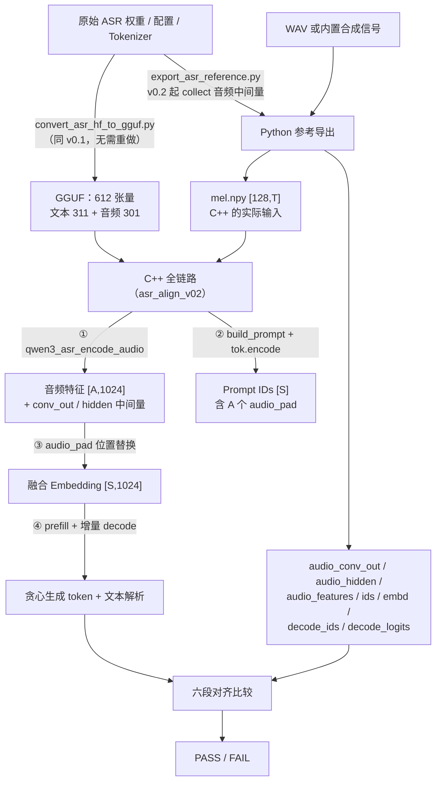

# asr/v0.2 代码分析：从参考 Mel 到 C++ 转写文本

本文解释 asr/v0.2 如何把“参考 Mel”变成“C++ 生成的转写文本”，沿一条音频追踪每个模块的数据与调用，不按每个结构体和宏逐项罗列。

- 想先跑起来：看 [README 的 ASR 使用步骤](../../README.md)。
- 想理解模型结构：看 [模型架构与推理流程](../qwen_model/Qwen3-ASR-0.6B_Model_Architecture_And_Inference.md)。
- 想了解交付范围与验收历史：看 [版本规划](design_asr.md)。
- 需要 Decoder 数值对齐的背景（理解本文第 3、4 节的前提）：看 [v0.1 代码分析](code_analysis_asr-v0.1.md)。

## 0. 版本定位与整体数据流

v0.1 证明的事：给定参考融合 Embedding，C++ Decoder 能复现 Python 的 hidden、logits 与生成 token。v0.2 把输入起点往前推进一段：**给定参考 Mel（Python 提取），C++ 自己完成音频编码、Prompt 构造、特征融合、prefill 与生成。**Python 保留三个职责：转换权重、提取 Mel、产出参考答案。



与 v0.1 最大的差别在**长度参数**：v0.1 的 C++ 从 Decoder 输入开始，只有 S 一个未知量；v0.2 从 Mel 开始，出现一组互相咬合的长度，全部由一个 T 推导：

| 记号 | 含义 | 计算方式 | 本版实测案例 |
| --- | --- | --- | --- |
| T | 有效 Mel 帧数 | Python 按 attention mask 裁剪 | T=190 |
| N | CNN 块数 | `ceil(T/100)` | N=2（100 帧 + 90 帧尾块） |
| A | 音频位置数 | `13*floor(T/100) + ceil((T mod 100)/8)` | A=25（13+12） |
| S | 混合输入位置数 | Prompt 模板 + A 个 `<\|audio_pad\|>` | auto: 40，lang: 43 |
| G | 参考生成 token 数 | Python 贪心循环自然到 EOS | auto: 8，lang: 5 |

**这组长度是连锁的**：A 错则 S 错，S 错则融合错，融合错则生成必错，修任何一个都要从头核对。

## 1. 数据准备：v0.2 改了导出脚本的什么

GGUF 转换（[convert_asr_hf_to_gguf.py](../../tools/convert_asr_hf_to_gguf.py)）**完全复用 v0.1**：612 张量契约不变，换音频不需要重新转换。变化只在 [export_asr_reference.py](../../scripts/asr/export_asr_reference.py)。

### 1.1 新增音频塔中间量落盘

[audio_tower_forward](../../scripts/asr/export_asr_reference.py#L118-L221) 增加可选 `collect` 参数，在不改变数值行为的前提下采集三组中间量（[保存处](../../scripts/asr/export_asr_reference.py#L342-L344)）：

| 文件 | 形状 | 内容 | 对齐 C++ 的哪一段 |
| --- | --- | --- | --- |
| `audio_conv_out.npy` | `[A,896]` | CNN + 局部正弦位置编码、去 padding 后的 Transformer 输入 | CNN 阶段输出经去 padding 拼接 |
| `audio_hidden.npy` | `[19,A,896]` | `hidden[0]=conv_out`，`hidden[i]=` 第 i 层输出 | 音频 Transformer 逐层 |
| `audio_features.npy` | `[A,1024]` | ln_post/proj1/GELU/proj2 最终投影 | 音频塔最终输出 |

### 1.2 采集点与官方代码的对应关系

参考的音频塔按官方 `modeling_qwen3_asr.py`（commit `7c6daf77`）逐行 fp32 复现，采集点精确定位在：

| 采集点 | 关键语义 |
| --- | --- |
| 分块（[L128-L137](../../scripts/asr/export_asr_reference.py#L128-L137)） | 每 100 个有效 Mel 帧一块；尾块用真实长度（T=190 时为 90），`pad_sequence` 只做右 padding |
| conv_out（[L166-L169](../../scripts/asr/export_asr_reference.py#L166-L169)） | 位置编码加在 padded 长度上、去 padding 之前——所以参考 conv_out 恰好是每个有效位置一行 |
| hidden（[L199-L205](../../scripts/asr/export_asr_reference.py#L199-L205)） | 每层 `residual + norm(mha)` 与 FFN 残差之后；与文本 Decoder 不同，音频逐层 hidden **不含**最终归一化 |
| features（[L214-L220](../../scripts/asr/export_asr_reference.py#L214-L220)） | ln_post → proj1 → GELU（PyTorch 默认 erf 精确版）→ proj2 |

**为什么在参考侧采集**：参考是“答案”，C++ 是“考生”。v0.1 的验证范围只能覆盖 Decoder 段（`layer_hidden` 是 Decoder 逐层输出）；v0.2 靠这三个文件把验证向前扩展到 conv_out——音频塔的第一个可观察交接点。

### 1.3 其余参考文件的角色变化

`ids/embd/decode_ids/decode_logits/layer_hidden/prefill_*` 的语义与 v0.1 完全一致（见 [v0.1 分析 §2.3](code_analysis_asr-v0.1.md)），但角色从“参与推理的输入”降级为“纯对答案”：v0.1 里 `embd.npy` 是 C++ prefill 的实际输入；v0.2 里 C++ 自己融合出输入，读 `embd.npy` 只为验证自己的融合结果（§4 第 3 段）。

## 2. C++ 音频 Encoder：src/audio_encoder.{h,cpp}

### 2.1 接口与分阶段设计

[qwen3_asr_encode_audio](../../src/audio_encoder.cpp#L304-L379) 是唯一入口：

```cpp
bool qwen3_asr_encode_audio(const qwen3_model & model,
                            const float * mel, int32_t T,
                            bool want_intermediates,
                            qwen3_asr_audio_result & out);
```

调用方只提供 mel 和 T；A 由内部推导并回填 `out.A`，`want_intermediates=true` 时额外填充 `out.conv_out` 与 `out.hidden` 供对齐工具逐段比较。**入口即校验**：非 ASR 架构、mel 为空、T≤0、A 超过单窗口上限（§5）直接返回 false。

内部分成两个阶段，各自建独立 ggml 图：

```text
qwen3_asr_encode_audio
 ├─ qwen3_asr_audio_positions(T) → A        公式推导，不依赖参考
 ├─ run_cnn_stage                            CNN 分块并行
 │    输入: mel [128,T] → 尾块 zero-pad 填充为 [time=100, freq=128, 1, N]
 │    输出: stage1 [896,13,N]（含 padding 位置，未去）
 ├─ 去 padding + 按块拼接 → conv_out [A,896]（host 行主序）
 └─ run_transformer_stage
      输入: conv_out [A,896]（→ 张量 [896,A]）
      输出: features [A,1024]；want_intermediates 时另有 hidden [19,A,896]
```

去 padding 发生在阶段之间（[audio_encoder.cpp L345-L361](../../src/audio_encoder.cpp#L345-L361)）：从 stage1 各块“挑出前 valid 个时间位置”按块序拼成连续 [A,896]，并断言拼接行数恰好等于 A。**分两个图的意义**：CNN 以块为 batch 维并行，Transformer 对全部 A 个位置全局注意，两者图形结构不同，分开建图互不牵制，也便于分段定位误差。

### 2.2 阶段 1：CNN 的四个易错点

[run_cnn_stage](../../src/audio_encoder.cpp#L95-L189) 复现 3 层 Conv2d + GELU → 展平 → conv_out 投影 → 局部正弦位置编码。实现时命中的坑：

**① conv bias 建在 GELU 之前。**`ggml_conv_2d` 不带 bias；官方 `gelu(conv2d(x, w, b))` 里 bias 是卷积的一部分，**必须先 add 再 gelu**，顺序反了会污染整条音频塔。ggml conv 输出布局是 `[OW=time, OH=freq, OC=channel, N]`，bias 逐通道（作用在 ne2），而 `ggml_add` 按 `ggml_can_repeat` 广播，因此 bias 要 reshape 成 `[1,1,OC,1]`（[L133-L135](../../src/audio_encoder.cpp#L133-L135)）。

**② 展平顺序是 channel 先于 frequency。**官方 `permute(0,3,1,2).view(b,t,c*f)` 的展平索引是 `c*16+f`。ggml conv 输出 c3 是 `[time=13, freq=16, ch=480, N]`；`ggml_permute(c3, 2, 0, 1, 3)` 得 `[freq, ch, time, N]`，cont 后内存顺序 freq 最快，再 reshape 为 `[16*480=7680, 13, N]`，与官方索引一致（[L158-L167](../../src/audio_encoder.cpp#L158-L167)）。

**③ 尾块 zero-pad 只能右 padding。**T=190 分成 100 帧 + 90 帧尾块。尾块在时间维尾部补零到 100（[L150-L156](../../src/audio_encoder.cpp#L150-L156)）。右 padding 的零不影响有效输出：每块 90 帧经过三层 stride-2 卷积得到 `(90+2-3)/2+1=47 → 24 → 12` 个有效时间位置，第 13 个位置完全落在零填充区，去 padding 时丢弃。这个语义必须与参考侧 `pad_sequence` 的右 padding 一致，不能改成左 padding。

**④ 位置编码的内存布局。**官方 SinusoidsPositionEmbedding 输出 `[length, channels]`。[sinusoids_f32](../../src/audio_encoder.cpp#L61-L75) 生成 `[length, d_model]` 行主序——每个位置一行 896 个值，正是 `ne0=d_model` 张量期望的连续内存——set 进 pos_t 后经 `ggml_add` 广播 `[896,13,1] → [896,13,N]`。**每块的位置从 0 重新开始**：N 块共用同一张 13 行表，这正是“局部”位置编码的含义。

> **实施记录**：本版曾在这里引入布局 bug——生成表按 `[d_model, length]` 排布后原样 set 进 `[896,13]` 张量，位置编码整体乱序，conv_out rmse≈0.75、端到端 FAIL；修正为行主序后 rmse 降到 3.5e-4（详见 §4.3）。

**⑤ GELU 形式的取舍。**`ggml_gelu` 是 tanh 近似（`0.5x(1+tanh(√(2/π)x(1+0.044715x²)))`），官方用 PyTorch 默认 erf 精确版。实测该差异贡献 conv_out rmse≈3.3e-4，与 F16 权重量化同量级，本版不换 `ggml_gelu_erf`；如需进一步压缩误差可替换并回归验证。

### 2.3 阶段 2：音频 Transformer 与文本 Decoder 的三点不同

[run_transformer_stage](../../src/audio_encoder.cpp#L191-L303) 跑 18 层，每层 `LayerNorm → 非因果 MHA → 残差 → LayerNorm → fc1 → GELU → fc2 → 残差`（norm 与线性层**全部带 bias**），末端 `ln_post → proj1 → GELU → proj2`。

| 对比项 | 文本 Decoder（v0.1） | 音频 Transformer（v0.2） |
| --- | --- | --- |
| 归一化 | RMSNorm，无 bias | LayerNorm 带 bias：`ggml_norm` 后手动 mul weight、add bias |
| 注意力 | 因果 GQA，读写 KV cache | 非因果、无 mask、全局双向：`softmax((QK^T)/√64)·V` |
| FFN | SwiGLU（gate/up/down） | 普通两层：fc1 → GELU → fc2 |

MHA 用三步 mul_mat 实现（[L229-L250](../../src/audio_encoder.cpp#L229-L250)）：Q/K permute 到 `[head_dim, A, n_head]`，`mul_mat` 得分矩阵 `[A_k, A_q, head]` → softmax → V 需 `cont(permute(v, 1, 2, 0, 3))` 转成 `[A, head_dim, n_head]` 供第二个 mul_mat。permute 轴序错一个或漏 cont 都会得到完全错误的结果，是本阶段最脆的一处。

**非因果无 mask 是 v0.2 单窗口约束的直接体现**：A≤104 时全局双向注意力与官方单窗口行为一致；跨窗口块对角 mask 属 v0.4（§5）。

### 2.4 中间量输出（want_intermediates）

[逐层输出的建图处理](../../src/audio_encoder.cpp#L288-L303)有一个 ggml 细节：每层末尾 `cont(cur)` + `set_output` 收集进 layer_outs，但这些节点**不在最终输出 o 的上游链路上**，必须逐个 `ggml_build_forward_expand(gf, lo)`，否则 gallocr 不会为它们分配 buffer。最终 hidden[0] 直接 memcpy conv_out，hidden[i] 从 layer_outs[i-1] 读回，组成 `[19,A,896]`。

## 3. Prompt、融合与生成：asr_align_v02 的主线

### 3.1 build_prompt：token 名是词表契约

[build_prompt](../../examples/asr/api_test/asr_align_v02.cpp#L233-L244) 构造官方 chat_template（单音频、不带 Thinking 前缀）：

```text
<|im_start|>system
{context}<|im_end|>
<|im_start|>user
<|audio_start|><|audio_pad|>×A<|audio_end|><|im_end|>
<|im_start|>assistant
（lang 模式追加）language Chinese<asr_text>
```

> **实施记录**：本版曾把音频起止标记写成 `<|audio_bos|>` / `<|audio_eos|>`——这两个名字**不在词表**，会被 BPE 按普通文本拆碎（S 从 40 涨到 52、ids 全错）。词表里的真名是 `<|audio_start|>`（151669）与 `<|audio_end|>`（151670）。**Prompt 里的字面量必须对照 GGUF 词表核对，不能凭记忆写。**

`--mode auto` 时模型自己生成 `language X<asr_text>` 协议头；`--mode lang` 把协议头写进输入，模型直接续写正文。

### 3.2 融合在 C++ 侧怎么做

融合在 [main 融合段](../../examples/asr/api_test/asr_align_v02.cpp#L357-L379)，纯 host 操作，不进 ggml 图：

```text
对 S 个位置逐行处理：
  ids[s] == audio_pad_id(151676)? → 从 audio.features 按序取第 ai 行 memcpy（1024 floats）
  否则                           → token_embd(ids[s], row) 单行查表（F16→F32）
结果 fused [S,1024] 作为 prefill 的 embd 入口（v0.1 的 graph 双入口，n_past=0）
```

两个要点：
- **替换而非相加**：audio_pad 位置的文本 Embedding 被音频特征整体覆盖；`<|audio_start|>`/`<|audio_end|>` 等模板标记保留文字向量。
- **顺序一一对应**：features 的第 ai 个向量对应 ids 中第 ai 个 audio_pad 位置。工具先从 ids 统计 audio_pad 数量并断言等于 A（[L349-L354](../../examples/asr/api_test/asr_align_v02.cpp#L349-L354)），再按序填充。

### 3.3 生成与文本解析

生成流程与 v0.1 差异极小：fused prefill（n_past=0）→ 首 token argmax → token 查表增量 decode（n_past=S,S+1,…）→ 命中 EOS 集合 {151645, 151643} 或达到 `--max-gen` 停止。唯一变化是起点——v0.1 的 prefill 输入是 Python 给的 embd，v0.2 是 C++ 自己融合的 embd；Decoder 机制一行未改。

文本解析保持最小实现：`decode(skip_special=false)` 输出原始 token 串（raw），`decode(true)` 输出去 special 后的正文（text）。语言协议（`language Chinese`）与 `<asr_text>` 尚未拆成独立字段——结构化 language/text 响应是 v0.3 API 的目标。

## 4. 对齐验证结构：六段检查如何拆分误差

### 4.1 检查段与误差归属

[main](../../examples/asr/api_test/asr_align_v02.cpp#L248-L455) 的顺序刻意按依赖链安排，每段检查**上段残留误差是否继续传导**：

| # | 段 | 输入来源 | 判定（阈值）；FAIL 优先怀疑 |
| --- | --- | --- | --- |
| 1 | A 一致性 | mel → [A 公式](../../src/audio_encoder.cpp#L14-L19) | `A(cpp)==A_ref`；mel 维度或公式 |
| 1 | conv_out | CNN 输出去 padding 后 | rmse ≤ 0.20；CNN/展平/位置编码/GELU |
| 1 | audio_layer 0..17 | C++ hidden[i] | 各层 rmse ≤ 0.20；该层注意力或 FFN |
| 1 | audio_features | C++ 投影输出 | rmse ≤ 0.20；ln_post/proj |
| 2 | ids 一致性 | C++ tok.encode(prompt) | 与 ref_ids 逐位一致；prompt 模板或 tokenizer |
| 2 | audio_pad 数 | 从 ids 统计 | `== A`；占位符数量或模板 |
| 3 | fused_embd | C++ 自己的融合结果 | rmse ≤ 0.05；融合行序或查表 |
| 4 | prefill logits | fused → eval | max_abs ≤ 0.5 且 top10 ≥ 9/10；Decoder（v0.1 能力） |
| 5 | teacher forcing | 参考前一 token 增量 | 同上；KV/位置增量（v0.1 能力） |
| 6 | 自由生成 + 解析 | 自贪心 + decode | 长度相等且逐 token 一致；argmax 分叉 |

“优先怀疑”的前提是**前序段落全部通过**——先修上游，再看下游是否只是被殃及。

### 4.2 阈值阶梯的依据

| 对比项 | 阈值 | 本版实测 |
| --- | --- | --- |
| conv_out / audio hidden / features | rmse ≤ 0.20 | ≤ 0.0021（18 层累积、F16 权重） |
| fused_embd | rmse ≤ 0.05 | 3.2e-5（音频位 ≈4e-5，文本位查同一 F16 表、理论为 0） |
| logits | max_abs ≤ 0.5 且 top10 ≥ 9/10 | max_abs ≤ 0.056，top10 10/10 |

音频塔阈值放宽到 0.20，覆盖 18 层 F16 累积；融合与 logits 沿用 v0.1 量级。核心判据是**每段实测误差应与“上一段 + 一级量化”的可期噪声同量级**——若某段大出数个量级，先查该段自身实现，而不是怀疑量化（§4.3 的 bug 正是这样暴露的：0.75 远超 3e-4 的量化基线）。

### 4.3 实施中修复的两个 bug（记录免重蹈）

两个 bug 都是首次运行 FAIL 后定位的，共同点：**跨语言契约没有对照真相**（C++ 写死的字面量 vs Python/词表事实）。

| Bug | 症状 | 根因 | 修复后 |
| --- | --- | --- | --- |
| `sinusoids_f32` 表布局写反 | conv_out rmse=0.75、逐层全炸 | 生成 `[d_model,length]` 排布，set 进 `[896,13]`（ne0=d_model）张量后位置编码乱序 | 改为 `[length,d_model]` 行主序；rmse 0.75 → 3.5e-4 |
| `<\|audio_bos\|>`/`<\|audio_eos\|>` 不在词表 | S=52≠40、ids MISMATCH、fused 对比越界读出 NaN/1e38 | token 名凭记忆写错，被 BPE 拆成碎片；融合对比读参考 embd 越界 | 改用词表真名 `<\|audio_start\|>`/`<\|audio_end\|>`；ids 逐位一致 |

**可复制的定位手法**：发现 conv_out 大误差后，先在 Python 用参考 mel 重算 CNN 链路，做 erf/tanh GELU × fp32/F16 权重的 2×2 对照——结果全部 rmse ≤ 4e-4，一步排除“量化或 GELU 形式”两个嫌疑，锁定 C++ 自身实现；再逐项对照官方 `SinusoidsPositionEmbedding` 的输出语义，定位到填充索引。同时给融合对比加了 `min(S,S_ref)` 防越界（防呆不改变判定：此时 ids 段已必然 FAIL）。

### 4.4 v0.2 验收基线（2026-10-01，两案例 PASS）

| 指标 | auto（T=190,A=25,S=40,G=8） | lang（S=43,G=5） | 容差 |
| --- | --- | --- | --- |
| conv_out rmse | 3.5e-4 | 3.5e-4 | ≤ 0.20 |
| 音频逐层 hidden 最差 rmse | 2.1e-3（末层） | 2.1e-3 | ≤ 0.20 |
| audio_features rmse | 4.0e-5 | 4.0e-5 | ≤ 0.20 |
| ids | 40=40 逐位一致 | 43=43 逐位一致 | 完全一致 |
| fused_embd rmse | 3.2e-5 | 3.1e-5 | ≤ 0.05 |
| prefill logits max_abs / top10 | 0.056 / 10/10 | 0.038 / 10/10 | ≤ 0.5 且 ≥ 9 |
| teacher forcing 最差 max_abs / top10 | 0.045 / 10/10 | 0.045 / 10/10 | 同上 |
| 自由生成 | 8=8 逐 token 一致 | 5=5 一致 | 完全一致 |
| 转写输出（raw） | `language Chinese<asr_text>今天天气怎么样？<\|im_end\|>` | `今天天气怎么样？<\|im_end\|>` | — |

参考为 fp32、C++ 为 F16 权重。转写文字与参考生成完全一致（基线音频内容为“今天天气怎么样？”），说明音频链路与生成语义均已打通。

## 5. 当前边界与已知限制

- **单注意力窗口约束。**音频 Transformer 对全部 A 个位置做全局双向注意，本版仅支持 `A ≤ 13*(n_window_infer/chunk) = 13*8 = 104`，即 T ≤ 800 帧（约 8 秒 16 kHz 音频）；超长输入 `qwen3_asr_encode_audio` 直接报错（[校验处](../../src/audio_encoder.cpp#L323-L329)）。跨窗口块对角 mask 属 v0.4（见 [设计 §3.5](design_asr.md)）。
- **Mel 仍由 Python 提取。**C++ Log-Mel 属 v0.3；当前 `mel.npy` 来自 transformers 4.57.6 的 WhisperFeatureExtractor（与 preprocessor_config 同源）。
- **单音频、单请求、贪心生成。**Prompt 模板只支持一条音频；无采样与重复惩罚；`language` 协议未拆独立字段；`--context` 参数已提供，但参考数据的 context 固定为空。
- **文件交接仍要求同源。**v0.2 参考目录新增 3 个 npy；把 v0.1 旧目录（无 `audio_*` 文件）喂给 v0.2 工具会加载失败并明确报错。混用不同音频/版本的目录依然会得出错误结论。
- **LLM 路径零改动。**v0.2 未触碰 model/graph/kv/tokenizer 的既有行为（`audio_encoder.cpp` 是纯新增源文件，挂入核心源列表）；需要时可用 `asr_align_v01` 与 LLM 示例交叉回归。

## 6. 源码阅读顺序建议

| 目的 | 入口 | 一句话 |
| --- | --- | --- |
| 理解 A 公式 | [qwen3_asr_audio_positions](../../src/audio_encoder.cpp#L14-L19) | `13·floor(T/100)+ceil((T mod 100)/8)`，一切长度的源头 |
| 理解 CNN 阶段 | [run_cnn_stage](../../src/audio_encoder.cpp#L95-L189) | 分块卷积 + bias 广播 + 展平顺序 + 局部位置编码 |
| 理解音频 Transformer | [run_transformer_stage](../../src/audio_encoder.cpp#L191-L303) | LayerNorm+bias、非因果 MHA、两层 FFN、输出投影 |
| 理解完整编排 | [qwen3_asr_encode_audio](../../src/audio_encoder.cpp#L304-L379) | 校验、两阶段、去 padding 拼接、结果回填 |
| 理解对齐工具主线 | [main](../../examples/asr/api_test/asr_align_v02.cpp#L248-L455) | 六段检查按依赖链排布 |
| 理解参考导出 | [export_case](../../scripts/asr/export_asr_reference.py#L238-L379) | Mel → 音频塔 → Prompt → 融合 → Decoder → 落盘 |
| 温习 Decoder | [v0.1 分析 §3](code_analysis_asr-v0.1.md) | prefill/teacher forcing/自由生成的底层语义 |

主线串成一句话：**导出脚本采集中间量当答案，audio_encoder 用两个独立 ggml 阶段复现音频塔，对齐工具用六段检查确认每段误差都在量化噪声量级，剩下的生成交给 v0.1 已验证的 Decoder。**
