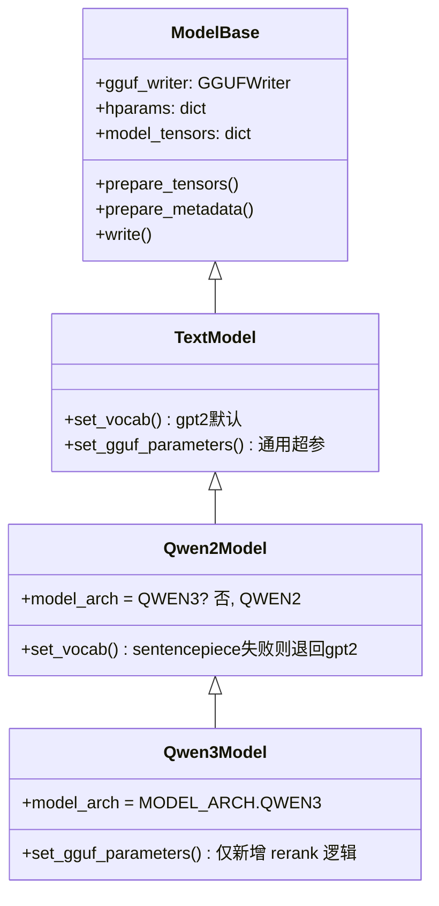

# `convert_hf_to_gguf.py` 脚本解析（以 Qwen3-0.6B 为例）

> 分析对象：[scripts/convert_hf_to_gguf.py](../scripts/convert_hf_to_gguf.py)（llama.cpp 官方转换脚本，随
> [scripts/gguf/](../scripts/gguf/) 包一起拷贝进本仓库）。
>
> 输入模型：`/home/lil72/data/model/Qwen3-0___6B/`（HF safetensors，bf16）
> 输出产物：[models/qwen3-0.6b-f16.gguf](../models/qwen3-0.6b-f16.gguf)（约 1.4GB，F16）
>
> 本文所有字段/顺序/张量列表均通过 `scripts/gguf/scripts/gguf_dump.py` 对**实际生成的
> gguf 文件**回读验证，不是纯读源码推测。

---

## 1. 转换命令与整体流程

对应本仓库场景的调用方式（`main()` 解析的 CLI 参数）：

```bash
conda run -n llm python scripts/convert_hf_to_gguf.py \
    /home/lil72/data/model/Qwen3-0___6B \
    --outfile models/qwen3-0.6b-f16.gguf \
    --outtype f16
```

`main()`（[convert_hf_to_gguf.py](../scripts/convert_hf_to_gguf.py#L12332)）的执行步骤：

1. `parse_args()` 解析命令行；`--outtype f16` → `ftype = gguf.LlamaFileType.MOSTLY_F16`（值为 `1`）。
2. `ModelBase.load_hparams(dir_model)` 用 `transformers.AutoConfig.from_pretrained` 读取
   `config.json` 得到 hparams 字典。
3. `get_model_architecture(hparams, TEXT)` 取 `hparams["architectures"][0]` = `"Qwen3ForCausalLM"`。
4. `ModelBase.from_model_architecture("Qwen3ForCausalLM")` 通过 `@ModelBase.register(...)`
   装饰器注册表找到对应的模型类 → **`Qwen3Model`**。
5. 实例化 `Qwen3Model(dir_model, ftype, fname_out, ...)`。
6. 非 `--vocab-only` 模式下调用 `model_instance.write()`，这是整个转换的核心。

### 1.1 类继承关系



- `Qwen3Model` 注册名：`@ModelBase.register("Qwen3ForCausalLM")`（[convert_hf_to_gguf.py:4521](../scripts/convert_hf_to_gguf.py#L4521)）。
- `Qwen3Model` 继承自 `Qwen2Model`，日常（非 rerank）场景下**几乎不覆写任何逻辑**，
  超参写入和张量映射规则基本沿用 `Qwen2Model`/`TextModel`，只有 `model_arch` 换成了
  `gguf.MODEL_ARCH.QWEN3`（决定了 KV 键名前缀是 `qwen3.*` 以及张量名映射表）。
- Qwen3-0.6B 不是 reranker（`_is_qwen3_reranker()` 通过 README/`_name_or_path` 判断），
  所以 `is_rerank = False`，rerank 专属的 `pooling_type=RANK`、`classifier_output_labels`、
  rerank chat_template 等分支都不会触发。

### 1.2 `write()` 的执行顺序（决定了文件内容的先后顺序）

[`ModelBase.write()`](../scripts/convert_hf_to_gguf.py#L851)：

```python
def write(self):
    self.prepare_tensors()                       # 1. 处理并"缓存"所有张量(此时还未写文件)
    self.prepare_metadata(vocab_only=False)       # 2. 生成全部 KV 元数据(此时还未写文件)
    self.gguf_writer.write_header_to_file(...)    # 3. 写文件头 (magic/version/tensor_count/kv_count)
    self.gguf_writer.write_kv_data_to_file()      # 4. 写全部 KV 元数据
    self.gguf_writer.write_tensors_to_file(...)   # 5. 写张量信息表 + 张量二进制数据
    self.gguf_writer.close()
```

**关键点：`prepare_tensors()` 先于 `prepare_metadata()` 执行**，但由于两者都只是往
`GGUFWriter` 的内存字典（`tensors` / `kv_data`）里追加内容，真正的文件落盘顺序仍然是
"先头部 → 再 KV → 再张量信息 → 最后张量数据"，与调用顺序无关。

`GGUFWriter.__init__()`（[gguf_writer.py:88](../scripts/gguf/gguf_writer.py#L88)）在被创建时（也就是
`Qwen3Model.__init__` 里）会立刻调用 `self.add_architecture()`，所以 **`general.architecture`
永远是整个 KV 列表里第一个被插入的键**（Python dict 保序，写盘顺序 = 插入顺序）。

---

## 2. 元数据（KV）写入的详细来源与顺序

`prepare_metadata()` 分为 `ModelBase` 基类版本和 `TextModel` 覆写版本，Qwen3Model 未再覆写。
实际调用链（`TextModel.prepare_metadata` 内部先 `super().prepare_metadata()` 再处理文件名和词表）：

```
GGUFWriter.__init__
  └─ add_architecture()                         → general.architecture

ModelBase.prepare_metadata(vocab_only=False)
  ├─ gguf.Metadata.load(override, dir_model, model_name, total_params)
  │     ├─ load_model_card()        读 README.md 的 YAML front-matter (license/tags/base_model等)
  │     ├─ load_hf_parameters()     读 config.json
  │     ├─ load_generation_config() 读 generation_config.json (采样默认值)
  │     └─ apply_metadata_heuristic() 综合推断 name/basename/finetune/size_label 等
  ├─ metadata.name 兜底为目录名 dir_model.name
  ├─ size_label 兜底为 gguf.size_label(total_params, ...)
  ├─ self.set_type()                             → general.type = "model"
  ├─ metadata.set_gguf_meta_model(gguf_writer)    → general.* 一大批作者/许可证/来源字段
  ├─ self.set_gguf_parameters()                   → qwen3.* 架构超参 (见第3节)
  └─ gguf_writer.add_quantization_version(...)    → general.quantization_version

TextModel.prepare_metadata (覆写, 在 super() 之后)
  ├─ 计算/填充输出文件名 (若 --outfile 是目录才需要模板名)
  └─ self.set_vocab()                             → tokenizer.* 分词器相关 (见第4节)
```

### 2.1 实际生成文件中的完整 KV 列表（按写入顺序，共 38 条）

用 `gguf_dump.py` 对 [models/qwen3-0.6b-f16.gguf](../models/qwen3-0.6b-f16.gguf) 回读得到（序号为该
gguf 文件的物理写入顺序）：

| # | Key | 类型 | 值 | 来源 |
|---|-----|------|----|------|
| 1 | `general.architecture` | STRING | `qwen3` | `GGUFWriter.__init__` → `add_architecture()`，值取自 `gguf.MODEL_ARCH_NAMES[QWEN3]` |
| 2 | `general.type` | STRING | `model` | `set_type()` |
| 3 | `general.sampling.top_k` | INT32 | `20` | `generation_config.json: top_k` |
| 4 | `general.sampling.top_p` | FLOAT32 | `0.95` | `generation_config.json: top_p` |
| 5 | `general.sampling.temp` | FLOAT32 | `0.6` | `generation_config.json: temperature` |
| 6 | `general.name` | STRING | `Qwen3 0___6B` | 兜底取自模型目录名 `Qwen3-0___6B`（README/model card 里没给出规范名，注意目录名里的 `___` 被原样带入，是 ModelScope 命名习惯遗留的“坑”） |
| 7 | `general.finetune` | STRING | `0___6B` | 从模型名启发式拆分出的 finetune 后缀 |
| 8 | `general.basename` | STRING | `Qwen3` | 从模型名启发式拆分出的 basename |
| 9 | `general.size_label` | STRING | `752M` | `gguf.size_label()` 依据 tensor 总参数量自动计算 |
| 10 | `general.license` | STRING | `apache-2.0` | 从 README.md YAML front-matter 的 `license` 字段 |
| 11 | `general.license.link` | STRING | `https://huggingface.co/Qwen/Qwen3-0.6B/blob/main/LICENSE` | 同上，`license` 展开为标准链接 |
| 12 | `general.base_model.count` | UINT32 | `1` | README.md front-matter `base_model` 字段个数 |
| 13 | `general.base_model.0.name` | STRING | `Qwen3 0.6B Base` | 同上 |
| 14 | `general.base_model.0.organization` | STRING | `Qwen` | 同上 |
| 15 | `general.base_model.0.repo_url` | STRING | `https://huggingface.co/Qwen/Qwen3-0.6B-Base` | 同上 |
| 16 | `general.tags` | [STRING] | `["text-generation"]` | README.md front-matter `tags` |
| 17 | `qwen3.block_count` | UINT32 | `28` | `config.json: num_hidden_layers` |
| 18 | `qwen3.context_length` | UINT32 | `40960` | `config.json: max_position_embeddings` |
| 19 | `qwen3.embedding_length` | UINT32 | `1024` | `config.json: hidden_size` |
| 20 | `qwen3.feed_forward_length` | UINT32 | `3072` | `config.json: intermediate_size` |
| 21 | `qwen3.attention.head_count` | UINT32 | `16` | `config.json: num_attention_heads` |
| 22 | `qwen3.attention.head_count_kv` | UINT32 | `8` | `config.json: num_key_value_heads`（GQA） |
| 23 | `qwen3.rope.freq_base` | FLOAT32 | `1000000.0` | `config.json: rope_theta` |
| 24 | `qwen3.attention.layer_norm_rms_epsilon` | FLOAT32 | `1e-06` | `config.json: rms_norm_eps` |
| 25 | `qwen3.attention.key_length` | UINT32 | `128` | `config.json: head_dim`（16 头×128 ≠ 1024，说明 Qwen3 的 head_dim 与 hidden_size 是独立配置的） |
| 26 | `qwen3.attention.value_length` | UINT32 | `128` | 同上 |
| 27 | `general.file_type` | UINT32 | `1` (`MOSTLY_F16`) | 命令行 `--outtype f16` |
| 28 | `general.quantization_version` | UINT32 | `2` | 常量 `gguf.GGML_QUANT_VERSION` |
| 29 | `tokenizer.ggml.model` | STRING | `gpt2` | `_set_vocab_gpt2()`（BPE 分词器统一标记为 `gpt2` 类型） |
| 30 | `tokenizer.ggml.pre` | STRING | `qwen2` | 用内置 chktok/hash 表识别出 Qwen 使用的 BPE 预分词规则 |
| 31 | `tokenizer.ggml.tokens` | [STRING]×151936 | 词表全量 token 字符串 | `AutoTokenizer` 词表 + `added_tokens` |
| 32 | `tokenizer.ggml.token_type` | [INT32]×151936 | 每个 token 的类型（NORMAL/CONTROL/…） | 同上 |
| 33 | `tokenizer.ggml.merges` | [STRING]×151387 | BPE 合并规则 | `merges.txt` |
| 34 | `tokenizer.ggml.eos_token_id` | UINT32 | `151645` (`<\|im_end\|>`) | `tokenizer_config.json` / `config.json` |
| 35 | `tokenizer.ggml.padding_token_id` | UINT32 | `151643` | 同上 |
| 36 | `tokenizer.ggml.bos_token_id` | UINT32 | `151643` | 同上 |
| 37 | `tokenizer.ggml.add_bos_token` | BOOL | `false` | `tokenizer_config.json: add_bos_token` |
| 38 | `tokenizer.chat_template` | STRING | Jinja2 模板全文（ChatML 风格，含 `<think>` 标签处理） | `tokenizer_config.json: chat_template` |

> 没有出现 `qwen3.attention.pooling_type` —— 因为 `Qwen2Model.set_gguf_parameters()` 里的
> `self._try_set_pooling_type()` 检测不到 embedding/pooling 相关配置，跳过。
> 也没有 `qwen3.rope.scaling.type` —— 因为 `config.json` 的 `rope_scaling` 为 `null`。

### 2.2 一个容易踩的坑：`general.name` 里的 `___`

模型目录名是 `Qwen3-0___6B`（ModelScope 下载工具把路径中的 `.` 替换成了 `___`）。
由于该模型的 README.md 没有给出更规范的 `model_name`，`apply_metadata_heuristic()` 只能
用目录名兜底，导致 gguf 里的 `general.name` = `Qwen3 0___6B`（**带着下划线**）。
如果希望名字干净，可以用 `--model-name "Qwen3-0.6B"` 显式覆盖。

---

## 3. 架构相关超参写入逻辑（`set_gguf_parameters`）

调用链：`Qwen3Model.set_gguf_parameters()` → `Qwen2Model.set_gguf_parameters()`
（只加了一行 `self._try_set_pooling_type()`）→ `TextModel.set_gguf_parameters()`（真正干活的地方，
[convert_hf_to_gguf.py:996](../scripts/convert_hf_to_gguf.py#L996)）。

该函数是**架构无关的通用逻辑**，通过 `find_hparam([多个可能的键名...])` 依次尝试从
HF `config.json` 里找到对应字段，找到就写一个 `<arch>.<key>` 形式的 GGUF KV：

| GGUF key（前缀 `qwen3.`） | 尝试的 HF hparam 键（按顺序） | Qwen3-0.6B 命中值 |
|---|---|---|
| `block_count` | `n_layers`, `num_hidden_layers`, `n_layer`, `num_layers` | 28 |
| `context_length` | `max_position_embeddings`, `n_ctx`, ... | 40960 |
| `embedding_length` | `hidden_size`, `n_embd`, `dim` | 1024 |
| `feed_forward_length` | `intermediate_size`, `n_inner`, `hidden_dim` | 3072 |
| `attention.head_count` | `num_attention_heads`, `n_head`, `n_heads` | 16 |
| `attention.head_count_kv` | `num_key_value_heads`, `n_kv_heads` | 8 |
| `rope.freq_base` | `rope_parameters["rope_theta"]` | 1000000.0 |
| `attention.layer_norm_rms_epsilon` | `rms_norm_eps`, `norm_eps` | 1e-6 |
| `attention.key_length` / `value_length` | `head_dim` | 128 / 128 |
| `file_type` | 由 `--outtype` 决定，非 hparam | 1 |

未命中的字段（因为 Qwen3-0.6B 没有对应配置，代码里做了 `if xxx is not None:` 判断后跳过）：
`rope.scaling.*`（`rope_scaling=null`）、`expert_count` / `expert_used_count`（非 MoE）、
`layer_norm_eps`（Qwen3 只用 RMSNorm，没有普通 LayerNorm）。

Qwen3 特有的两个张量级细节（不在 KV 里，但影响张量写入，见第 5 节）：
- **QK-Norm**：Qwen3 相比 Qwen2 在每个注意力头的 Q/K 上多了一次 RMSNorm
  （`attn_q_norm.weight` / `attn_k_norm.weight`，形状为 `[head_dim]=128`），
  这是 Qwen3 与 Qwen2 最核心的结构差异，靠 `gguf.MODEL_ARCH.QWEN3` 对应的
  `TensorNameMap` 自动识别 `self_attn.q_norm` / `self_attn.k_norm` 并映射过去。
- `head_dim=128` 与 `hidden_size / head_count = 1024/16 = 64` **不相等**，
  说明 Qwen3 的注意力头维度是独立配置的，Q/K/V 投影的实际输出维度是
  `head_dim * head_count(_kv)`，而不是简单的 `hidden_size`。

---

## 4. 分词器（vocab）写入逻辑

调用链：`Qwen3Model.set_vocab()`（只处理 `intern-s1-mini` 特例，Qwen3-0.6B 不命中）
→ `Qwen2Model.set_vocab()`：

```python
def set_vocab(self):
    try:
        self._set_vocab_sentencepiece()   # 先尝试找 tokenizer.model (sentencepiece)
    except FileNotFoundError:
        self._set_vocab_gpt2()            # 找不到就退回 BPE/gpt2 风格
```

Qwen3-0.6B 目录里只有 `tokenizer.json` / `vocab.json` / `merges.txt`，没有 `tokenizer.model`，
所以必然走 **`_set_vocab_gpt2()`** 分支（[convert_hf_to_gguf.py:1472](../scripts/convert_hf_to_gguf.py#L1472)）：

1. `get_vocab_base()`：用 `AutoTokenizer` 加载词表，遍历 `[0, vocab_size)`：
   - 不在词表里的 id → 填充 `"[PAD{i}]"`，类型 `UNUSED`；
   - 在 `added_vocab`（特殊/自定义 token）里 → 类型 `CONTROL` 或 `USER_DEFINED`；
   - 其余 → 类型 `NORMAL`。
2. `get_vocab_base_pre()`：对一段固定探针文本做编码，取 token id 序列的 sha256，
   在内置哈希表里查表识别出这是 **`qwen2`** 预分词规则（`tokenizer.ggml.pre = "qwen2"`）。
3. 依次写入：`tokenizer.ggml.model="gpt2"` → `tokenizer.ggml.pre` → `tokenizer.ggml.tokens`
   → `tokenizer.ggml.token_type`。
4. `gguf.SpecialVocab(dir_model, load_merges=True)` 读取：
   - `merges.txt` → `tokenizer.ggml.merges`；
   - `tokenizer_config.json` / `tokenizer.json` 里的特殊 token id（bos/eos/pad/unk/...）
     → `tokenizer.ggml.*_token_id`；
   - `add_bos_token` / `add_eos_token` 等布尔开关 → `tokenizer.ggml.add_*_token`；
   - `chat_template` 字段（Jinja2 模板原文，ChatML + `<think>...</think>` 思考标签）
     → `tokenizer.chat_template`。

---

## 5. 张量（tensor）写入逻辑

### 5.1 处理管线：`prepare_tensors()`

[`ModelBase.prepare_tensors()`](../scripts/convert_hf_to_gguf.py#L677) 对每个原始张量做：

```
model_tensors (来自 safetensors, 惰性加载)
   │
   ├─ dequant_model()          反量化 (Qwen3-0.6B 原始权重是 bf16, 无量化配置, 这一步是空操作)
   │
   for name, data_torch in get_tensors():
   ├─ modify_tensors(name)     → Qwen3Model 继承 Qwen2Model 的实现:
   │                              · 跳过 vision/audio 相关张量 (Qwen3-0.6B 是纯文本模型, 不涉及)
   │                              · map_tensor_name(): 用 TensorNameMap 把 HF 名字
   │                                (如 model.layers.0.self_attn.q_proj.weight)
   │                                翻译成 GGUF 名字 (blk.0.attn_q.weight)
   ├─ 决定写入的量化类型 data_qtype:
   │      · n_dims <= 1 或名字以 "_norm.weight" 结尾 → 强制 F32 (所有 RMSNorm 权重)
   │      · 其余按 --outtype 决定 → f16 → F16
   └─ gguf_writer.add_tensor(new_name, data, raw_dtype=data_qtype)
```

### 5.2 实际写入结果：311 个张量

Qwen3-0.6B：28 层 × 每层 11 个张量（1 attn_norm + 3 ffn + 1 ffn_norm + 2 qk_norm +
3 qkv/attn_output... 详见下表）+ 3 个全局张量（token_embd / output / output_norm）
= 28×11 + 3 = **311**，与 `gguf_dump.py` 报告的 `tensor_count = 311` 完全一致。

**单层（以 `blk.N` 为例）包含的 11 个张量：**

| GGUF 张量名 | 形状 | dtype | 对应 HF 权重名 |
|---|---|---|---|
| `blk.N.attn_norm.weight` | `[1024]` | F32 | `model.layers.N.input_layernorm.weight` |
| `blk.N.ffn_down.weight` | `[3072,1024]` | F16 | `model.layers.N.mlp.down_proj.weight` |
| `blk.N.ffn_gate.weight` | `[1024,3072]` | F16 | `model.layers.N.mlp.gate_proj.weight` |
| `blk.N.ffn_up.weight` | `[1024,3072]` | F16 | `model.layers.N.mlp.up_proj.weight` |
| `blk.N.ffn_norm.weight` | `[1024]` | F32 | `model.layers.N.post_attention_layernorm.weight` |
| `blk.N.attn_k_norm.weight` | `[128]` | F32 | `model.layers.N.self_attn.k_norm.weight`（Qwen3 独有的 QK-Norm） |
| `blk.N.attn_k.weight` | `[1024,1024]` | F16 | `model.layers.N.self_attn.k_proj.weight`（8 个 KV 头 × 128） |
| `blk.N.attn_output.weight` | `[2048,1024]` | F16 | `model.layers.N.self_attn.o_proj.weight` |
| `blk.N.attn_q_norm.weight` | `[128]` | F32 | `model.layers.N.self_attn.q_norm.weight`（Qwen3 独有的 QK-Norm） |
| `blk.N.attn_q.weight` | `[1024,2048]` | F16 | `model.layers.N.self_attn.q_proj.weight`（16 个 Q 头 × 128） |
| `blk.N.attn_v.weight` | `[1024,1024]` | F16 | `model.layers.N.self_attn.v_proj.weight` |

**全局张量：**

| GGUF 张量名 | 形状 | dtype | 说明 |
|---|---|---|---|
| `output.weight` | `[1024,151936]` | F16 | 对应 HF `lm_head.weight`。注意 `config.json` 里 `tie_word_embeddings=true`，理论上应与 embedding 共享权重、可以不单独存储；但该模型的 `model.safetensors` **实际上把 `lm_head.weight` 单独存了一份**（与 `embed_tokens.weight` 数值相同），所以转换脚本没有做任何"共享权重"的特殊处理，原样各写一份，文件体积因此比理论上"仅存一份 embedding"多了约 300MB。 |
| `token_embd.weight` | `[1024,151936]` | F16 | 对应 HF `model.embed_tokens.weight` |
| `output_norm.weight` | `[1024]` | F32 | 对应 HF `model.norm.weight`（最终输出前的 RMSNorm） |

> `gguf.MODEL_ARCH.QWEN3` 的张量清单里还定义了 `MODEL_TENSOR.ROPE_FREQS`
> （[constants.py:1777](../scripts/gguf/constants.py#L1777)），但由于 Qwen3 用的是最朴素的
> RoPE（无 NTK/YaRN 缩放，`generate_extra_tensors()` 未被覆写返回空），
> 实际文件里**没有** `rope_freqs.weight` 这个张量——它只是"该架构允许存在"的可选项。

### 5.3 张量在文件中的**物理顺序**（重要且反直觉）

实际 dump 出来的张量顺序是：

```
output.weight, token_embd.weight,
blk.0.*(6项按名字字母序排列), blk.1.*, blk.10.*, blk.11.*, ..., blk.19.*, blk.2.*, blk.20.*, ..., blk.9.*,
output_norm.weight
```

**层号不是按数值 0,1,2,...,27 排列的，而是按字符串字典序排列（0,1,10,11,...,19,2,20,...,9）！**

原因：`index_tensors()` 直接按 `model.safetensors` 文件内部保存的 key 顺序读入
`model_tensors` 字典（Python dict 保序），而 safetensors 工具在保存权重时是按
**张量名字符串**排序写入文件头的。转换脚本的 `get_tensors()` 只是原样遍历这个字典、
逐个 `modify_tensors()` 改名后写入 `gguf_writer.tensors`，**全程没有对层号做数值排序**。
所以最终 GGUF 文件里张量的物理排布顺序 = HF safetensors 内部张量名的字符串字典序：

```
lm_head.weight
< model.embed_tokens.weight
< model.layers.0....  < model.layers.1.... < model.layers.10.... < ... < model.layers.19....
< model.layers.2.... < model.layers.20.... < ... < model.layers.9....
< model.norm.weight
```

这不影响推理正确性（推理时按张量名字符串查找，不依赖物理顺序），但如果要手写一个
最简 GGUF 解析器、按"文件里第几个张量"这种下标去对应"第几层"，会踩坑——必须要按
`blk.{层号}.xxx` 名字解析层号，而不能假设第 N 组张量就是第 N 层。

---

## 6. 文件物理布局总结

**GGUF 格式本身只有 4 段，没有"专门的词表段"**——分词器（vocab）内容不是单独一块，
而是作为**普通 KV 键值对**（只是 value 类型是"字符串数组/整型数组"而不是单个标量），
和 `general.*`、`qwen3.*` 混在同一个 KV 数据区里顺序写入的。第 2 节表格里的
第 29~38 行（`tokenizer.ggml.model` ... `tokenizer.chat_template`）就是词表数据，
物理上位于 KV 区的尾部（因为 `set_vocab()` 是 `prepare_metadata()` 里最后被调用的）：

```
┌──────────────────────────────────────────┐
│ Header: magic(4B) + version(4B)           │
│         + tensor_count(8B) + kv_count(8B) │  ← write_header_to_file()
├──────────────────────────────────────────┤
│ KV 数据: 38 个 key-value，按第2节顺序      │  ← write_kv_data_to_file()
│   ├─ #1~28  general.* / qwen3.*           │     (标量为主，体积很小)
│   └─ #29~38 tokenizer.*  ←【词表在这里】   │     体积较大的几个 KV:
│        ・tokenizer.ggml.tokens   [STRING]×151936   (每个 token 一个字符串)
│        ・tokenizer.ggml.token_type [INT32]×151936
│        ・tokenizer.ggml.merges  [STRING]×151387   (BPE 合并规则)
│        ・tokenizer.chat_template          (一整段 Jinja2 模板文本)
├──────────────────────────────────────────┤
│ 张量信息表: 311 条 (name/n_dims/shape/     │
│   dtype/offset)，按第5.3节的物理顺序        │  ← write_tensors_to_file()
│                                            │    内部先调 write_ti_data_to_file()
├──────────────────────────────────────────┤
│ 张量二进制数据: 按同样顺序连续存放，          │
│   每个张量按 32 字节对齐 (GGUF_DEFAULT_     │
│   ALIGNMENT) 做 padding                    │
│   (权重数据本体，占了 1.4GB 文件的绝大部分)  │
└──────────────────────────────────────────┘
```

换句话说：**词表 = KV 区里体积最大的几条记录，而不是文件里独立的一段**。
`GGUFWriter` 内部也没有 `write_vocab_to_file()` 这种函数，所有 `add_token_list()` /
`add_token_merges()` / `add_token_types()` 调用最终都只是
`self.add_key_value(key, val, GGUFValueType.STRING/ARRAY, ...)`，走的是和写
`qwen3.block_count` 一模一样的 `kv_data[0][key] = GGUFValue(...)` 路径，
只是数组类型的 value 在 `write_kv_data_to_file()` 序列化时会先写元素类型和数量，
再顺序写每个数组元素（对 151936 个 token 字符串来说这一项本身就有几 MB）。

---

## 7. 小结：Qwen3Model 相比通用逻辑到底"多做了什么"

对 Qwen3-0.6B（非 rerank）这种最基础的场景，`Qwen3Model` 相对父类 `Qwen2Model` /
`TextModel` 实际生效的定制点非常少，几乎全部超参写入和张量映射都复用通用框架：

1. `model_arch = gguf.MODEL_ARCH.QWEN3`：决定 KV key 前缀 `qwen3.*` 和
   `TensorNameMap` 使用 Qwen3 专属的张量名映射表（多了 `attn_q_norm` / `attn_k_norm`）。
2. `__init__` 里探测是否为 reranker 变体（读 README.md / `_name_or_path`），
   Qwen3-0.6B 命中失败，`is_rerank=False`，不影响后续流程。
3. `set_vocab()` 处理 `InternS1ForConditionalGeneration` 特例，Qwen3-0.6B 不命中，
   直接走父类 `Qwen2Model._set_vocab_sentencepiece → 失败 → _set_vocab_gpt2`。

真正决定"Qwen3 长什么样"的核心差异（QK-Norm、`head_dim` 独立于 `hidden_size/head_count`、
GQA 的 `head_count_kv`）都是**通过读取 `config.json` 里已有的字段 + 通用的
`TensorNameMap` 自动识别**完成的，脚本本身并没有为 Qwen3 写特别多的定制代码——这也是
`convert_hf_to_gguf.py` 用"一份通用框架 + 各模型极薄的子类"来支撑上百种架构的设计方式。
