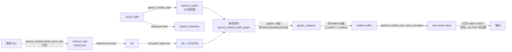
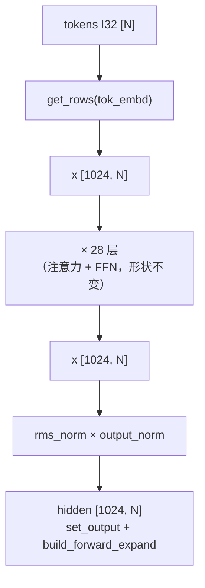

# frostfall.embed v0.1 —— Qwen3-Embedding-0.6B 推理代码逐接口详解

> 本文按"**整体数据流 → 新增模块逐个拆解 → 主流程 → 使用与对拍**"的顺序，讲解 v0.1 的每一份新增代码。
> 架构原理与超参数背景见 [design_embed.md](design_embed.md)；GGUF 层面的差异见
> [convert_hf_to_gguf_qwen3-0.6b_embed.md](convert_hf_to_gguf_qwen3-0.6b_embed.md)。
>
> 与 llm 版 [code_analysis_llm-v0.1.md](../llm/code_analysis_llm-v0.1.md) 大量共通的模块
> （`core/model.{h,cpp}` 权重加载、`core/tokenizer.{h,cpp}` BPE、`core/log.h`）本文不再重复，
> 只讲**差异**与**新增**。

---

## 0. 整体数据流



与 llm v0.1 的核心差异：

1. **无自回归**：`qwen3_embed_build_graph` 只跑一次，不循环。
2. **无 KV cache**：K/V 是本次图内的临时张量，随图释放。
3. **无 lm_head**：图输出是 final RMSNorm 后的 `[n_embd, n_tokens]` 隐层，不做 vocab 投影。
4. **无采样**：主流程末尾是"取最后一列 → pool → normalize → 打印"，没有 argmax/temperature。
5. **有 pooling + normalize**：新增一步定长向量化。
6. **有 instruction 模板**：query 侧前置 `"Instruct: {task}\nQuery:"`。
7. **必须手动追加 EOS**：GGUF 元数据 `add_eos_token=True`，但 `tokenizer.encode` 不做，
   调用层显式补 `151643`（详见 §5.1）。

---

## 1. 复用与新增文件

| 类别 | 文件 | 是否改动 | 说明 |
| --- | --- | --- | --- |
| 复用（零改动） | [src/core/model.{h,cpp}](../../src/core/model.h) | ❌ | 权重加载；`output.weight` 缺失时 fallback 到 `tok_embd`，Embedding 不用这一路，零成本 |
| 复用（零改动） | [src/core/tokenizer.{h,cpp}](../../src/core/tokenizer.h) | ❌ | BPE encode/decode |
| 复用（零改动） | [src/core/common.{h,cpp}](../../src/core/common.h)、[src/core/log.h](../../src/core/log.h) | ❌ | GGUF 辅助、日志 |
| 复用（零改动） | [src/llm/graph.{h,cpp}](../../src/llm/graph.h) | ❌ | llm 版的因果 LM 图，本模块不 include |
| 复用（零改动） | [third_party/ggml/](../../third_party/ggml/)、[third_party/nlohmann/json.hpp](../../third_party/nlohmann/json.hpp) | ❌ | ggml 后端与 JSON |
| **新增** | [src/embed/embed_graph.{h,cpp}](../../src/embed/embed_graph.h) | 🆕 | embed 专用计算图：无 KV / 无 lm_head / 输出隐层 |
| **新增** | [src/embed/pooling.{h,cpp}](../../src/embed/pooling.h) | 🆕 | last-token pool + MRL 截断 + L2 归一化 |
| **新增** | [src/embed/qwen3_embed_prompt.{h,cpp}](../../src/embed/qwen3_embed_prompt.h) | 🆕 | query instruction 模板拼接 |
| **新增** | [examples/embed/v0_1_smoke/v0_1_smoke.cpp](../../examples/embed/v0_1_smoke/v0_1_smoke.cpp) | 🆕 | 最小可跑 CLI |
| **新增** | [scripts/embed_reference.py](../../scripts/embed_reference.py) | 🆕 | Python 参考实现（transformers） |
| **新增** | [scripts/embed_v0_1_check.sh](../../scripts/embed_v0_1_check.sh) | 🆕 | 端到端 4 条相似度矩阵对拍 |
| **改** | [CMakeLists.txt](../../CMakeLists.txt)（根） | 🔧 | 模块源文件列表（CORE/LLM/EMBED）+ 单一共享库 |
| **新增** | [examples/embed/v0_1_smoke/CMakeLists.txt](../../examples/embed/v0_1_smoke/CMakeLists.txt) | 🆕 | 薄壳：两行，只链接 `frostfall` |

**llm 侧 0 改动**：所有 llm 目标（`examples/llm/api_test` 的 4 个调用示例）依然正常编译运行——
llm 与 embed 模块同处一个 `libfrostfall.so`，靠 `src/` 模块目录划清边界，互不干扰。


---

## 2. `embed_graph.{h,cpp}` —— 与 llm 版 `graph` 的差异

### 2.1 张量名契约

图的 3 个输入 + 1 个输出，用固定名字约定：

| 宏 | 名字 | 类型 / 形状 | 与 llm 版对比 |
| --- | --- | --- | --- |
| `QWEN3_EMBED_TENSOR_NAME_TOKENS` | `tokens` | I32 `[N]` | ✅ 相同 |
| `QWEN3_EMBED_TENSOR_NAME_POS` | `positions` | I32 `[N]` | ✅ 相同（v0.1 无 KV，值恒为 `0..N-1`） |
| `QWEN3_EMBED_TENSOR_NAME_MASK` | `kq_mask` | F32 **`[N, N]`** | ⚠️ llm v0.2+ 是 `[n_kv, N]`；v0.1 也是 `[N, N]`，这里回到 v0.1 形状 |
| `QWEN3_EMBED_TENSOR_NAME_HIDDEN` | **`hidden`** | F32 **`[n_embd, N]`** | 🆕 llm 版是 `logits [n_vocab, N]`；embed 图不过 lm_head，输出是 final RMSNorm 后的隐层 |

### 2.2 `qwen3_embed_build_graph`（对外主接口）

```cpp
struct ggml_cgraph * qwen3_embed_build_graph(
        struct ggml_context * ctx,      // 必须 no_alloc=true
        const qwen3_model    & model,
        int32_t                n_tokens,
        int                    max_nodes);
```

**签名比 llm v0.2 少了 `kv` 和 `n_past` 两个参数**——因为 embed 无 KV cache 也无 `n_past`。
参数只留：临时 ctx、模型、本次 token 数、图节点上限。

### 2.3 整体形状流转



超参与 llm 版完全相同：`n_embd=1024, n_head=16, n_head_kv=8, head_dim=128, n_ff=3072`。
28 层之间形状恒为 `[1024, N]`（残差要求进出等形）。

### 2.4 每层内部：与 llm 版 v0.1 的差异

**FFN、末端 RMSNorm、embedding 查表** 与 llm 版**逐算子相同**，直接看
[llm code_analysis §3.2 ③④](../llm/code_analysis_llm-v0.1.md) 即可。

**自注意力**只有 3 处细节改动，都是"因为无 KV cache"派生出来的：

#### 差异 ① K 的拼装方式

llm v0.1 里 `K` 需要经过 `permute(0,2,1,3)`；embed v0.1 一样，但用的是**本次层内直接算出来的 `kcur`**
而不是从 KV cache 里 `view_3d` 读出来的历史。

llm v0.2 及以上的写法是先 `ggml_cpy(kcur → cache_k)`、再从 cache 里 `view_3d` 读，
embed v0.1 完全**跳过写 cache** 这一步：

```cpp
// llm v0.2/v1.0（增量 KV，摘要）:
ggml_build_forward_expand(gf, ggml_cpy(ctx, kcur, k_dst));   // 写 cache
struct ggml_tensor * K = ggml_view_3d(ctx, kv.k[il], ...);   // 读 cache

// embed v0.1（无 cache）:
struct ggml_tensor * K = ggml_permute(ctx, kcur, 0, 2, 1, 3); // 直接用本层的 kcur
```

好处：graph 节点数少一大截，代码也短了；本次前向计算完就整体丢弃（`ggml_free(ctx)`），无需管 K/V 内存。

#### 差异 ② V 的转置

llm v0.2/v1.0 里 V 是从 cache 里 `view_3d` 后再 `cont(permute(V, 1,0,2,3))` 转置。
embed v0.1 里 V 直接从 `vcur = [head_dim, n_head_kv, N]` 一次 `permute(1,2,0,3)` 就变成
`[N, head_dim, n_head_kv]`，再 `cont` 让内存连续：

```cpp
struct ggml_tensor * V = ggml_permute(ctx, vcur, 1, 2, 0, 3); // [N, head_dim, n_head_kv]
V = ggml_cont(ctx, V);
```

`permute` 的 4 元组 `(0,1,2,3)` 是新排列下"新维度 → 原维度"的映射，
`(1,2,0,3)` 表示新的 ne0=原 ne1、新 ne1=原 ne2、新 ne2=原 ne0（等价于 llm 版
`view_3d(head_dim,n_kv,n_head_kv) + permute(1,0,2,3)` 的效果，只是省了中间 view）。

#### 差异 ③ mask 尺寸 `[N, N]`

llm v0.2/v1.0 的 `kq_mask` 形状是 `[n_kv, N]`（因为 K 包含 KV cache 里 `n_past` 个历史 token
+ 本次 `N` 个新 token）。embed v0.1 无历史，`n_kv = N`，mask 变正方形。构造仍是标准下三角：

```cpp
std::vector<float> mask_buf((size_t) N * N, 0.0f);
for (int32_t q = 0; q < N; ++q) {
    for (int32_t k = q + 1; k < N; ++k) {
        mask_buf[(size_t) q * N + k] = -INFINITY;
    }
}
```

> **causal mask 必须保留**：Embedding 模型仍是 decoder-only 因果注意力（基于 Qwen3-0.6B-Base），
> last-token pool 的语义就是"最后位置能看到前面全部 token"。如果误改成全 0 的双向 mask，
> 与官方数值会显著不同。

### 2.5 与 llm 版 v0.1 逐算子形状对照

| # | 算子 | Embedding v0.1 输出 | 说明 |
| --- | --- | --- | --- |
| 1 | `rms_norm × attn_norm` | `[1024, N]` | 输入归一化 |
| 2 | `mul_mat(wq)` / `wk` / `wv` | `[2048/1024/1024, N]` | Q/K/V 投影 |
| 3 | `reshape_3d(q/k/v)` | `[128, 16/8/8, N]` | 拆头维 |
| 4 | QK-Norm | 形状不变 | **必须在 RoPE 前** |
| 5 | `rope_ext(NEOX)` | 形状不变 | 位置 `0..N-1` |
| 6 | `permute(q/k, 0,2,1,3)` | `[128, N, 16/8]` | 头维换到 ne2 |
| 7 | `mul_mat(K, q)` | `[N, N, 16]` | ne2 8→16 **GQA broadcast** |
| 8 | `soft_max_ext(kq, kq_mask, 1/√128)` | `[N, N, 16]` | + causal mask |
| 9 | `cont(permute(vcur, 1,2,0,3))` | `[N, 128, 8]` | V 转置 |
| 10 | `mul_mat(V, kq)` | `[128, N, 16]` | kqv |
| 11 | `permute(kqv, 0,2,1,3)` + `cont_2d(2048,N)` | `[2048, N]` | 合并头 |
| 12 | `mul_mat(wo)` | `[1024, N]` | 输出投影 |
| 13 | `add(inp_attn, cur)` | `[1024, N]` | 残差 |
| 14 | FFN（rms_norm/gate/silu/up/down/add） | `[1024, N]` | 与 llm 完全一致 |
| 15 | `rms_norm × output_norm` | `[1024, N]` | 末端归一化 |
| 16 | `set_name("hidden") + set_output` | `[1024, N]` | ★ 到此为止，**不做 lm_head** |

`ggml_build_forward_expand(gf, x)` 把根节点标记为输出，`ggml_gallocr_alloc_graph` 分配
所有中间张量的 buffer，之后 `ggml_backend_graph_compute` 一次跑完。

### 2.6 与 llm 版 graph.cpp 复用的关键坑（原文照收）

- **RoPE 必须用 `GGML_ROPE_TYPE_NEOX`**，用 NORMAL 输出乱码。
- **QK-Norm 在 RoPE 之前**，顺序反了结果错。
- **GQA broadcast**：`ggml_mul_mat` 在 `ne2` 维（头维）自动广播。
- **各种 permute/cont** 是为了把张量摆成 `ggml_mul_mat` 期望的 batched 布局；`cont` 真正拷贝内存。

---

## 3. `pooling.{h,cpp}` —— last-token pool + MRL + L2

只有一个对外函数：

```cpp
std::vector<float> qwen3_embed_pool_and_normalize(
        const float * hidden_data,   // ggml F32 张量原始指针
        int32_t       n_embd,        // 1024
        int32_t       n_tokens,      // N
        int32_t       target_dim);   // 0 或 >=n_embd 表示满维；[32, n_embd) 表示 MRL 截断
```

### 3.1 hidden 张量的内存布局

`ggml_tensor` 形状 `[n_embd, n_tokens]` 意味着 `ne[0]=n_embd`（内存里变化最快的维度）、
`ne[1]=n_tokens`。所以内存是"每个 token 连续占 `n_embd` 个 float"：

```
token 0: [d0, d1, ..., d1023]  ← hidden_data[0 .. n_embd)
token 1: [d0, d1, ..., d1023]  ← hidden_data[n_embd .. 2*n_embd)
...
token N-1: [d0, d1, ..., d1023] ← hidden_data[(N-1)*n_embd .. N*n_embd)
```

**last-token pool 取最后一个 token 的整段向量**：

```cpp
const float * last = hidden_data + (int64_t)(n_tokens - 1) * n_embd;
std::vector<float> v(last, last + n_embd);
```

**为什么"最后一列"就是 last token**：v0.1 无 padding，序列末位就是真实内容的末位；
GGUF `add_eos_token=True` 要求这个末位是 `<|endoftext|>`(151643)，因此我们在
[v0_1_smoke.cpp](../../examples/embed/v0_1_smoke/v0_1_smoke.cpp) 里手动追加了这个 token（见 §5.1）。

### 3.2 三步顺序：pool → MRL 截断 → L2 归一化

```cpp
// 1) pool 已在上面得到 v (n_embd 维)

// 2) MRL 截断
if (target_dim > 0 && target_dim < n_embd) {
    v.resize(target_dim);   // 前 target_dim 维
}

// 3) L2 归一化
double sq = 0.0;
for (float x : v) sq += (double)x * (double)x;
const float norm = (float) std::sqrt(sq);
if (norm > 0.0f) {
    const float inv = 1.0f / norm;
    for (float & x : v) x *= inv;
}
```

**顺序不能反**：如果先 L2 归一化再截断，得到的向量 `‖v[:target_dim]‖₂ < 1`，
就不再是单位向量，与官方语义不符（官方 `sentence-transformers` 的 `Normalize` 层
就是"pool → 归一化"，但 MRL 场景下必须先截再归）。

### 3.3 累加用 `double`、缩放用 `float`

`sq` 用 `double` 累加是为避免 F16→F32 反量化后长向量（1024 维）平方和累积误差；
`norm/inv/x *=` 保持 `float` 是因为最终输出就是 `float`，没必要多花一次转换。

---

## 4. `qwen3_embed_prompt.{h,cpp}` —— 极简的模板拼接

```cpp
extern const char * const QWEN3_EMBED_DEFAULT_QUERY_TASK;   // 官方默认 task
std::string qwen3_embed_build_query_text(const std::string & text,
                                         const std::string & task);
```

实现只有 4 行有效代码：

```cpp
const char * const QWEN3_EMBED_DEFAULT_QUERY_TASK =
    "Given a web search query, retrieve relevant passages that answer the query";

std::string qwen3_embed_build_query_text(const std::string & text,
                                         const std::string & task) {
    const std::string & t = task.empty() ? std::string(QWEN3_EMBED_DEFAULT_QUERY_TASK) : task;
    return "Instruct: " + t + "\nQuery:" + text;
}
```

**注意**：官方模板是 `"Instruct: {task}\nQuery:{text}"`，
**`Query:` 冒号后没有空格**（与 `Instruct:` 后有空格不对称，容易写反）。
默认 task 来自 HF 模型目录下 `config_sentence_transformers.json` 里 `prompts.query` 的值。

**document 侧不加前缀**：调用方只在 `is_query=true` 时才调用该函数，
`is_query=false` 直接把原始 `text` 送进 tokenizer。

### 4.1 这不是 ChatML

名字带"模板"，但它与 llm 版 `qwen3_chat.cpp` 的 ChatML 是两套东西。差异根源于模型血统：
Qwen3-Embedding 基于 **Qwen3-0.6B-Base**（基座）做对比学习微调，不是经对话微调的 Instruct 版，
输入没有 `<|im_start|>` / `<|im_end|>` 包裹、没有 role——旁证是 embed 的 eos 为
`<|endoftext|>`(151643) 而非 chat 版 `<|im_end|>`(151645)（见
[convert_hf_to_gguf_qwen3-0.6b_embed.md](convert_hf_to_gguf_qwen3-0.6b_embed.md) §4.2）。

| | llm 版 ChatML | embed 版 instruction 前缀 |
| --- | --- | --- |
| 本质 | 结构化多轮对话协议（CONTROL token + role） | 纯文本任务指令前缀 |
| 来源 | Instruct 版对话微调 | `config_sentence_transformers.json` 的 `prompts.query` |
| 参与链路 | 拼协议 → encode → 生成至 `<\|im_end\|>` → 输出切分 | 仅 encode 前一次字符串拼接 |

为什么要有这个前缀：检索是**非对称**任务（query 短、document 长），对比微调时 query 侧数据
就带着 `Instruct:\nQuery:` 前缀喂入，推理必须原样复现才能对齐官方数值；document 训练时即原文，
故不加。

---

## 5. `examples/embed/v0_1_smoke/v0_1_smoke.cpp` —— 主链路

### 5.1 关键坑：手动追加 `<|endoftext|>`(151643)

```cpp
std::vector<int32_t> ids = tokenizer.encode(input);
int32_t eos_id = model.hparams.eos_token_id > 0 ? model.hparams.eos_token_id : 151643;
ids.push_back(eos_id);
```

**为什么必须补**：
- GGUF 元数据 `tokenizer.ggml.add_eos_token = True`，官方 `AutoTokenizer.__call__(text)`
  会自动在末尾追加 `<|endoftext|>`；
- 项目现有 [src/core/tokenizer.cpp](../../src/core/tokenizer.cpp)（v0.2 引入时按 llm 默认 `add_eos_token=False` 实现）
  **不处理这个标志**，`encode()` 返回的 ids 不含 EOS；
- Embedding 走 last-token pool，序列末位的 hidden 决定输出向量；缺 EOS 会取到句尾标点位置的
  hidden，与官方 cosine 显著偏差。

v1.0 会把这段逻辑收进 `EmbeddingEngine`，由引擎读 `hparams` + `add_eos_token` 标志自动追加。

### 5.2 主流程 8 步

时序与 §0 数据流图一致，源码要点：

1. **加载**：`qwen3_model_load` + `ggml_backend_cpu_set_n_threads` + `tokenizer.load`
   （tokenizer 和 model 从**同一个 GGUF** 读，元数据一致）。
2. **prompt 组装**：`--is-query` 走 [qwen3_embed_prompt](../../src/embed/qwen3_embed_prompt.h)，否则用原文。
3. **encode + 追加 EOS**（§5.1）。
4. **构图**：no_alloc ctx + `qwen3_embed_build_graph(ctx, model, N, 8192)`（`kMaxNodes` 与 llm 版一致）。
5. **分配 & 填输入**：`positions[i]=i`；`kq_mask[q][k] = (k>q ? -INFINITY : 0)`（下三角）。
6. **计算**：`ggml_backend_graph_compute(model.backend, gf)`。
7. **取输出**：`ggml_backend_tensor_get` 把整段 `[n_embd, N]` 拷回 host。
8. **pool + normalize + 打印**：`qwen3_embed_pool_and_normalize` → stdout 一行 JSON；`--out` 另写全量。


---

## 6. 使用与对拍

### 6.1 三件套分工

| 组件 | 角色 | 输入 → 输出 |
| --- | --- | --- |
| [v0_1_smoke](../../examples/embed/v0_1_smoke/v0_1_smoke.cpp)（C++） | **被测实现** | GGUF + text → stdout 一行 JSON；`--out` 写全量 `v_all` |
| [embed_reference.py](../../scripts/embed_reference.py)（transformers） | **参考实现** | HF 模型目录 + text → stdout JSON（恒含 `v_all`） |
| [embed_v0_1_check.sh](../../scripts/embed_v0_1_check.sh) | **对拍驱动** | 编排前两者各跑 4 条 → 2×2 矩阵 + 逐条 cosine + PASS/FAIL |

对接契约：两侧 stdout 均为单行 JSON `{dim, n_tokens, norm, v8}`，参考侧多一个 `v_all`；
日志一律走 stderr，不污染结果流。参考实现刻意**不走 sentence-transformers**（显式
`last_token_pool + F.normalize`），避免黑盒 pooling 干扰定位；且用 **fp32** 权重——
C++ 侧是 F16 计算，用 fp32 参考才能量化误差（两边都 F16 会把误差掩盖）。

### 6.2 构建与单次运行

GGUF 按 [convert_hf_to_gguf_qwen3-0.6b_embed.md](convert_hf_to_gguf_qwen3-0.6b_embed.md) 转换得到后：

```bash
cmake -B build -DCMAKE_BUILD_TYPE=Release && cmake --build build -j$(nproc)
./build/examples/embed/v0_1_smoke/v0_1_smoke models/qwen3-embedding-0.6b-f16.gguf \
    --text "The capital of China is Beijing."
```

```
./v0_1_smoke <model.gguf> [--text "..."] [--is-query] [--task "..."]
                          [--target-dim N] [--threads N] [--out FILE]
```

| 参数 | 默认 | 作用 |
| --- | --- | --- |
| `--text` | 从 stdin 读到 EOF | 输入文本 |
| `--is-query` | false | 拼 `Instruct:\nQuery:` 前缀（§4） |
| `--task` | 官方默认模板 | 覆写 task 描述 |
| `--target-dim` | 0（=满维 1024） | MRL 截断到 32..1024 |
| `--threads` | 8 | CPU backend 线程数 |
| `--out` | 无 | 全量向量 JSON 写文件（供对拍） |

### 6.3 单条对拍

同一条文本两侧各跑一遍，比 `v8` 或用 `v_all` 算 cosine：

```bash
# C++ 侧（F16 权重）
./build/examples/embed/v0_1_smoke/v0_1_smoke models/qwen3-embedding-0.6b-f16.gguf \
    --text "What is the capital of China?" --is-query --out /tmp/cpp.json

# 参考侧（transformers fp32，HF 模型目录按需替换）
conda run -n llm python scripts/embed_reference.py \
    --model /path/to/Qwen3-Embedding-0.6B \
    --text "What is the capital of China?" --is-query > /tmp/ref.json
```

`embed_reference.py` 参数与 C++ 侧对齐（`--text / --is-query / --task / --target-dim`），
另多 `--model`（HF 目录）与 `--dtype`（默认 float32）。比对任意 JSON 工具均可，例如：

```python
import json, numpy as np
a = np.array(json.load(open("/tmp/cpp.json"))["v_all"])
b = np.array(json.load(open("/tmp/ref.json"))["v_all"])
print("cosine =", float(a @ b))   # 两侧均已 L2 归一化，点积即 cosine
```

### 6.4 端到端对拍（一键）

```bash
# 脚本顶部的 MODEL_GGUF / MODEL_HF 可用同名环境变量覆盖
MODEL_HF=/path/to/Qwen3-Embedding-0.6B bash scripts/embed_v0_1_check.sh
```

脚本流程：官方 README 的 4 条示例（2 query + 2 doc）→ C++、参考各跑一遍 → 内嵌 Python
汇总输出 2×2 相似度矩阵与逐条 cosine，按阈值判定：4 条 cosine（C++ vs ref）均 **≥ 0.999**
且 C++ 矩阵与官方矩阵逐元素 abs diff **≤ 0.01**，打印 PASS/FAIL。

实测（2026-07-31，PASS）：

```
frostfall(C++, F16):    [[0.76457, 0.14149], [0.13552, 0.59993]]
transformers ref fp32:  [[0.76456, 0.14143], [0.13550, 0.59996]]
official (README):      [[0.7646,  0.1414 ], [0.1355,  0.6000 ]]
```

| 指标 | 阈值 | 实测 |
| --- | --- | --- |
| C++ vs ref 单条 cosine | ≥ 0.999 | **0.9999998** |
| 1024 维逐维 abs-diff max | ≤ 5e-3 | **8.2e-5** |
| 官方 2×2 矩阵每元素 diff | ≤ 0.01 | **9.5e-5** |
| 4 条 (query+doc) 逐条 cosine | ≥ 0.999 | **1.000000**（全部） |
| MRL 256/512/1024 均单位向量 | `‖v‖₂≈1` | ✅ |
| MRL 256 vs ref cosine | ≥ 0.999 | **0.9999998** |

---

## 7. v0.1 已知简化 / v1.0 演进

| 简化点 | 影响 | v1.0 计划 |
| --- | --- | --- |
| 只支持**单条文本** | 无 batch，多条只能串行调 | ✅ v1.0 加静态 batch（左 padding + attention mask） |
| **函数式 API** | 无类封装，每次调用都要手动 gallocr/ctx/allocr | ✅ v1.0 引入 `EmbeddingEngine` |
| 手动追加 EOS 在**调用层**做 | 用户容易忘 | ✅ v1.0 收进 `EmbeddingEngine::Embed` 内部 |
| **无 JSON 配置** | 所有参数走 CLI | ✅ v1.0 `Init(EngineConfig) / InitFromJsonFile / InitFromJsonString` 三入口 |
| **model.output 冗余 fallback** | 已 fallback 到 `tok_embd`，实际零内存开销（Embedding GGUF 里根本没这个张量） | 保持现状，v1.0 也不用 skip |
| 只支持 CPU backend | 无 GPU | 与 llm 版正交，暂不排期 |
| 只支持 Qwen3-Embedding-0.6B | 无多架构 | 教学定位，刻意不做 |

**核心对拍手段**：`scripts/embed_reference.py` + `scripts/embed_v0_1_check.sh` 已跑绿，
后续版本改动都需过这两个脚本回归。
