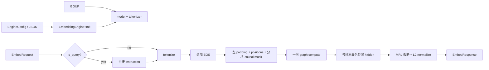

# frostfall.embed v1.0 —— `EmbeddingEngine` API 与静态 batch 实现

> 本文面向两类读者：需要集成 `EmbeddingEngine` 的调用方，以及需要检查 batch 数值正确性的维护者。
> 建议先读 §1～§3；只有在排查 padding、mask 或 batch/single 不一致时，再深入 §4。
>
> 架构背景与模型差异见 [design_embed.md](design_embed.md)；底层 graph、pooling 和 prompt
> 的逐算子说明见 [code_analysis_embed-v0.1.md](code_analysis_embed-v0.1.md)。本文只展开 v1.0 新增的 API 封装与静态 batch。

---

## 1. 版本定位与代码地图

v1.0 把 v0.1 中由调用方手写的单条推理链路收进 `Frostfall::EmbeddingEngine`：调用方初始化一次引擎，之后只需提交文本并读取归一化后的向量。

主要变化：

1. 用 `EngineConfig`、`EmbedRequest`、`EmbedResponse` 提供稳定的库 API。
2. 支持结构体、JSON 文件和 JSON 字符串三种初始化方式。
3. 在库内统一处理 query instruction、EOS、MRL 截断和 L2 normalize。
4. 支持多条文本在同一张图中执行的静态 batch。
5. 提供单条调用和 batch 相似度两个最小示例。

关键文件：

| 文件 | 职责 |
| --- | --- |
| [src/embed/embed_types.h](../../src/embed/embed_types.h) | 请求、响应和统计类型 |
| [src/embed/embedding_engine.h](../../src/embed/embedding_engine.h) | `EmbeddingEngine` 公共接口与配置 |
| [src/embed/embedding_engine.cpp](../../src/embed/embedding_engine.cpp) | 初始化、batch 构造、前向、pooling 和错误处理 |
| [src/embed/embed_graph.{h,cpp}](../../src/embed/embed_graph.h) | 无 KV cache、无 lm_head 的 embedding graph |
| [src/embed/pooling.{h,cpp}](../../src/embed/pooling.h) | last-token pool、MRL 截断和 L2 normalize |
| [examples/embed/v1_0_api/](../../examples/embed/v1_0_api) | blocking 与 batch 示例 |

当前分支维护的是 v1.0 API 及其示例。v0.1 的裸函数 smoke CLI 只作为历史背景，不是当前编译和回归入口。

---

## 2. 架构与生命周期

### 2.1 一次请求如何流转



和 v0.1 相比，EOS、query 模板和向量后处理都成为库内契约，调用方不应再重复实现。

### 2.2 初始化与资源生命周期

`Init` 按以下顺序执行：

```text
校验配置
  → 释放上一次 Init 的 allocator/model
  → 加载 GGUF model
  → 设置 CPU 线程数
  → 加载 tokenizer
  → n_ctx = min(config.n_ctx, n_ctx_train)
  → 创建 graph allocator
  → 记录 load_ms，标记 initialized
```

模型、tokenizer 和 graph allocator 会一直保留到析构或下一次 `Init`，因此正常用法是“初始化一次，重复调用 `Embed`”。`Init` 返回 `false` 时，优先检查 `model_path`、GGUF 完整性和 tokenizer 元数据。

### 2.3 线程模型

同一个 engine 可以被多个线程调用，但不会并行执行推理：

- `infer_mutex` 串行化 `Init` 和 `Embed`，保护模型、tokenizer、allocator 与临时图。
- `stats_mutex` 保护最近一次统计的读写。

因此“接口线程安全”不等于“同一实例内并行推理”。v1.0 也不支持 continuous batching；如需并发吞吐，应在更高层调度请求或使用多个独立实例，并评估模型内存成本。

---

## 3. 公共 API 与行为契约

### 3.1 初始化配置

```cpp
Frostfall::EmbeddingEngine engine;

Frostfall::EmbeddingEngine::EngineConfig cfg;
cfg.model_path = "models/qwen3-embedding-0.6b-f16.gguf";
cfg.target_dim = 256;

if (!engine.Init(cfg)) {
    // 初始化失败
}
```

也可以从 JSON 初始化：

```cpp
bool InitFromJsonFile(const std::string& path);
bool InitFromJsonString(const std::string& json);
```

三个入口最终都使用同一个 `EngineConfig`：

| 字段 | 默认值 | 含义 |
| --- | ---: | --- |
| `model_path` | 空 | GGUF 路径，唯一必填项 |
| `n_ctx` | 8192 | 单条文本最大 token 数，实际值不超过模型的 `n_ctx_train` |
| `n_threads` | 8 | CPU backend 线程数 |
| `max_batch` | 8 | 单次请求最多包含的文本数 |
| `target_dim` | 1024 | 请求未指定维度时的默认输出维度 |
| `pad_token_id` | 151643 | 左 padding token；负数时回退到 tokenizer pad/EOS |
| `default_task` | 官方检索任务描述 | query 未传 `task` 时使用 |

`n_ctx` 限制的是 batch 内每条文本的长度，不是展平后的 `total_tokens`。

### 3.2 请求、响应与统计

批量接口是主接口：

```cpp
Frostfall::EmbedRequest req;
req.texts = {"What is gravity?", "How do I bake bread?"};
req.is_query = true;
req.target_dim = 256;

Frostfall::EmbedResponse resp = engine.Embed(req);
if (!resp.error.empty()) {
    // 失败：不要读取 embeddings
}
```

`EmbedRequest` 的契约：

| 字段 | 说明 |
| --- | --- |
| `texts` | 非空文本列表，数量不得超过 `max_batch` |
| `is_query` | 为 `true` 时，所有文本都拼接 query instruction |
| `task` | 覆盖本次 query task；为空时使用 `default_task` |
| `target_dim` | 请求级输出维度；`0` 表示使用引擎默认值 |

`is_query` 和 `task` 都是请求级字段，因此同一请求不能混合 query 与 document。检索场景应分别调用两次：一次编码 queries，一次编码 documents。

成功时：

- `error.empty()`；
- `embeddings.size() == req.texts.size()`；
- 每条向量长度等于 `dim`；
- 每条向量已经 L2 归一化，点积可直接作为 cosine 相似度。

失败时 `error` 非空，`embeddings` 为空；`stats` 仍可能保留失败前已经完成阶段的数据。

`EmbedStats` 用于定位耗时，而不是累计指标：

| 字段 | 含义 |
| --- | --- |
| `load_ms` | 最近一次成功初始化的模型和 tokenizer 加载耗时 |
| `tokenize_ms` | 本次模板拼接、分词和追加 EOS 的耗时 |
| `compute_ms` | 本次 graph 前向耗时 |
| `pool_ms` | 读取 hidden、截断和归一化的耗时 |
| `n_tokens_max` | batch 内最长序列的 token 数，包含 EOS |
| `n_texts` | 本次 batch 大小 |

`GetLastStats()` 返回最近一次成功走到统计写回的 `Embed` 数据。若只需单条向量，也可用便利重载：

```cpp
std::vector<float> vec = engine.Embed(text, is_query, task);
```

该重载失败时只返回空向量，拿不到具体错误；需要诊断时应使用 `EmbedRequest` 接口。

### 3.3 `is_query` 与 `task`：含义、实现和模型适配

这两个参数只控制**分词前的输入格式**：`is_query` 选择输入角色，`task` 填充 query instruction。它们不会让引擎切换另一套模型或计算图。

| 参数 | 直接作用 | 不负责的事情 |
| --- | --- | --- |
| `is_query` | 决定使用 query 模板还是保留原文 | 不执行检索，不切换权重、graph 或相似度算法 |
| `task` | 描述 query 希望检索什么内容 | 不是分类标签或过滤条件，也不会自动开启 query 模式 |

可以把它们理解为：

```text
is_query = 这批文本是“搜索请求”还是“候选文档”？
task     = 如果是搜索请求，希望找到什么类型的结果？
```

例如，query 请求可以写成：

```cpp
Frostfall::EmbedRequest query_req;
query_req.texts = {"北京有什么好吃的？"};
query_req.is_query = true;
query_req.task = "Retrieve passages that answer the user's question";
```

document 请求则保留原文：

```cpp
Frostfall::EmbedRequest doc_req;
doc_req.texts = {
    "北京烤鸭是北京著名的传统美食。",
    "上海小笼包以皮薄馅多著称。"
};
doc_req.is_query = false;
```

#### 代码执行链路

`EmbeddingEngine::Embed` 先解析 task，再逐条构造 tokenizer 的输入：

```cpp
const std::string& task =
    req.task.empty() ? impl_->config.default_task : req.task;

for (const std::string& text : req.texts) {
    const std::string input = req.is_query
        ? qwen3_embed_build_query_text(text, task)
        : text;

    std::vector<int32_t> ids = tokenizer.encode(input);
    ids.push_back(eos);
}
```

完整分支如下：

```text
原始 text
  ├─ is_query=false → input = text ─────────────────────┐
  │                                                     │
  └─ is_query=true  → 选择 task                         │
                       ├─ req.task 非空：使用请求值      │
                       └─ 否则：使用 config.default_task │
                              ↓                          │
                       拼 Qwen3 query 模板 ──────────────┤
                                                        ↓
                                            tokenize → 追加 EOS
                                                        ↓
                                             同一套 batch 与 graph
                                                        ↓
                                     last-token pool → normalize
```

当前 `qwen3_embed_build_query_text` 生成：

```text
Instruct: {task}
Query:{text}
```

若传给 prompt builder 的 task 仍为空，它内部还会回退到：

```text
Given a web search query, retrieve relevant passages that answer the query
```

因此有四个容易混淆的结论：

1. `task` 只有在 `is_query=true` 时才进入模型输入；document 请求即使设置了 `task`，结果也不受影响。
2. `task` 不会自动把请求变成 query，必须显式设置 `is_query=true`。
3. query 和 document 后续使用完全相同的 tokenizer、EOS、graph、pooling 和 normalize；最终向量不同，是因为模板改变了 token 序列。
4. 两个参数都是 batch 级字段，同一 `EmbedRequest` 中的所有文本共享同一种角色和 task。

#### 为什么这是 Qwen3 契约，而不是通用规则

区分 query/document 是非对称语义检索中的常见概念，但**具体前缀是模型训练契约**。Qwen3-Embedding 官方用法要求 query 携带一条任务 instruction，而检索文档无需添加 instruction；当前 API 正是对这个约定的封装。参见 [Qwen3-Embedding 官方用法](https://github.com/QwenLM/Qwen3-Embedding#usage)。

其他模型可能采用不同格式：

| 模型/模式 | query 输入 | document 输入 | 当前实现能否直接复用 |
| --- | --- | --- | --- |
| Qwen3-Embedding | `Instruct: {task}\nQuery:{text}` 一类模板 | 原文 | 可以，当前 builder 为它定制 |
| E5 | `query: {text}` | `passage: {text}` | 不可以，需要同时格式化两种角色 |
| 无 prompt 的对称模型 | 原文 | 原文 | 不需要 `task`，两边可走同一格式 |
| Sentence Transformers 中配置了 prompt/router 的模型 | 由模型的 query/document prompt 或路由决定 | 同左 | 应调用或复刻该模型配置，不能假设固定模板 |

E5 的模型卡明确说明 `query:` / `passage:` 是训练时采用的前缀，遗漏会降低效果；Sentence Transformers 也说明，只有模型定义了 prompt 或任务路由时，query/document 编码才会不同。参见 [E5 模型卡](https://huggingface.co/intfloat/e5-base#faq) 和 [Sentence Transformers：对称与非对称检索](https://sbert.net/examples/sentence_transformer/applications/semantic-search/README.html#symmetric-vs-asymmetric-semantic-search)。

因此更换 embedding 模型时，应同时核对并适配：输入前缀、query/document 是否对称、pooling、padding、EOS、归一化和输出维度。`is_query` 可以保留为通用的“输入角色”抽象，但 `qwen3_embed_build_query_text` 和 `task` 的当前语义不能直接套给所有模型。

> **模板版本注意**：当前仓库代码固定为 `"Instruct: " + task + "\nQuery:" + text`；Qwen 官方仓库目前展示的示例在换行后还有一个空格，即 `\n Query:`。若需要与特定 Python 参考实现严格数值对拍，应以目标模型版本采用的模板为准，固定同一字符串后再比较，不能忽略空白差异。

### 3.4 输出维度规则

维度先取请求值；请求为 `0` 时取引擎默认值，然后按下表解析：

| 解析后的值 | 行为 |
| --- | --- |
| `<= 0` | 使用模型满维 `n_embd` |
| `1..31` | 返回错误 |
| `32..n_embd-1` | MRL 截断到该维度 |
| `>= n_embd` | 使用模型满维 `n_embd` |

后处理顺序必须是“先截断，再 L2 normalize”。反过来会让截断向量的范数小于 1。

---

## 4. `Embed` 与静态 batch 的核心实现

这是 v1.0 最需要理解的部分。实现没有把 graph 改成三维 batch，而是把所有样本展平成一个 token 轴，再用 mask 隔离样本。

### 4.1 六个执行阶段

| 阶段 | 关键行为 | 主要失败条件 |
| --- | --- | --- |
| 1. 校验请求 | 检查初始化状态、空 batch 和 `max_batch` | 未初始化、文本为空、batch 过大 |
| 2. 解析维度 | 合并请求值与默认值 | 维度落在 `1..31` |
| 3. 文本转 token | 可选 query 模板，每条末尾追加 EOS | 单条长度超过 `n_ctx` |
| 4. 构造 batch | 左 padding，生成 positions 和 mask | `total_tokens²` 内存压力 |
| 5. 前向计算 | 构图、分配、填张量、执行 backend | graph/backend 异常 |
| 6. 生成向量 | 取每条最后位置，MRL 截断并归一化 | hidden 读取或数值异常 |

EOS 由库内部自动追加：

```cpp
std::vector<int32_t> ids = tokenizer.encode(input);
ids.push_back(eos);
```

EOS id 依次回退到 model metadata、tokenizer metadata、`151643`。调用方不要把 EOS 拼进文本，否则会重复追加，并改变 last-token pooling 的位置与结果。

### 4.2 展平、左 padding 与 pooling 位置

设 batch 大小为 `B`，batch 内最长序列长度为 `L`，则 graph 看到：

```text
total_tokens = B × L
tokens       = [total_tokens]
positions    = [total_tokens]
kq_mask      = [total_tokens, total_tokens]
hidden       = [n_embd, total_tokens]
```

例如两条序列长度分别为 3 和 5：

```text
flat index:  0  1  2  3  4 | 5  6  7  8  9
sample:      sample 0       | sample 1
tokens:      P  P  a  b EOS | c  d  e  f EOS
positions:   0  0  0  1  2 | 0  1  2  3  4
```

短序列必须左 padding，这样每个样本块的最后一个位置都是真实 EOS。pooling 因而可以统一读取：

```cpp
last_index = b * max_len + (max_len - 1);
```

如果改成右 padding，这个索引会读到 pad hidden，向量将无法与参考实现对齐。

### 4.3 分块 causal mask

普通的全局下三角 mask 不够：它会让后面的样本看到前面样本。v1.0 使用 block-diagonal causal mask，同时隔离样本、保留 decoder-only 语义并屏蔽真实 token 左侧的 pad key。

对两个样本，可把允许 attention 的区域理解为：

```text
             keys
           sample 0 | sample 1
queries  ┌──────────┬──────────┐
sample 0 │ causal   │  -INF    │
         │ block    │          │
         ├──────────┼──────────┤
sample 1 │  -INF    │ causal   │
         │          │ block    │
         └──────────┴──────────┘
```

精确规则：

| query/key 关系 | mask |
| --- | --- |
| 属于不同样本 | `-INF` |
| query 是真实 token、key 是其左侧 pad | `-INF` |
| 同一样本且 `key_position <= query_position` | `0` |
| 同一样本且 key 位于 query 右侧 | `-INF` |

pad query 自身仍保留可见位置，避免出现整行 `-INF` 导致 softmax 产生 NaN；但真实 query 看不到 pad key，因此 pad 不会进入真实 token 的 softmax 分母。

### 4.4 为什么能复用 v0.1 graph

`qwen3_embed_build_graph` 只依赖 `total_tokens`，不理解 batch 边界：

- 每个样本的 `positions` 在自己的块内重新从 0 计数；
- `kq_mask` 负责切断跨样本 attention；
- graph 输出统一的 `[n_embd, total_tokens]` hidden；
- 调用层再按 `b * max_len + max_len - 1` 拆回各样本向量。

这使 v1.0 无需改动底层 graph 签名，适合教学、小 batch 和较短文本，但不是吞吐优化方案。mask 实际分配为：

```text
(B × L)² 个 float ≈ 4 × B² × L² bytes
```

例如 batch 或文本长度翻倍，mask 内存都会显著增长。出现大 batch 长文本 OOM 或构图缓慢时，应先检查 `total_tokens`，而不是只看 `max_batch` 或单条 `n_ctx`。

---

## 5. 示例与正确性验证

### 5.1 最小运行方式

构建：

```bash
cmake -B build -DCMAKE_BUILD_TYPE=Release
cmake --build build -j$(nproc)
```

单条 document：

```bash
./build/examples/embed/v1_0_api/embed_blocking \
  examples/embed/v1_0_api/embed_conf.json \
  --text "The capital of China is Beijing." --target-dim 256
```

query 路径增加 `--is-query`，需要时再用 `--task` 覆盖默认任务。batch 示例：

```bash
./build/examples/embed/v1_0_api/embed_batch \
  examples/embed/v1_0_api/embed_conf.json --target-dim 256
```

两个示例各自验证：

| 示例 | 主要覆盖 |
| --- | --- |
| `embed_blocking.cpp` | JSON 初始化、单条 document/query、请求级维度、stats |
| `embed_batch.cpp` | query/doc 分离、静态 batch、2×2 cosine 相似度矩阵 |

输出中 `dim` 应与请求一致，向量 norm 应接近 1。相似度矩阵的对角线通常应高于非对角线，但示例句子只是 smoke 数据，不是固定数值金标。

### 5.2 必做回归：batch 与 single 一致性

v1.0 最重要的验证不是“程序能运行”，而是同一文本在 batch 和单条调用中得到相同结果：

1. 对一组不同长度的文本执行一次 batch。
2. 对同一组文本逐条执行 single。
3. 逐条比较两种结果的 cosine，应接近 1。

这一个测试能同时发现样本间泄漏、position 重置错误、左 padding 屏蔽错误和 `last_index` 错误。建议再覆盖：

| 用例 | 主要检查 |
| --- | --- |
| 长短文本混合 | 左 padding 与 pad key 屏蔽 |
| `target_dim=256/512/1024` | 截断维度及“截断后归一化” |
| 同一文本分别作为 query/document | instruction 模板是否生效 |
| 接近 `n_ctx` 的文本 | 长度校验与 mask 内存压力 |

### 5.3 与 transformers 对拍

需要验证数学结果时，Python 参考侧必须使用同一模型，并与 C++ 保持以下条件一致：

- tokenizer 使用 left padding；
- 每条序列包含相同的 EOS；
- 模型保持 decoder-only causal attention；
- 使用 last-token pool；
- MRL 截断后再执行 L2 normalize。

若 single 已能对齐而 batch 不能，问题通常在展平布局、positions 或 block-diagonal mask；若 single 也不能对齐，再检查 tokenizer、EOS、graph 和 pooling。

---

## 6. 限制与排障速查

| 现象 | 常见原因 | 检查重点 |
| --- | --- | --- |
| 向量与参考实现差异大 | 使用了右 padding | EOS 是否位于每个样本块末尾 |
| batch 与 single 不一致 | 样本间 attention 泄漏 | mask 是否为 block-diagonal |
| 输出出现 NaN | 某个 mask query 行全为 `-INF` | pad query 是否至少保留一个可见 key |
| 单条也无法对齐 | EOS、causal mask 或 tokenizer 不一致 | 是否重复/遗漏 EOS，是否误改双向 attention |
| 截断向量 norm 小于 1 | 先归一化后截断 | pooling 顺序应为截断 → normalize |
| query/doc 相似度异常 | 两类文本混在同一请求或模板错误 | 按 `is_query` 拆成两次请求，并核对 §3.3 的模型模板 |
| 大 batch 长文本 OOM/很慢 | 方形 mask 为 `O((B×L)²)` | 降低 batch/长度，或重构 batch graph |
| 多线程调用没有吞吐提升 | 单 engine 内部串行化 | 在上层调度或评估多实例 |

理解 v1.0 时，最重要的三个不变量是：每条序列以 EOS 结束、真实 token 不关注 padding/其他样本、MRL 截断发生在归一化之前。只要这三点和 batch-vs-single 回归成立，API 封装层的主要数值风险就得到了覆盖。
