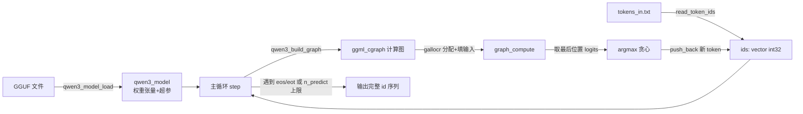
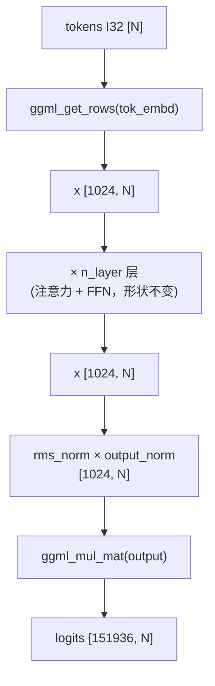

# frostfall v0.1 —— 推理框架代码逐接口详解

> 本文按“**数据结构 → 加载 → 构图 → 主循环 → 日志**”的顺序，逐个接口拆解 v0.1 源码。
> 架构原理与超参数背景见 [design.md](design.md)；本文只讲“代码里每个接口做了什么、为什么这么写、有哪些坑”。

源码文件（`src/`）：

| 文件 | 职责 |
| --- | --- |
| [model.h](../src/core/model.h) / [model.cpp](../src/core/model.cpp) | 模型数据结构 + 从 GGUF 加载权重 |
| [graph.h](../src/llm/graph.h) / [graph.cpp](../src/llm/graph.cpp) | 构建 Qwen3 单步前向的 ggml 计算图 |
| [main.cpp](../src/main.cpp) | 主链路：加载 → 构图 → 前向 → 贪心解码 → 循环 |
| [log.h](../src/core/log.h) | 头文件内实现的轻量流式日志（glog 兼容） |

---

## 0. 整体数据流



关键设计取舍（v0.1）：

1. **tokenizer 不在 C++ 里**：prompt 的分词、解码都交给 Python 脚本，本程序只读写 token id。
2. **没有增量 KV cache**：每生成一个 token，都把“当前完整序列”从头重算一遍（O(n²)，但最简单、最不容易写错）。

---

## 1. 数据结构（model.h）

### 1.1 `struct qwen3_hparams` —— 超参数

从 GGUF 元数据读出的所有超参数集中放在这里。字段与含义：

| 字段 | 含义 | 备注 |
| --- | --- | --- |
| `n_vocab` | 词表大小 | 从 `token_embd` 形状读，比元数据 key 更可靠 |
| `n_embd` | hidden_size | |
| `n_layer` | Transformer block 数 | |
| `n_head` | Query 头数 | |
| `n_head_kv` | KV 头数 | GQA，`n_head_kv <= n_head` |
| `n_embd_head` | 每个头的维度 head_dim | **≠ `n_embd/n_head`**，是独立超参 |
| `n_ff` | FFN 中间维度 | |
| `n_ctx_train` | 训练上下文上限 | 超过就停 |
| `rms_norm_eps` | RMSNorm epsilon | 默认 `1e-6` |
| `rope_freq_base` | RoPE 频率基数 | 默认 `1e6` |
| `eos_token_id` / `eot_token_id` / `bos_token_id` | 特殊 token | 用于判断生成停止 |

两个便捷方法：

```cpp
int32_t n_embd_head_all() const { return n_embd_head * n_head; }    // Q 投影展平维度
int32_t n_embd_kv_all()   const { return n_embd_head * n_head_kv; } // K/V 投影展平维度
```

> ⚠️ **核心坑**：Qwen3-0.6B 里 `head_dim(128) * n_head(16) = 2048 ≠ n_embd(1024)`。
> 所以 Q/K/V 投影后的维度必须按 `head_dim` 算，绝不能用 `n_embd` 想当然。

### 1.2 `struct qwen3_layer` —— 单层权重

一个 Transformer block 的 11 个权重张量指针（都指向 `ctx_data` 里由 GGUF 建好的张量）：

| 字段 | 形状 | 作用 |
| --- | --- | --- |
| `attn_norm` | `[n_embd]` | 输入 RMSNorm 权重 |
| `wq` | `[n_embd, head_dim*n_head]` | Q 投影 |
| `wk` | `[n_embd, head_dim*n_head_kv]` | K 投影 |
| `wv` | `[n_embd, head_dim*n_head_kv]` | V 投影 |
| `wo` | `[head_dim*n_head, n_embd]` | 输出投影 |
| `attn_q_norm` | `[head_dim]` | **QK-Norm（Qwen3 专有）** |
| `attn_k_norm` | `[head_dim]` | **QK-Norm（Qwen3 专有）** |
| `ffn_norm` | `[n_embd]` | FFN 前 RMSNorm |
| `ffn_gate` | `[n_embd, n_ff]` | SwiGLU gate |
| `ffn_up` | `[n_embd, n_ff]` | SwiGLU up |
| `ffn_down` | `[n_ff, n_embd]` | SwiGLU down |

### 1.3 `struct qwen3_model` —— 整个模型

除各层权重（`std::vector<qwen3_layer> layers`）外，还有三个全局张量：

- `tok_embd` `[n_embd, n_vocab]`：token embedding。
- `output_norm` `[n_embd]`：末端 RMSNorm。
- `output` `[n_embd, n_vocab]`：lm_head。**若 GGUF 里没有 `output.weight`，就复用 `tok_embd`（tied embedding）**。

以及三个 ggml 资源句柄：

- `ctx_data`：持有所有权重张量的**元数据**（名字/形状/类型）。
- `backend`：计算后端（v0.1 固定 CPU）。
- `buffer`：实际存放权重**数据**的 backend 内存块。

拷贝构造/赋值被 `= delete`（禁止复制模型，避免重复释放 ggml 资源）。

析构函数按 `buffer → backend → ctx_data` 顺序释放：

```cpp
qwen3_model::~qwen3_model() {
    if (buffer)   ggml_backend_buffer_free(buffer);
    if (backend)  ggml_backend_free(backend);
    if (ctx_data) ggml_free(ctx_data);
}
```

---

## 2. 模型加载（model.cpp）

### 2.1 `gguf_get_i32_any` / `gguf_get_f32_any`（内部辅助）

```cpp
int32_t gguf_get_i32_any(const gguf_context * ctx, const char * key, int32_t def);
float   gguf_get_f32_any(const gguf_context * ctx, const char * key, float   def);
```

**为什么需要**：GGUF 里整型 kv 可能被存成 `U32/I32/U64/I64` 任意一种，浮点同理（`F32/F64`）。
这两个函数按实际存储类型分派读取，**key 不存在时返回默认值**，避免上层写一堆 `switch`。

### 2.2 `qwen3_load_tensor_data`（内部辅助）

```cpp
bool qwen3_load_tensor_data(const std::string & fname,
                            ggml_context * ctx_data,
                            gguf_context * ctx_gguf);
```

把 GGUF 文件里的**原始权重字节**按张量名拷进已分配好的 backend buffer。写法照抄 ggml 官方 `examples/mnist` 的 `load_from_gguf()`。要点：

1. 重新以 `"rb"` 打开文件（`gguf_init_from_file` 用的是元数据，权重数据要另读）。
2. 遍历 GGUF 里每个张量，用 `ggml_get_tensor(ctx_data, name)` 找到对应元数据张量；找不到就 `continue`。
3. 计算文件内偏移 `data_offset + tensor_offset`，`fseek` 定位。
4. 用 16MB 缓冲**分块** `fread` + `ggml_backend_tensor_set` 写入（避免一次性读大张量占内存）。

### 2.3 `qwen3_model_load`（对外主接口）

```cpp
bool qwen3_model_load(const std::string & fname, qwen3_model & model);
```

从 GGUF 文件加载 Qwen3 权重到 CPU backend。失败返回 `false` 并打印原因。执行流程：

1. **建元数据**：`gguf_init_from_file` 用 `no_alloc=true` + `ctx=&model.ctx_data`。
   这会自动创建 `ctx_data` 并把 GGUF 里记录的每个张量都建好元数据（只占名字/形状，不占数据内存）。
   于是后面直接按名字 `ggml_get_tensor()` 取指针即可，无需手写 `new_tensor`。
2. **架构校验**：`general.architecture` 必须是 `"qwen3"`，否则报错退出。
3. **读超参数**：用 2.1 的辅助函数读取 `qwen3.*` 系列 key 填进 `hparams`。
4. **取权重指针**：内部 lambda `get_tensor(name)` 按名字取张量并在缺失时报错。
   - `n_vocab` 从 `tok_embd->ne[1]` 读（比元数据 key 更可靠）。
   - `output.weight` 缺失时回落到 `tok_embd`（tied embedding）。
   - 逐层拼 `"blk.{il}."` 前缀取 11 个层权重，用 `ok &&` 累积检查是否齐全。
5. **初始化 backend + 分配**：`ggml_backend_cpu_init()` → `ggml_backend_alloc_ctx_tensors()`
   把 `ctx_data` 里所有张量真正落到 buffer 上。
6. **灌数据**：调 2.2 的 `qwen3_load_tensor_data` 把权重字节拷进 buffer。
7. 释放临时的 `ctx_gguf`（`model.ctx_data` 保留，权重要靠它）。

> 注意 `ctx_gguf` 在每个失败分支里都单独 `gguf_free` 了 —— v0.1 用手动清理而非 RAII 守卫，
> 阅读时需留意每条 `return false` 前是否都释放了它。

---

## 3. 计算图构建（graph.cpp）

### 3.1 张量名常量与输入/输出契约（graph.h）

图有 3 个输入、1 个输出，用固定名字约定（构图和填数据两处解耦）：

| 宏 | 名字 | 类型/形状 | 含义 |
| --- | --- | --- | --- |
| `QWEN3_TENSOR_NAME_TOKENS` | `tokens` | I32 `[n_tokens]` | token id |
| `QWEN3_TENSOR_NAME_POS` | `positions` | I32 `[n_tokens]` | RoPE 位置（本版恒为 `0..n_tokens-1`） |
| `QWEN3_TENSOR_NAME_MASK` | `kq_mask` | F32 `[n_tokens, n_tokens]` | 因果 mask（未来位置填 `-inf`） |
| `QWEN3_TENSOR_NAME_LOGITS` | `logits` | F32 `[n_vocab, n_tokens]` | 输出 logits |

构图完成、gallocr 分配后，用 `ggml_graph_get_tensor(gf, 名字)` 取出来填输入 / 读输出。

> **ggml 形状约定**：张量形状写作 `[ne0, ne1, ne2, ...]`，其中 **`ne0` 是内存里变化最快的“最内层”维度**
> （与 numpy 的 `[..., ne1, ne0]` 行主序相反）。下文所有形状都按此约定书写。
> `ggml_mul_mat(A, B)`：要求 `A->ne0 == B->ne0`（内积维对齐），结果形状为 `[A->ne1, B->ne1, B->ne2, ...]`，
> 高维（`ne2/ne3`）用于 batched 矩阵乘，且当 `A->ne2 < B->ne2` 时按整数倍**自动 broadcast**（GQA 就靠这个）。

以 Qwen3-0.6B 的实际超参数为例（下文形状流转都用这组数）：

| 符号 | 值 | 符号 | 值 |
| --- | --- | --- | --- |
| `n_embd` | 1024 | `n_head` | 16 |
| `head_dim` (`n_embd_head`) | 128 | `n_head_kv` | 8 |
| `head_dim*n_head` | 2048 | `head_dim*n_head_kv` | 1024 |
| `n_ff` | 3072 | `n_vocab` | 151936 |

设当前序列长度为 `N`（= `n_tokens`）。

### 3.2 `qwen3_build_graph`（对外主接口）

```cpp
struct ggml_cgraph * qwen3_build_graph(
        struct ggml_context * ctx,      // 必须 no_alloc=true
        const qwen3_model    & model,
        int32_t                n_tokens,
        int                    max_nodes); // >= 图中算子节点数
```

只**搭图不算数**：返回一个 `ggml_cgraph`，实际数据由调用方用 `ggml_gallocr` 之后分配。

#### 整体形状流转（一眼看全）



每一层的输入输出形状都是 `[n_embd, N] = [1024, N]`（残差要求进出等形），所以 28 层可以直接串起来。
下面把**单层内部**的形状逐算子拆开。

#### ① 输入张量 + embedding

| 步骤 | 算子 | 输出形状 | 说明 |
| --- | --- | --- | --- |
| 输入 | `tokens` | `[N]` I32 | `ggml_set_input` |
| 输入 | `positions` | `[N]` I32 | `ggml_set_input` |
| 输入 | `kq_mask` | `[N, N]` F32 | `ggml_set_input`，`ne0=k`、`ne1=q` |
| embed | `ggml_get_rows(tok_embd, tokens)` | `[1024, N]` | 按 id 取 embedding 行 → `x` |

`qwen3_build_graph` 里这三个输入只是**空壳**（`ggml_set_input`，`no_alloc=true`，构图时无实际数据），
真正的数值由 [main.cpp](../src/main.cpp) 在每个 decode step、`ggml_gallocr_alloc_graph` 分配好内存之后，
用 `ggml_graph_get_tensor` 按名字取出、`ggml_backend_tensor_set` 填入：

| tensor | 作用 | 由来（main.cpp） |
| --- | --- | --- |
| `tokens` | 整个网络计算的起点：`ggml_get_rows(tok_embd, tokens)` 把每个 id 换成 `[1024]` 的词向量，拼成 `x=[1024, N]`，只在最开始被消费一次 | 当前完整序列 `ids`（prompt token + 已生成 token） |
| `positions` | 每一层的 `ggml_rope_ext` 都要用它做 RoPE 旋转位置编码，是"横向"复用的旁路输入，不参与层间残差传递 | 每步现算 `pos_buf[i] = i`，即当前序列的下标本身 |
| `kq_mask` | 每一层的 `ggml_soft_max_ext` 都要用它做因果屏蔽 | 每步现算的 `N×N` 下三角矩阵 |

三者都是**图级输入**（不是某一层专属），但只有 `tokens` 决定了"层输入 `x` 从哪来"；
`positions`/`kq_mask` 是每层内部计算（RoPE、注意力 mask）都要重新引用的同一份数据。

**`positions` 的取值规律**：就是简单的 `0, 1, 2, ..., N-1`——序列里第几个 token，位置编号就是几。
因为 v0.1 没有增量 KV cache，**每个 decode step 都是给"当前完整序列"重新生成一遍完整的 `0..N-1`**，
而不是只给新增的那 1 个 token 编号。例如 prompt 是 5 个 token 时 `positions=[0,1,2,3,4]`；
生成第 6 个 token 后序列变 6 长，下一步重新构图，`positions=[0,1,2,3,4,5]`——前 5 个位置编号和上一步完全一样，只是又算了一遍。
位置编号恒等于该 token 在序列里的下标，不因为"是 prompt 里的"还是"新生成的"而不同。

**`kq_mask` 为什么遮住右上角（`k > q`）**：这是为了实现**因果（causal）注意力**——预测第 `q` 个位置的下一个词时，
只允许依赖 `token[0..q]` 这些"已经发生"的信息，不能看到"未来"的 token（训练时未来 token 恰好是标准答案会导致作弊；
推理时未来 token 根本还不存在）。`mask_buf` 里 `q` 是行（慢维）、`k` 是列（快维），`k>q` 的点分布在主对角线右上方，
形成上三角区域，直观看就是"右上角被挖掉"，保留的下三角（含对角线）就是"当前位置及之前的位置"：

```
        k=0   k=1   k=2   k=3
q=0:    0.0  -inf  -inf  -inf     <- q=0 只能看 k=0
q=1:    0.0   0.0  -inf  -inf     <- q=1 能看 k=0,1
q=2:    0.0   0.0   0.0  -inf     <- q=2 能看 k=0,1,2
q=3:    0.0   0.0   0.0   0.0     <- q=3 能看全部
```

`kq_mask` 在 `ggml_soft_max_ext(kq, kq_mask, kq_scale, 0.0f)` 里是在 softmax **之前**加到注意力分数上：
$\text{softmax}(kq \cdot \text{scale} + \text{mask})$。被遮位置分数变成 `-\infty`，`exp(-\infty)=0`，
softmax 后这些位置的注意力权重精确变成 0——即"未来 token 的信息权重乘以 0，完全不参与 `kqv` 的加权求和"。

> **`mask_buf` 为什么用扁平 `std::vector<float>` 而不是 `vector<vector<float>>`**：
> `kq_mask` 虽然是 `ggml_new_tensor_2d` 建的"二维"张量，但底层物理上永远是**一段连续内存**，
> `ne[]`/`nb[]` 只是"怎么解读这块内存"的元信息（`nb[1]=N*sizeof(float)`，行主序）。
> `ggml_backend_tensor_set(t_mask, mask_buf.data(), 0, size)` 本质是按字节 `memcpy`，
> 要求源数据也是一整块连续内存且字节顺序与目标一致。`vector<vector<float>>` 每行是各自独立堆分配、彼此不连续，
> 无法一次性整体拷贝。所以代码用扁平数组 + 手动下标 `mask_buf[q * n_tokens + k]`，
> 效果上等价于二维数组，但完全匹配 ggml tensor 的真实内存布局——这也是 C/BLAS/ggml 生态里表达矩阵的标准做法。

#### ② 单层：自注意力（形状逐步）

| # | 算子 | 输出形状 | 备注 |
| --- | --- | --- | --- |
| 1 | `ggml_rms_norm(x)` → `ggml_mul(attn_norm)` | `[1024, N]` | 输入归一化，`cur` |
| 2 | `ggml_mul_mat(wq, cur)` | `[2048, N]` | Q 投影，`= head_dim*n_head` |
| 3 | `ggml_mul_mat(wk, cur)` | `[1024, N]` | K 投影，`= head_dim*n_head_kv` |
| 4 | `ggml_mul_mat(wv, cur)` | `[1024, N]` | V 投影 |
| 5 | `reshape_3d(q)` | `[128, 16, N]` | 拆出头维 `[head_dim, n_head, N]` |
| 6 | `reshape_3d(k/v)` | `[128, 8, N]` | `[head_dim, n_head_kv, N]` |
| 7 | QK-Norm(q) | `[128, 16, N]` | 对每头 `head_dim` 做 RMSNorm×`attn_q_norm`；**在 RoPE 前** |
| 8 | QK-Norm(k) | `[128, 8, N]` | ×`attn_k_norm` |
| 9 | `ggml_rope_ext(q/k, NEOX)` | 形状不变 | 位置编码，仅旋转数值 |
| 10 | `permute(q, 0,2,1,3)` | `[128, N, 16]` | 头维换到 `ne2` → `q` |
| 11 | `permute(k, 0,2,1,3)` | `[128, N, 8]` | → `k` |
| 12 | `ggml_mul_mat(k, q)` | `[N, N, 16]` | `kq`；`ne2` 8→16 **GQA broadcast** |
| 13 | `ggml_soft_max_ext(kq, kq_mask, kq_scale)` | `[N, N, 16]` | 缩放 `1/√128` + 加因果 mask + softmax |
| 14 | `cont(permute(v, 1,2,0,3))` | `[N, 128, 8]` | V 转置成可乘布局 |
| 15 | `ggml_mul_mat(v, kq)` | `[128, N, 16]` | `kqv`，加权求和 |
| 16 | `permute(kqv, 0,2,1,3)` | `[128, 16, N]` | 头维换回 `ne1` |
| 17 | `ggml_cont_2d(..., 2048, N)` | `[2048, N]` | 合并头 → `cur` |
| 18 | `ggml_mul_mat(wo, cur)` | `[1024, N]` | 输出投影，回到 `n_embd` |
| 19 | `ggml_add(inp_attn, cur)` | `[1024, N]` | 残差 → 新 `x` |

> 第 12 步是 GQA 的核心：`k` 的 `ne2=8`、`q` 的 `ne2=16`，`ggml_mul_mat` 发现 `8` 能整除 `16`，
> 就让**每 2 个 Q 头共享 1 组 KV**，无需手动复制 KV，省内存也省代码。

#### ③ 单层：FFN（SwiGLU）

| # | 算子 | 输出形状 | 备注 |
| --- | --- | --- | --- |
| 1 | `ggml_rms_norm(x)` → `ggml_mul(ffn_norm)` | `[1024, N]` | FFN 前归一化，`cur` |
| 2 | `ggml_mul_mat(ffn_gate, cur)` | `[3072, N]` | `gate` |
| 3 | `ggml_mul_mat(ffn_up, cur)` | `[3072, N]` | `up` |
| 4 | `ggml_silu(gate)` → `ggml_mul(gate, up)` | `[3072, N]` | SwiGLU 门控 |
| 5 | `ggml_mul_mat(ffn_down, cur)` | `[1024, N]` | 降回 `n_embd` |
| 6 | `ggml_add(inp_ffn, cur)` | `[1024, N]` | 残差 → 新 `x` |

#### ④ 末端 + 输出

| # | 算子 | 输出形状 | 备注 |
| --- | --- | --- | --- |
| 1 | `ggml_rms_norm(x)` → `ggml_mul(output_norm)` | `[1024, N]` | 末端归一化 |
| 2 | `ggml_mul_mat(output, x)` | `[151936, N]` | lm_head → `logits` |
| 3 | `set_name`/`set_output` + `build_forward_expand` | — | 标记输出、展开前向图 |

主循环只读 `logits` 的**最后一列**（第 `N-1` 个 token 位置）来做 argmax，见 §4.3。

#### 对应源码（精简版）

自注意力：

```cpp
struct ggml_tensor * inp_attn = x;                                   // [1024, N]
cur  = ggml_mul(ctx, ggml_rms_norm(ctx, x, eps), layer.attn_norm);   // [1024, N]
qcur = ggml_mul_mat(ctx, layer.wq, cur);                             // [2048, N]
kcur = ggml_mul_mat(ctx, layer.wk, cur);                             // [1024, N]
vcur = ggml_mul_mat(ctx, layer.wv, cur);                             // [1024, N]
qcur = ggml_reshape_3d(ctx, qcur, 128, 16, N);                       // [128, 16, N]
kcur = ggml_reshape_3d(ctx, kcur, 128,  8, N);                       // [128,  8, N]
vcur = ggml_reshape_3d(ctx, vcur, 128,  8, N);                       // [128,  8, N]
qcur = ggml_mul(ctx, ggml_rms_norm(ctx, qcur, eps), layer.attn_q_norm); // QK-Norm（RoPE 前）
kcur = ggml_mul(ctx, ggml_rms_norm(ctx, kcur, eps), layer.attn_k_norm);
qcur = ggml_rope_ext(ctx, qcur, positions, ..., GGML_ROPE_TYPE_NEOX, ...); // 形状不变
kcur = ggml_rope_ext(ctx, kcur, positions, ..., GGML_ROPE_TYPE_NEOX, ...);
q  = ggml_permute(ctx, qcur, 0, 2, 1, 3);                            // [128, N, 16]
k  = ggml_permute(ctx, kcur, 0, 2, 1, 3);                            // [128, N,  8]
kq = ggml_mul_mat(ctx, k, q);                                        // [N, N, 16] (GQA broadcast)
kq = ggml_soft_max_ext(ctx, kq, kq_mask, kq_scale, 0.0f);            // [N, N, 16]
v   = ggml_cont(ctx, ggml_permute(ctx, vcur, 1, 2, 0, 3));           // [N, 128, 8]
kqv = ggml_mul_mat(ctx, v, kq);                                      // [128, N, 16]
kqv = ggml_permute(ctx, kqv, 0, 2, 1, 3);                            // [128, 16, N]
cur = ggml_cont_2d(ctx, kqv, 128 * 16, N);                           // [2048, N]
cur = ggml_mul_mat(ctx, layer.wo, cur);                              // [1024, N]
x   = ggml_add(ctx, inp_attn, cur);                                  // [1024, N] 残差
```

FFN（SwiGLU）：

```cpp
struct ggml_tensor * inp_ffn = x;                                    // [1024, N]
cur  = ggml_mul(ctx, ggml_rms_norm(ctx, x, eps), layer.ffn_norm);    // [1024, N]
gate = ggml_silu(ctx, ggml_mul_mat(ctx, layer.ffn_gate, cur));       // [3072, N]
up   = ggml_mul_mat(ctx, layer.ffn_up, cur);                         // [3072, N]
cur  = ggml_mul_mat(ctx, layer.ffn_down, ggml_mul(ctx, gate, up));   // [1024, N]
x    = ggml_add(ctx, inp_ffn, cur);                                  // [1024, N] 残差
```

末端：

```cpp
x = ggml_mul(ctx, ggml_rms_norm(ctx, x, eps), model.output_norm);    // [1024, N]
logits = ggml_mul_mat(ctx, model.output, x);                         // [151936, N]
ggml_set_name(logits, QWEN3_TENSOR_NAME_LOGITS);
ggml_set_output(logits);
ggml_build_forward_expand(gf, logits);
```

关键坑（都在注释里标了）：

- **RoPE 必须用 `GGML_ROPE_TYPE_NEOX`**，用 NORMAL 会输出乱码。
- **QK-Norm 在 RoPE 之前**，顺序反了结果错。
- **GQA broadcast**：`ggml_mul_mat` 在 `ne2` 维（头维）自动广播，实现“每组 Q 头共享一组 KV”，无需手动复制 KV。
- **各种 permute/cont** 是为了把张量摆成 `ggml_mul_mat` 期望的 batched 布局；`cont` 会真正拷贝内存使其连续。

---

## 4. 主链路（main.cpp）

### 4.1 命令行解析

- `struct cli_args`：`model_path` / `tokens_in` / `tokens_out` / `n_predict(64)` / `n_threads(4)`。
- `print_usage(prog)`：打印用法。
- `parse_args(argc, argv, args)`：手写解析 `-m/-i/-o/-n/-t/-h`；缺参数或缺必填项报错。
  内部 lambda `next_value` 负责取下一个参数并在缺失时退出。

### 4.2 IO / 采样辅助

- `read_token_ids(path)`：从文本文件读空白分隔的整数，返回 `vector<int32_t>`。
- `argmax(logits, n_vocab)`：线性扫描取最大 logit 下标 —— v0.1 的贪心解码就是它。

### 4.3 `main` 流程

1. 解析参数；`qwen3_model_load` 加载模型；CPU backend 设线程数。
2. `read_token_ids` 读 prompt；空则报错。
3. 建一个复用的 `ggml_gallocr allocr`（`ggml_gallocr_new`），供每一步图分配中间张量。
4. **主循环** `step = 0..n_predict-1`：
   - 到达 `n_ctx_train` 上限就停。
   - 用 `no_alloc=true` 的临时 `ggml_context` + `qwen3_build_graph` 按**当前完整长度**重新构图。
   - `ggml_gallocr_alloc_graph(allocr, gf)` 分配中间张量。
   - 按名字取 `tokens`/`positions`/`kq_mask`，用 `ggml_backend_tensor_set` 填入：
     - positions = `0..n_tokens-1`；
     - 因果 mask：`q` 是慢维、`k` 是快维，`k > q` 的位置填 `-INFINITY`。
   - `ggml_backend_graph_compute` 跑前向。
   - 只取**最后一个 token 位置**的 logits（偏移 `(n_tokens-1)*n_vocab`），`argmax` 得下一个 id。
   - `ggml_free(ctx)` 释放本步图；`ids.push_back(next_id)`。
   - 若 `next_id` 命中 `eos_token_id` 或 `eot_token_id` 就停。
5. `ggml_gallocr_free(allocr)`；打印耗时统计。
6. 输出完整 token id 序列（prompt+生成）到 stdout，若给了 `-o` 也写文件。

> **每步都 `ggml_init` 新建临时 ctx、算完 `ggml_free`**：因为没有 KV cache，图的形状每步都变（`n_tokens` 递增），
> 所以不能复用图结构；但 `allocr` 是复用的，它会按需重新分配中间张量内存。

---

## 5. 日志（log.h）

头文件内 inline 实现的极简日志，**glog 兼容的流式接口**，无需单独编译单元或初始化。

- 用法：`LOG(INFO) << "msg";`（还有 `WARNING`/`ERROR`/`FATAL`）。
- `LOG(severity)` 宏展开成构造一个临时 `frostfall::LogMessage` 对象并返回其内部 `ostringstream`。
- **析构时**才真正输出：拼一行 `I0708 12:34:56.123456 file.cpp:42] msg\n` 到 stderr 并 flush。
- 首字母 `I/W/E/F` 对应四个级别；`FATAL` 打印后调用 `std::abort()`。
- 只保留文件名（去目录），风格与 glog 一致。

---

## 6. v0.1 已知简化 / 后续演进

| 简化点 | 影响 | 计划 |
| --- | --- | --- |
| 无增量 KV cache | 每步 O(n²) 重算，长序列慢 | v0.2 引入 KV cache |
| tokenizer 在 Python | C++ 只读写 id | 后续内置 BPE |
| 只支持 CPU backend | 无 GPU 加速 | 后续接 CUDA/Metal |
| 仅贪心 argmax | 无采样多样性 | 后续加 temperature/top-k/top-p |
| 只支持 Qwen3 | 无多架构 | 教学定位，刻意不做 |

对拍验证：用 `scripts/compare_llamacpp.py` 对同一 prompt 与 llama.cpp 做数值对拍（细节见 README 与脚本）。
