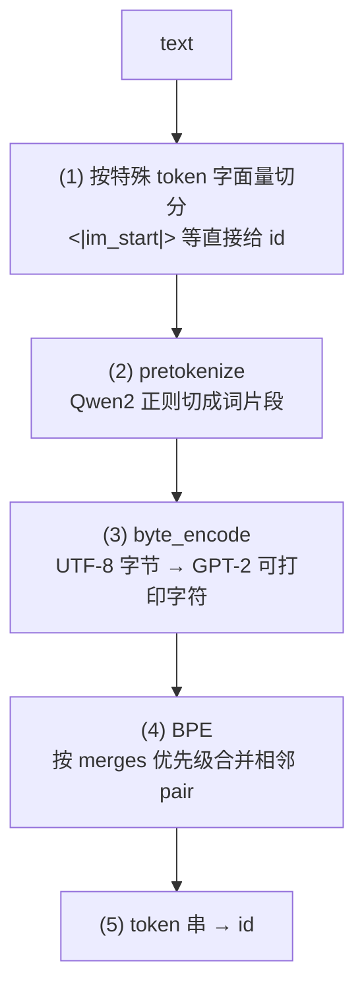
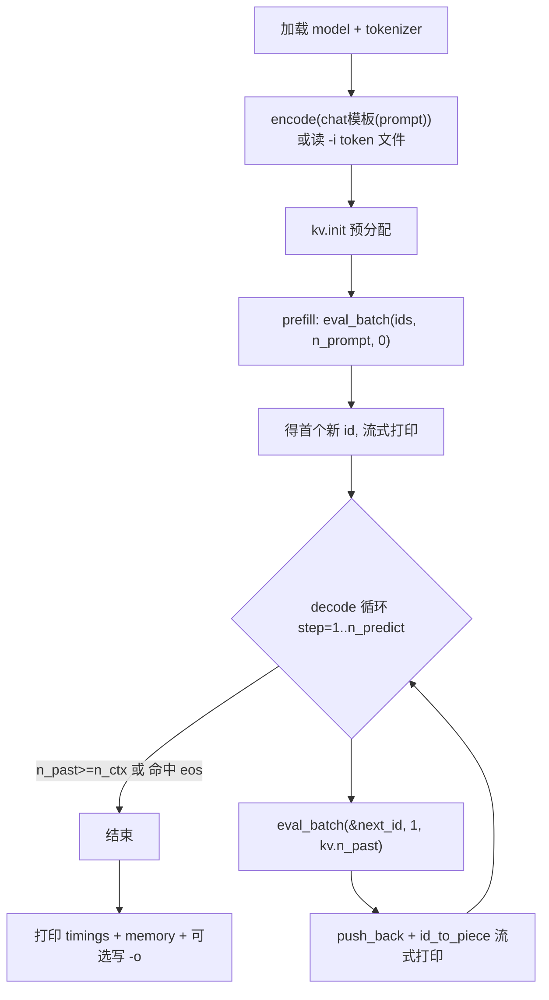

# frostfall v0.2 —— 推理框架代码逐接口详解

> 本文承接 [code_analysis.md](code_analysis.md)（v0.1），**只讲 v0.2 相对 v0.1 的增量改动**：
> 自研分词器、增量 KV cache、模块拆分与计时统计。模型加载（model.*）、单层前向的算子/形状原理
> 与 v0.1 完全一致，未变的部分请直接参考 v0.1 文档，本文不再重复。
> 架构原理与超参数背景见 [design.md](design.md)。

v0.2 的三条主线：

1. **去掉 Python 依赖**：prompt 分词、id→文本解码都在 C++ 里做（自研 byte-level BPE），用 `-p` 直接传文本。
2. **增量 KV cache**：把 v0.1「每步重算整段序列」的 O(n²) 改成「prefill 一次 + decode 每步 1 token」的 O(n)。
3. **工程化**：源码按职责拆成多个编译单元；打印各阶段耗时、tokens/s、权重/KV 内存占用；流式打印生成文本。

源码文件（`src/`），**加粗为 v0.2 新增**：

| 文件 | 职责 | v0.2 变化 |
| --- | --- | --- |
| model.h / model.cpp | 模型数据结构 + 从 GGUF 加载权重 | 基本不变 |
| **[tokenizer.h](../src/core/tokenizer.h) / [tokenizer.cpp](../src/core/tokenizer.cpp)** | 自研 Qwen3 分词器（byte-level BPE） | **新增** |
| **[kv_cache.h](../src/llm/kv_cache.h) / [kv_cache.cpp](../src/llm/kv_cache.cpp)** | 增量 KV cache（每层 K/V 持久化） | **新增** |
| **[common.h](../src/core/common.h) / [common.cpp](../src/core/common.cpp)** | 计时器 / chat 模板 / 字节格式化 | **新增** |
| [graph.h](../src/llm/graph.h) / [graph.cpp](../src/llm/graph.cpp) | 构建单步前向计算图 | **改：接 KV cache** |
| [main.cpp](../src/main.cpp) | 主链路 | **改：prefill/decode + 流式打印** |
| [log.h](../src/core/log.h) | 头文件内实现的轻量流式日志 | 不变 |

---

## 0. 整体数据流（v0.2）

```mermaid
flowchart LR
    G[GGUF 文件] -->|qwen3_model_load| M[qwen3_model<br/>权重+超参]
    G -->|tokenizer.load| TK[qwen3_tokenizer<br/>词表/merges/特殊token]
    P["-p 文本"] -->|apply_chat_template| CT[套 chat 模板的文本]
    CT -->|tokenizer.encode| IDS[prompt ids]
    M --> KVI[kv_cache.init<br/>预分配每层 K/V]
    IDS --> PF[prefill<br/>eval_batch 整段]
    KVI --> PF
    PF -->|写 cache [0,n_prompt)| KV[(KV cache)]
    PF -->|最后位置 argmax| N0[首个新 token]
    N0 --> DEC[decode 循环<br/>每步 eval_batch 1 token]
    KV --> DEC
    DEC -->|追加写 cache n_past| KV
    DEC -->|id_to_piece 流式打印| OUT[stdout]
    DEC -->|命中 eos / n_predict 上限| END[结束 + 计时统计]
```

与 v0.1 的关键区别：

- v0.1：每个 decode step 用**当前完整序列**从头构图前向（`positions = 0..N-1`，K/V 全部重算）。
- v0.2：**prefill 一次**把整段 prompt 的 K/V 写进 cache；之后每步只喂 **1 个** 新 token，K/V 追加写到 `n_past`，
  注意力从 cache 读 `[0, n_past+1)` 的历史。计算量从每步 O(n) 累积成 O(n²) → 降到 decode 每步 O(1)（对序列长度）。

---

## 1. 自研分词器（tokenizer.h / tokenizer.cpp）

Qwen3 用的是 **byte-level BPE**（与 HF 的 GPT-2 / Qwen2 tokenizer 同款）。v0.2 直接从 GGUF 元数据读词表与合并规则，
在 C++ 里复刻 encode/decode，产出与 `transformers` **逐 id 完全一致**（中/英、含 chat 模板均验证过）。

### 1.1 `struct qwen3_tokenizer` —— 数据结构

| 字段 | 类型 | 含义 |
| --- | --- | --- |
| `id_to_token` | `vector<string>` | 每个 id 的字符串。NORMAL 存「字节级编码」串；特殊 token 存字面量如 `<|im_end|>` |
| `token_type` | `vector<int32_t>` | 与 `id_to_token` 对齐：`1=NORMAL 3=CONTROL 4=USER_DEFINED` |
| `token_to_id` | `unordered_map<string,int32_t>` | 反查：token 串 → id |
| `merge_rank` | `unordered_map<string,int32_t>` | BPE 合并规则：key=`"左 右"`，value=优先级（越小越优先） |
| `special_tokens` | `vector<pair<string,int32_t>>` | 特殊 token 字面量→id，**按长度降序**（长匹配优先） |
| `eos_id/bos_id/pad_id/add_bos` | | 特殊 token id 与是否前置 bos |

对外接口：`load(fname)` / `encode(text)` / `decode(ids, skip_special)` / `id_to_piece(id, skip_special)` /
`is_special(id)`。

### 1.2 encode 五步流水线



**(1) 特殊 token 切分**（`encode`）：从左到右扫描，先尝试匹配任一特殊 token 字面量（已按长度降序，避免前缀误伤）；
命中就直接压入其 id，否则找到「下一个特殊 token 起点」，把这段普通文本交给后续步骤。

**(2) pretokenize**（`pretokenize`）：复刻 llama.cpp `LLAMA_VOCAB_PRE_TYPE_QWEN2` 的正则：

```
(?:'[sS]|'[tT]|'[rR][eE]|'[vV][eE]|'[mM]|'[lL][lL]|'[dD])
| [^\r\n\p{L}\p{N}]?\p{L}+     | \p{N}
|  ?[^\s\p{L}\p{N}]+[\r\n]*    | \s*[\r\n]+   | \s+(?!\S)   | \s+
```

> **为什么手写扫描器而不用 `std::regex`**：`std::regex` 不支持 `\p{L}`/`\p{N}` Unicode 属性，
> 且回溯语义难以和参考实现对齐。代码改为把文本先转码点数组，再按上述 7 个分支**逐位置贪心匹配**。
> `\p{L}`/`\p{N}`/`\s` 用**码点区间近似**（`is_letter`/`is_number`/`is_whitespace`），覆盖英/中/日/韩/常见欧洲语言，
> 足够跑通教学用例；不追求对全部 Unicode 脚本 100% 精确。Qwen2 的一个特性是**数字逐位切分**（分支 3 每次只吃一个数字）。

**(3) byte_encode + GPT-2 bytes_to_unicode**（`byte_coder`）：把片段的每个 UTF-8 字节映射成一个「可打印」Unicode 码点，
再编回 UTF-8。规则：可打印区间 `[33,126]∪[161,172]∪[174,255]` 的字节映射到自身，其余字节按序映射到 `256,257,...`
（例如空格 `0x20 → 0x120 = 'Ġ'`）。**词表里存的就是这些映射后的字符串**，所以任意字节都能安全地当文本参与 BPE。

**(4) BPE**（`bpe_encode_piece`）：初始把片段拆成「每个码点一个 symbol」，然后反复：
扫描所有相邻 pair，找 `merge_rank` 里 rank 最小（优先级最高）的那对，合并；直到没有可合并 pair。
最后把每个 symbol 查 `token_to_id` 得到 id。

> **合并语义**：每轮只合并选中 pair 的**最左一次**出现（清晰、易读），靠下一轮再次选中同一 pair 继续合并剩余出现，
> 收敛结果与 GPT-2 参考实现等价。若某 symbol 意外不在词表（理论不会发生，单字节编码字符都在），会 `LOG(WARNING)` 并逐字符兜底。

### 1.3 decode

`id_to_piece(id)`：特殊 token 在 `skip_special=true` 时返回空串、否则返回字面量；NORMAL token 是「字节级编码」串，
逐码点用 `cp_to_byte` **逆映射回原始字节**拼成 UTF-8。`decode(ids)` 就是逐 id 拼 `id_to_piece`。
main 里流式打印用的正是 `id_to_piece`（每生成一个 id 立刻还原成文本片段输出）。

### 1.4 load：从 GGUF 读元数据

`load()` 用 `no_alloc=true` 打开 GGUF（只要元数据），读三个数组 key：
`tokenizer.ggml.tokens` / `token_type` / `merges`，填好上面的结构；`token_type` 为 CONTROL/USER_DEFINED 的收进
`special_tokens` 并按长度降序排。再读 `eos/bos/padding_token_id` 与 `add_bos_token`。整型 key 用 `get_u32` 兼容 U32/I32。

> **坑**：merges 每条形如 `"左 右"`，用**第一个空格**分隔即可 —— 因为左右片段本身是字节级编码串、内部不含空格字节
> （空格已被映射成 `Ġ`），所以无歧义。

---

## 2. 增量 KV cache（kv_cache.h / kv_cache.cpp）

### 2.1 为什么要它

v0.1 没有 cache：第 `t` 步要把 `t` 个 token 全部重新前向，每层 K/V 全部重算，总计算量 $\sum_{t} O(t) = O(n^2)$。
v0.2 把每层算出的 K/V **持久化**到一块专用 buffer，prefill 后 decode 每步只算新 token 的 1 份 K/V 并追加，
注意力直接读历史 → 序列维度上每步 O(1)，总体 O(n)。

### 2.2 `struct qwen3_kv_cache` —— 数据结构与存储布局

| 字段 | 含义 |
| --- | --- |
| `n_ctx` | 预分配的上下文长度上限 |
| `n_past` | 当前 cache 中已有效的 token 数（= 下次写入的起始位置） |
| `k` / `v` | `vector<ggml_tensor*>`，每层一个，各是 **1D F16** 张量，长度 `n_embd_kv_all * n_ctx` |
| `ctx` / `buffer` | 持有 cache 张量元数据的 context + backend 内存块 |

**存储布局**：`n_embd_kv_all = head_dim * n_head_kv`（GQA 只存 KV 头，Qwen3-0.6B = `128*8 = 1024`）。
每块 cache 是一段扁平内存，逻辑上按 token 顺序摆放：第 `t` 个 token 占用 `[t*n_embd_kv_all, (t+1)*n_embd_kv_all)`。
读取时用 `ggml_view_3d` 重新解读成 `[head_dim, n_kv, n_head_kv]`（见 §3）。

> **为何用 1D + view 而不是直接建 3D**：写入区间 `[n_past, n_past+n)` 随步变化，1D + `view_1d(偏移)` 定位最直接；
> 读取时再用 `view_3d` 配合手算的 `nb1/nb2` 把它「看成」多维，零拷贝。

### 2.3 `init` / `size_bytes` / 析构

`init(model, n_ctx)`：用 `no_alloc=true` 建 `ctx`（`mem_size` 恰好 `(2*n_layer+1)*ggml_tensor_overhead()`），
为每层建 `cache_k_{il}` / `cache_v_{il}` 两个 1D F16 张量并命名，最后 `ggml_backend_alloc_ctx_tensors` 一次性落到 buffer。
`size_bytes()` 返回 buffer 字节数（供统计打印）。析构按 `buffer → ctx` 顺序释放；禁用拷贝（避免重复释放）。

Qwen3-0.6B、`n_ctx=4096` 时：每层 `1024 * 4096 * 2B = 8 MB`，K+V 共 `16 MB/层 * 28 层 ≈ 448 MB`。

### 2.4 prefill / decode 差异：写 cache 与读 cache 的偏移量

二者复用同一块 cache 内存，区别只在于**写入偏移量**和**读取长度**：

| | prefill | decode（每步） |
| --- | --- | --- |
| `n_tokens` | 整段 prompt（如 10） | 恒为 `1` |
| `n_past`（写入起点） | `0` | 上一步结束时的 `n_kv`，逐步 `10→11→…→17` |
| 写入区间 | `[0, 10) * n_embd_kv_all` | `[n_past, n_past+1) * n_embd_kv_all`，如第 11 个 token 写 `[10,11)` |
| 读取区间（`view_3d` 的 offset 恒为 `0`） | `[0, 10) * n_embd_kv_all` | `[0, n_past+1) * n_embd_kv_all` |
| 复用的历史 | 无（首次写入） | `[0, n_past)` 这段是之前写入后从未被覆盖的数据，本次原样读出 |

具体走一遍（Qwen3-0.6B：`n_embd_kv_all = head_dim*n_head_kv = 128*8 = 1024`，F16 每元素 2 字节）：

1. **prefill**：`n_past=0, n=10` → 写 `[0,10)*1024`，同时读 `[0,10)*1024` 做 attention；结束后 `kv.n_past=10`。
2. **decode 第 11 个 token**：`n_past=10, n=1` → 只写 `[10,11)*1024`（这个新 token 自己的 K/V）；
   读取时 `view_3d` 的 offset 仍是 `0`，只是长度（`n_kv`）变成 11，于是读到 `[0,11)*1024`——
   前 10 段是 prefill 写入后从未覆盖、原封不动躺在内存里的历史，后 1 段是刚写入的新 token，两段拼起来就是完整历史。
   结束后 `kv.n_past=11`。
3. **decode 第 12 个 token**：`n_past=11, n=1` → 写 `[11,12)*1024`，读 `[0,12)*1024`；以此类推直到第 18 个 token（`n_past=17`）。

一句话：**写永远只追加“新增的一小段”，读永远从偏移 `0` 开始、只是长度变长**——这正是“graph 每次重建、cache 内存跨步复用”的具体机制（详见 §3.3 的图形状差异、§5.2 的调用差异）。

---

## 3. 计算图构建（graph.cpp）—— 接入 KV cache

### 3.1 接口签名变化

```cpp
struct ggml_cgraph * qwen3_build_graph(
        struct ggml_context * ctx,
        const qwen3_model    & model,
        const qwen3_kv_cache & kv,       // ★ 新增：读写历史 K/V
        int32_t                n_tokens, // 本次输入 token 数（prefill=n_prompt，decode=1）
        int32_t                n_past,   // ★ 新增：cache 中已有 token 数
        int                    max_nodes);
```

输入张量名字契约与 v0.1 相同，但**形状随 `n_past` 变化**：

| 宏 | 名字 | v0.2 形状 | 说明 |
| --- | --- | --- | --- |
| `..._TOKENS` | `tokens` | I32 `[n_tokens]` | 本次输入 id |
| `..._POS` | `positions` | I32 `[n_tokens]` | **值 = `n_past + i`（绝对位置）** |
| `..._MASK` | `kq_mask` | F32 `[n_kv, n_tokens]` | `n_kv = n_past + n_tokens`，`ne0=k`、`ne1=q` |
| `..._LOGITS` | `logits` | F32 `[n_vocab, n_tokens]` | 输出 |

设本次输入 `n = n_tokens`，历史 `n_past`，可见长度 `n_kv = n_past + n`。

### 3.2 单层内部：写 cache → 读 cache

前半段（RMSNorm → QKV 投影 → reshape → QK-Norm → RoPE）与 v0.1 **完全相同**，唯一区别是 RoPE 的位置来自
`positions`（值 `n_past+i`），保证 decode 阶段用的是**绝对位置**。核心新增是「写 cache / 读 cache」：

```cpp
const size_t kv_esz = ggml_element_size(kv.k[0]);   // F16 = 2 字节

// ---- 写：本次 K/V 写入 cache 的 [n_past, n_past+n) ----
struct ggml_tensor * k_dst = ggml_view_1d(ctx, kv.k[il],
        n_tokens * n_embd_kv_all, n_past * n_embd_kv_all * kv_esz);
struct ggml_tensor * v_dst = ggml_view_1d(ctx, kv.v[il],
        n_tokens * n_embd_kv_all, n_past * n_embd_kv_all * kv_esz);
ggml_build_forward_expand(gf, ggml_cpy(ctx, kcur, k_dst));   // ★ 立即 expand
ggml_build_forward_expand(gf, ggml_cpy(ctx, vcur, v_dst));   // ★ 立即 expand

// ---- 读：从 cache 取 [0, n_kv) 的历史，看成 [head_dim, n_kv, n_head_kv] ----
struct ggml_tensor * K = ggml_view_3d(ctx, kv.k[il],
        n_embd_head, n_kv, n_head_kv,
        n_embd_kv_all * kv_esz,   // nb1：相邻 kv 位置跨度
        n_embd_head   * kv_esz,   // nb2：相邻头跨度
        0);
struct ggml_tensor * q  = ggml_permute(ctx, qcur, 0, 2, 1, 3);   // [head_dim, n, n_head]
struct ggml_tensor * kq = ggml_mul_mat(ctx, K, q);               // [n_kv, n, n_head]，GQA broadcast
kq = ggml_soft_max_ext(ctx, kq, kq_mask, kq_scale, 0.0f);

struct ggml_tensor * V = ggml_view_3d(ctx, kv.v[il],
        n_embd_head, n_kv, n_head_kv,
        n_embd_kv_all * kv_esz, n_embd_head * kv_esz, 0);
V = ggml_cont(ctx, ggml_permute(ctx, V, 1, 0, 2, 3));            // [n_kv, head_dim, n_head_kv]
struct ggml_tensor * kqv = ggml_mul_mat(ctx, V, kq);            // [head_dim, n, n_head]
kqv = ggml_permute(ctx, kqv, 0, 2, 1, 3);
cur = ggml_cont_2d(ctx, kqv, n_embd_head * n_head, n_tokens);
cur = ggml_mul_mat(ctx, layer.wo, cur);
x   = ggml_add(ctx, inp_attn, cur);
```

单层注意力形状流转（以 Qwen3-0.6B、`n`=本次、`n_kv`=历史+本次）：

| # | 算子 | 输出形状 | 备注 |
| --- | --- | --- | --- |
| 写 K | `cpy(kcur → view_1d(cache_k))` | — | 写入 `[n_past, n_past+n)`，立即 expand |
| 写 V | `cpy(vcur → view_1d(cache_v))` | — | 同上 |
| 读 K | `view_3d(cache_k)` | `[128, n_kv, 8]` | 手算 `nb1/nb2` 解读布局 |
| — | `permute(q,0,2,1,3)` | `[128, n, 16]` | |
| kq | `mul_mat(K, q)` | `[n_kv, n, 16]` | `ne2` 8→16 GQA broadcast |
| — | `soft_max_ext(kq, kq_mask, scale)` | `[n_kv, n, 16]` | 缩放 + 因果 mask + softmax |
| 读 V | `cont(permute(view_3d(cache_v),1,0,2,3))` | `[n_kv, 128, 8]` | |
| kqv | `mul_mat(V, kq)` | `[128, n, 16]` | |
| — | `permute → cont_2d` | `[2048, n]` | 合并头 |
| — | `mul_mat(wo) → add(残差)` | `[1024, n]` | |

FFN 与末端（RMSNorm + lm_head）与 v0.1 完全一致，形状把 v0.1 的 `N` 换成本次 `n` 即可。

### 3.3 prefill 与 decode 不能共用同一张图

`eval_batch` 的签名是 `(batch, n, n_past)`，**每次调用都重新构图**（`ggml_init` + `qwen3_build_graph` + `gallocr_alloc`）。
prefill 和 decode 不仅不能共用，decode 各步之间也不能共用，原因是 `n_kv = n_past + n` 每步都不同，
它被硬编进张量形状里，导致三处关键张量每步形状都在变：

| 张量 | prefill (`n=n_prompt, n_past=0`) | decode step 1 (`n=1, n_past=50`) | decode step 2 (`n=1, n_past=51`) |
| --- | --- | --- | --- |
| `kq_mask` | `[n_prompt, n_prompt]` | `[51, 1]` | `[52, 1]` |
| `K` view_3d (ne1) | `[128, n_prompt, 8]` | `[128, 51, 8]` | `[128, 52, 8]` |
| `kq = mul_mat(K, q)` | `[n_prompt, n_prompt, 16]` | `[51, 1, 16]` | `[52, 1, 16]` |

graph 的形状在构图时就已确定，之后只能改输入数值不能改形状，所以形状变了就必须重建整张图。

**`allocr` 跨步复用**：虽然图每步重建，但 `ggml_gallocr_alloc_graph` 会检测新图的中间张量大小是否超过已分配容量，
只在需要时才真正重新分配 buffer（否则原地复用）。decode 阶段 `kq` 每步多 1 行，所以每步都会触发小幅扩容。

**如何实现 decode 图复用（当前未做）**：把 `n_kv` 固定为 `n_ctx`，未使用的 cache 槽在 `kq_mask` 里填 `-inf` 掩掉，
这样所有 decode 步的图形状完全相同，`gallocr` 只需分配一次，每步只改输入数值。llama.cpp 的 decode 路径就是这样做的。
当前教学框架选择「每步重建图」：代码更直观，无需处理 padding 掩码逻辑，代价是 decode 每步多一次 `ggml_init`/`gallocr`
开销——在长序列时这部分元数据操作的耗时会比较明显。

> **注意**：上表里“形状变了”指的是 `n_kv`（读取长度），并不代表 decode 每步的计算量随 `n_past` 增长——
> `qcur/kcur/vcur` 的投影、RoPE、QK-Norm 每步都只对 `n_tokens=1` 个新 token 做（O(1)），
> 变大的只是 attention 读历史的范围 `K/V view_3d` 和 `kq`/`softmax`（O(n_kv)）。写 cache 与读 cache 的具体偏移量演示见 §2.4。

### 3.4 关键坑（v0.2 新增）

- **写 cache 的 `cpy` 节点必须立即 `ggml_build_forward_expand`**：ggml 图按节点加入顺序执行，
  必须保证「写 K/V」排在「读 K/V」之前，否则本次 token 的 K/V 还没落地就被读，结果错乱。
  最终输出 `logits` 也要 `build_forward_expand`，但写 cache 的两个节点是**旁路副作用**（不在 logits 的依赖链上），
  不显式 expand 就可能被裁剪或乱序，所以单独提前 expand。
- **V 存的是「非转置」布局**：cache 里 V 和 K 一样按 `[head_dim, n_kv, n_head_kv]` 存，
  读出后再 `cont(permute(1,0,2,3))` 转成 `[n_kv, head_dim, n_head_kv]` 供 `mul_mat`。这样写入路径 K/V 对称、代码简单。
- **RoPE 用绝对位置**：`positions[i] = n_past + i`。prefill 时 `n_past=0` → `0..n_prompt-1`；
  decode 时每步 `n=1`、`positions=[n_past]`。位置编号与 v0.1「序列下标」语义一致，只是不再每步重算前缀。

---

## 4. 小工具（common.h / common.cpp）

`namespace ff` 下三样：

- `struct timer`：墙钟计时。构造即开始，`elapsed_ms()` 返回距开始毫秒；`reset()` 重新计时。基于 `steady_clock`。
- `format_mb(bytes)`：字节数 → `"%.2f MB"` 字符串（统计打印用）。
- `apply_chat_template(user, enable_thinking)`：硬编码 Qwen3 单轮 chat 模板，等价于 transformers 的
  `apply_chat_template([{role:user,content:user}], add_generation_prompt=True, enable_thinking=...)`：

  ```
  <|im_start|>user\n{user}<|im_end|>\n<|im_start|>assistant\n
  ```
  当 `enable_thinking=false` 时**额外补一个空 think 块** `<think>\n\n</think>\n\n`（与 Qwen3 默认模板一致）。

---

## 5. 主链路（main.cpp）—— prefill / decode

### 5.1 CLI 变化

`struct cli_args` 新增/调整：

| 参数 | 含义 | 默认 |
| --- | --- | --- |
| `-p, --prompt` | **直接传文本**（自研分词，默认套 chat 模板） | — |
| `-i, --tokens-in` | 读 token id 文件（**兼容对拍脚本**，与 `-p` 二选一） | — |
| `-o, --tokens-out` | 写完整 token id 序列（兼容对拍脚本） | — |
| `-n, --n-predict` | 最多生成新 token 数 | 64 |
| `-c, --ctx-size` | **KV cache 上下文上限** | 4096 |
| `-t, --threads` | CPU 线程数 | 4 |
| `--no-chat-template` | 不套 chat 模板，对 `-p` 纯文本编码 | 关 |
| `--think` | 启用 Qwen3 思考模式（不补空 think 块） | 关 |

`-m` 必填；`-p` 与 `-i` 至少给一个。

### 5.2 `eval_batch` —— 前向一个 batch（prefill 与 decode 共用）

核心是一个 lambda `eval_batch(batch, n, n_past) -> next_id`：

1. 用 `no_alloc=true` 临时 `ctx` + `qwen3_build_graph(model, kv, n, n_past, max_nodes)` 构图。
2. `ggml_gallocr_alloc_graph` 分配中间张量（`allocr` 全程复用）。
3. 填三个输入：
   - `tokens` = `batch`；
   - `positions[i] = n_past + i`；
   - `kq_mask`：`ne0=k(0..n_kv-1)`、`ne1=q(0..n-1)`，query 绝对位置 `n_past+q`，`k > n_past+q` 处填 `-INFINITY`。
4. `ggml_backend_graph_compute` 前向；只取**最后一个位置**（偏移 `(n-1)*n_vocab`）的 logits 做 `argmax`。
5. `ggml_free(ctx)`；**`kv.n_past = n_kv`** 推进 cache 有效长度；返回 `next_id`。

> `mask_buf` / `pos_buf` 提到循环外复用（每步 `resize`/`assign`），避免反复堆分配。
> `mask_buf` 用扁平 `vector<float>` + 手算下标 `q*n_kv + k`，与 ggml tensor 的连续内存布局匹配（原因见 v0.1 文档）。

`eval_batch` 是 prefill 与 decode **唯一共用**的入口，两处调用差异只在传参：

| 调用方 | `batch` | `n` | `n_past` | 效果 |
| --- | --- | --- | --- | --- |
| prefill（[main.cpp](../src/main.cpp#L220)） | `ids.data()`（整段 prompt） | `n_prompt` | `0` | 一次性把 `[0, n_prompt)` 写满 cache，返回首个新 token |
| decode 每步（[main.cpp](../src/main.cpp#L235)） | `&next_id`（单 token指针） | `1` | `kv.n_past`（上一步结束值） | 只追加写 1 个 token 的 K/V，返回下一个新 token |

换句话说，prefill 只是「`n_past=0` 时的一次特殊 `eval_batch` 调用」，decode 则是「`n_past` 逐步递增、`n` 恒为 1」的重复调用；
两者内部走的是同一套构图 + 写读 cache 逻辑（§2.4、§3.2），没有单独代码路径。

### 5.3 主流程



1. **加载**：`qwen3_model_load` + 设线程数；有 `-p` 时 `tokenizer.load`。
2. **编码**：`-p` → `apply_chat_template`（除非 `--no-chat-template`）→ `encode`；否则 `-i` 直接读 id。
3. **裁剪 ctx**：`n_ctx` 取 `min(args.n_ctx, n_ctx_train)`；`n_prompt + n_predict > n_ctx` 时 `LOG(WARNING)`。
4. **prefill**：`eval_batch(ids, n_prompt, 0)` 一次性把整段 prompt 写进 cache，返回首个新 token。
5. **decode**：从 step=1 起，每步 `eval_batch(&next_id, 1, kv.n_past)` 只前向 1 个 token；
   `id_to_piece` 流式打印；命中 `eos_id` 或 `n_past >= n_ctx` 停。
6. **统计**：打印 `load/prefill/decode/total` 耗时与各自 tok/s，以及 `weights` / `kv_cache` 内存占用。
7. **可选**：`-o` 时把完整 id 序列（prompt+生成）写文件（供对拍脚本读取）。

> **EOS = 151645（`<|im_end|>`）**。停止判定优先用 `tokenizer.eos_id`，回落到 `hparams.eos_token_id`。

---

## 6. v0.1 → v0.2 变化速查

| 维度 | v0.1 | v0.2 |
| --- | --- | --- |
| 分词 | Python（transformers）预处理，C++ 只读 id | **C++ 自研 byte-level BPE**，`-p` 直接传文本 |
| KV | 无 cache，每步重算整段（O(n²)） | **增量 KV cache**，prefill + decode（O(n)） |
| 构图输入 | `positions=0..N-1`，每步整段 | `positions=n_past+i`，`n_kv=n_past+n_tokens` |
| 输出 | 打印 token id 序列 | **流式打印文本**（`id_to_piece`），仍可 `-o` 写 id |
| chat 模板 | 交给 Python | **C++ 硬编码**（`apply_chat_template`） |
| 统计 | 仅总耗时 | **分阶段耗时 + tok/s + 内存占用** |
| 模块 | model/graph/main | + tokenizer / kv_cache / common |

**对拍验证**：`scripts/compare_llamacpp.py` 对 prompt `"The capital of France is"` 与 llama.cpp 逐 token 完全一致 ✓
（对拍脚本仍走 `-i/-o` token 文件路径，与自研分词解耦）。

---

## 7. v0.2 仍有的简化 / 后续演进

| 简化点 | 影响 | 计划 |
| --- | --- | --- |
| 只支持 CPU backend | 无 GPU 加速 | 后续接 CUDA/Metal |
| 仅贪心 argmax | 无采样多样性 | 后续加 temperature/top-k/top-p |
| 单轮 chat 模板 | 不支持多轮对话历史 | 后续扩展多轮 |
| pretokenizer 用码点区间近似 | 极生僻脚本可能不精确 | 教学够用，暂不引入完整 Unicode 表 |
| 只支持 Qwen3 | 无多架构 | 教学定位，刻意不做 |

**编译**：`cd build && cmake .. && make frostfall`。
