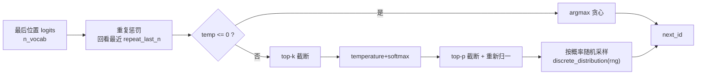

# frostfall v0.3 —— 推理框架代码逐接口详解

> 本文承接 [code_analysis_v0.2.md](code_analysis_v0.2.md)，**只讲 v0.3 相对 v0.2 的增量改动**：
> 采样策略（sampler）。模型加载（model.\*）、单层前向的算子/形状、自研分词器、增量 KV cache
> 与 v0.2 完全一致，未变的部分请直接参考 v0.2 文档，本文不再重复。
> 架构原理与超参数背景见 [design.md](design.md)。

v0.3 只有一条主线：**把 v0.2 写死的贪心解码（argmax）升级成可配置的采样链**，
让生成具备多样性，同时保证「`temp<=0` 退化为贪心、输出与 v0.2 逐 token 一致」——对拍验证因此不受影响。

采样链（每一步都可单独关闭）：

```
logits ──► 重复惩罚 ──► top-k 截断 ──► temperature+softmax ──► top-p 截断 ──► 按概率随机采样 ──► next_id
           repeat        top_k         temp                     top_p          std::discrete_distribution
           _penalty
```

源码文件（`src/`），**加粗为 v0.3 新增**：

| 文件 | 职责 | v0.3 变化 |
| --- | --- | --- |
| **[sampler.h](../src/llm/sampler.h) / [sampler.cpp](../src/llm/sampler.cpp)** | 采样策略（greedy / temperature / top-k / top-p / 重复惩罚） | **新增** |
| [main.cpp](../src/main.cpp) | 主链路 | **改：CLI 采样参数 + 用采样器替换 argmax** |
| [CMakeLists.txt](../CMakeLists.txt) | 构建 | **改：加入 `src/sampler.cpp`** |
| model / graph / kv_cache / tokenizer / common | 见 v0.2 文档 | 不变 |

---

## 0. 整体数据流（v0.3）

与 v0.2 唯一的差异是：`eval_batch` 拿到「最后一个位置的 logits」后，不再直接 `argmax`，
而是交给 `sampler.sample(...)` 走完整条采样链再返回 token id。其余（prefill / decode / KV cache / 流式打印）完全不变。



---

## 1. 采样模块（sampler.h / sampler.cpp）

> ⚠️ 命名空间：v0.3 的 sampler 定义在**全局命名空间**（不在 `ff` 下），所以 main.cpp 里直接写
> `sampler` / `sampler_params`，不加 `ff::` 前缀。

### 1.1 `struct sampler_params` —— 采样参数

| 字段 | 类型 | 默认 | 含义 / 关闭条件 |
| --- | --- | --- | --- |
| `temp` | `float` | `0.0f` | 采样温度。`<=0` → 贪心 argmax（忽略其它参数）；否则 `logit /= temp` |
| `top_k` | `int32_t` | `0` | 只在 logit 最高的 `k` 个候选里采样。`<=0` → 关闭（保留全部候选） |
| `top_p` | `float` | `1.0f` | nucleus 累计概率阈值。`>=1.0` → 关闭 |
| `repeat_penalty` | `float` | `1.0f` | 重复惩罚系数。`==1.0` → 关闭；`>1` 抑制近期已出现的 token |
| `repeat_last_n` | `int32_t` | `64` | 重复惩罚回看窗口长度。`<0` → 回看整段历史 |
| `seed` | `uint32_t` | `SAMPLER_SEED_RANDOM` | 随机种子。哨兵值 `0xFFFFFFFF` 表示「运行时随机取一个」 |

> **默认即贪心**：`temp=0`、`top_k=0`、`top_p=1.0`、`repeat_penalty=1.0`。
> 因此不带任何采样参数运行时行为与 v0.2 完全相同，对拍脚本（不传 `--temp`）继续走贪心路径。

### 1.2 `struct sampler` —— 采样器

只有两个成员：`sampler_params params` 与随机源 `std::mt19937 rng`；对外两个接口 `init` / `sample`。

**`init(const sampler_params & p)`**：

```cpp
void sampler::init(const sampler_params & p) {
    params = p;
    if (params.seed == SAMPLER_SEED_RANDOM) {
        std::random_device rd;
        params.seed = rd();                 // 未指定 → 取一个真随机种子
    }
    rng.seed(params.seed);                  // 回填后再 seed，便于打印复现
}
```

关键点：若用户没给 `--seed`，从 `std::random_device` 取一个种子并**回填** `params.seed`，
随后 main.cpp 会把这个真实种子打进日志——这样即便是「随机」运行，也能记下种子用于复现。

### 1.3 `sample(logits, n_vocab, prev)` —— 六步采样链

签名：`int32_t sample(float * logits, int32_t n_vocab, const std::vector<int32_t> & prev)`。
`logits` 会被**原地修改**（施加重复惩罚）；`prev` 是「到目前为止的完整 token 序列」，用作重复惩罚的回看历史。

**第 1 步：重复惩罚**（llama.cpp 同款做法）

```cpp
if (params.repeat_penalty != 1.0f && !prev.empty()) {
    const int32_t n = (int32_t) prev.size();
    const int32_t last_n = params.repeat_last_n < 0 ? n : std::min(n, params.repeat_last_n);
    for (int32_t i = n - last_n; i < n; ++i) {
        const int32_t t = prev[i];
        if (t < 0 || t >= n_vocab) continue;
        if (logits[t] > 0.0f) logits[t] /= params.repeat_penalty;  // 正 logit 缩小
        else                  logits[t] *= params.repeat_penalty;  // 负 logit 放大（更负）
    }
}
```

对最近 `last_n` 个已出现的 token：logit 为正就除以系数、为负就乘以系数，两种情况都**降低**该 token 再次被选中的概率。
用「正除负乘」而非「统一减一个常数」，是为了对已经很不可能的 token（负 logit）也施加一致方向的抑制。

**第 2 步：贪心短路**

```cpp
if (params.temp <= 0.0f) {
    return argmax(logits, n_vocab);   // temp<=0 → 直接取最大，忽略 top-k/top-p
}
```

这是保证「与 v0.2 一致」的关键分支：`temp<=0` 时完全绕过后面的候选构造与随机采样。

**第 3 步：构造候选 + top-k 截断**

```cpp
const int32_t k = params.top_k > 0 ? std::min(params.top_k, n_vocab) : n_vocab;
std::vector<candidate> cands(n_vocab);           // candidate = {id, logit, p}
for (int32_t i = 0; i < n_vocab; ++i) cands[i] = { i, logits[i], 0.0f };
std::partial_sort(cands.begin(), cands.begin() + k, cands.end(),
                  [](const candidate & a, const candidate & b) { return a.logit > b.logit; });
cands.resize(k);
```

用 `std::partial_sort` 只把前 `k` 个按 logit 降序排好（`O(n_vocab · log k)`，比全排序省），再截断。
`top_k<=0` 时 `k=n_vocab`（不截断）。

**第 4 步：temperature + softmax**（数值稳定：减最大值）

```cpp
const float max_logit = cands.front().logit;     // 已排序，front 即最大
double sum = 0.0;
for (auto & c : cands) { c.p = std::exp((c.logit - max_logit) / params.temp); sum += c.p; }
for (auto & c : cands) { c.p = (float)(c.p / sum); }
```

先除以 `temp` 再 softmax：`temp>1` 让分布更平（更随机），`temp<1` 更尖（更确定）。
减去 `max_logit` 避免 `exp` 溢出。

**第 5 步：top-p（nucleus）截断 + 重新归一化**

```cpp
if (params.top_p < 1.0f) {
    double cum = 0.0; size_t keep = cands.size();
    for (size_t i = 0; i < cands.size(); ++i) {
        cum += cands[i].p;
        if (cum >= params.top_p) { keep = i + 1; break; }   // 累计概率首次达到阈值
    }
    cands.resize(keep);
    double s = 0.0;
    for (auto & c : cands) s += c.p;
    for (auto & c : cands) c.p = (float)(c.p / s);           // 截断后重新归一
}
```

候选已按概率降序（第 3 步排过 logit，softmax 单调），从头累加到累计概率首次 `>= top_p` 为止，保留这批「核」候选。
截断后概率和 `<1`，必须重新归一化才能作为采样分布。

**第 6 步：按概率随机采样**

```cpp
std::vector<double> probs;
for (auto & c : cands) probs.push_back(c.p);
std::discrete_distribution<size_t> dist(probs.begin(), probs.end());
return cands[dist(rng)].id;
```

用 `std::discrete_distribution` 按各候选概率抽一个下标，返回其 token id。随机源是成员 `rng`（固定 seed 即可复现）。

### 1.4 各参数的关闭条件一览

| 参数 | 关闭取值 | 关闭后行为 |
| --- | --- | --- |
| `temp` | `<= 0` | 贪心 argmax，后续步骤全部跳过 |
| `top_k` | `<= 0` | 候选集 = 全词表 |
| `top_p` | `>= 1.0` | 不做 nucleus 截断 |
| `repeat_penalty` | `== 1.0` | 不改动任何 logit |

---

## 2. 主链路接入（main.cpp）

### 2.1 CLI 新增采样参数

`struct cli_args` 新增一个成员 `sampler_params sampling;`，并新增以下命令行开关：

| 参数 | 含义 | 默认 |
| --- | --- | --- |
| `--temp` | 采样温度，`<=0` 表示贪心 | `0` |
| `--top-k` | top-k 候选数，`<=0` 关闭 | `0` |
| `--top-p` | nucleus 阈值，`>=1` 关闭 | `1.0` |
| `--seed` | 随机种子（可复现）；不指定则每次随机 | 随机 |
| `--repeat-penalty` | 重复惩罚系数，`1.0` 关闭 | `1.0` |
| `--repeat-last-n` | 重复惩罚回看窗口，`<0` 表示整段历史 | `64` |

其余参数（`-m/-p/-i/-o/-n/-c/-t/--no-chat-template/--think`）与 v0.2 相同。

### 2.2 采样器初始化与日志

在 `kv.init` 之后、进入 `eval_batch` 之前初始化采样器，并打印实际生效的参数（含回填后的真实 seed）：

```cpp
sampler smpl;
smpl.init(args.sampling);
if (args.sampling.temp <= 0.0f) {
    LOG(INFO) << "sampling: greedy (temp<=0)";
} else {
    LOG(INFO) << "sampling: temp=" << smpl.params.temp
              << ", top_k=" << smpl.params.top_k
              << ", top_p=" << smpl.params.top_p
              << ", repeat_penalty=" << smpl.params.repeat_penalty
              << ", seed=" << smpl.params.seed;   // 打印回填后的真实种子，便于复现
}
```

### 2.3 `eval_batch` 里 argmax → 采样

v0.2 的 `eval_batch` 末尾是 `return argmax(logits.data(), n_vocab);`，v0.3 改为：

```cpp
    ggml_free(ctx);
    kv.n_past = n_kv;
    // ids 是“到目前为止的完整序列”（尚未追加本次采样结果），正好作为重复惩罚的回看历史。
    return smpl.sample(logits.data(), n_vocab, ids);
```

**关键时序**：`eval_batch` 采样时 `ids` 还没 `push_back` 本次结果，所以 `ids` 恰好是「已生成的历史」——
既包含 prompt token 也包含之前 decode 出来的 token，作为重复惩罚的回看窗口语义正确（与 llama.cpp 默认「回看整个上下文」一致）。
`smpl`、`ids` 都由 `eval_batch` 这个 lambda 以引用捕获（`[&]`）。

除这一行外，prefill / decode 主循环、流式打印、计时统计与 v0.2 完全相同。

---

## 3. 验证

- **贪心默认可复现且等价 v0.2**：不带采样参数（`temp=0`）时走 argmax 分支，对拍脚本
  `scripts/compare_llamacpp.py`（走 `-i/-o`、不传 `--temp`）与 v0.2 行为一致，逐 token 对拍不受影响。
- **固定 seed 可复现**：同一 prompt + 相同 `--temp/--top-k/--top-p/--seed`，两次运行输出完全一致。
  实测：

  ```bash
  ./build/frostfall -m models/qwen3-0.6b-f16.gguf -p "介绍一下你自己" -n 20 \
      --temp 0.8 --top-k 20 --top-p 0.95 --seed 42
  # 两次运行输出逐字一致 ✓
  ```

---

## 4. v0.2 → v0.3 变化速查

| 维度 | v0.2 | v0.3 |
| --- | --- | --- |
| 解码策略 | 仅贪心 argmax | **greedy / temperature / top-k / top-p 采样链** |
| 重复控制 | 无 | **repeat penalty（可设回看窗口）** |
| 随机性 | 无 | **可设 seed，固定 seed 可复现** |
| CLI | 无采样开关 | **`--temp/--top-k/--top-p/--seed/--repeat-penalty/--repeat-last-n`** |
| 模块 | + tokenizer / kv_cache / common | **+ sampler** |
| 对拍 | 逐 token 一致 | `temp=0` 退化贪心，**仍逐 token 一致** |

---

## 5. v0.3 仍有的简化 / 后续演进

| 简化点 | 影响 | 计划 |
| --- | --- | --- |
| 只支持 CPU backend | 无 GPU 加速 | v0.4 接 CUDA/Metal |
| 只加载 F16 权重 | 内存/带宽未优化 | v0.4 支持 Q8_0/Q4_K 量化权重 |
| 采样链未含 min-p / typical / mirostat | 采样策略偏基础 | 教学够用，按需再扩 |
| 单序列、单 batch | 无并行/投机采样 | 进阶话题，暂不做 |
| 只支持 Qwen3 | 无多架构 | 教学定位，刻意不做 |
