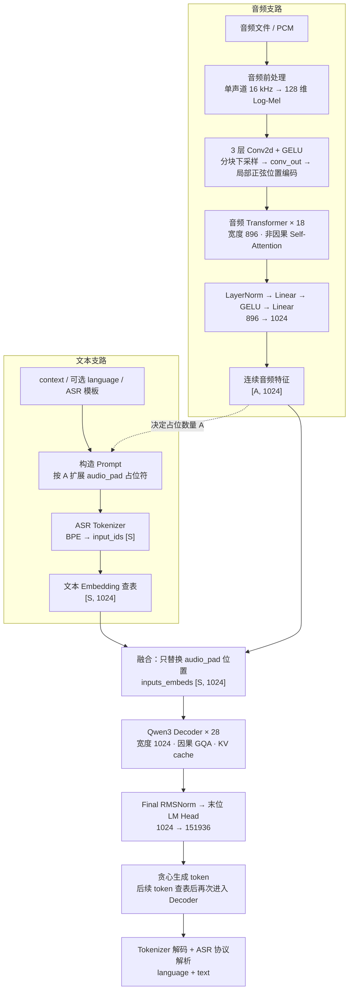
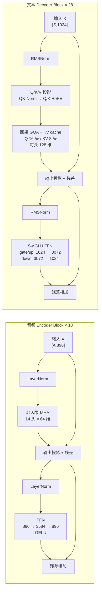
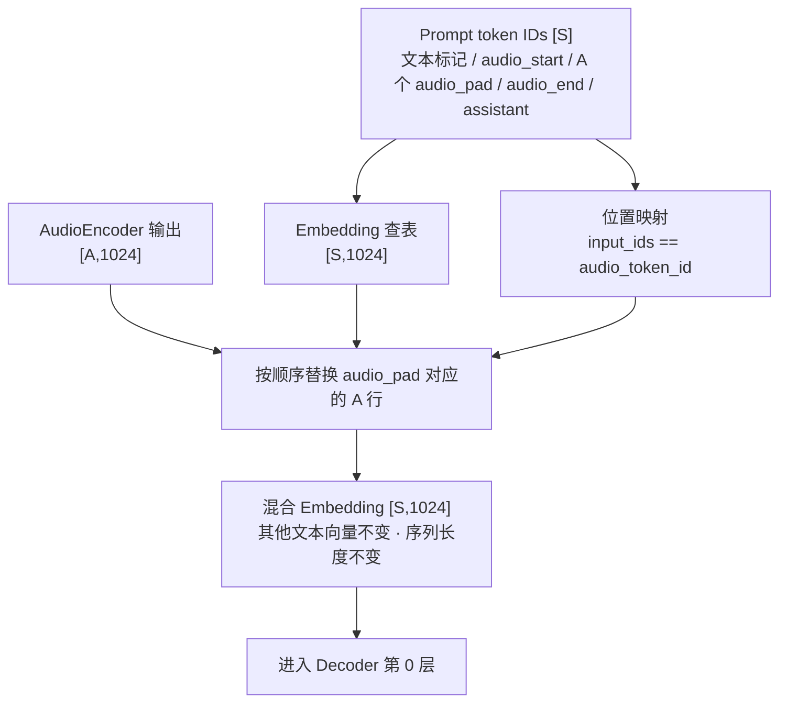
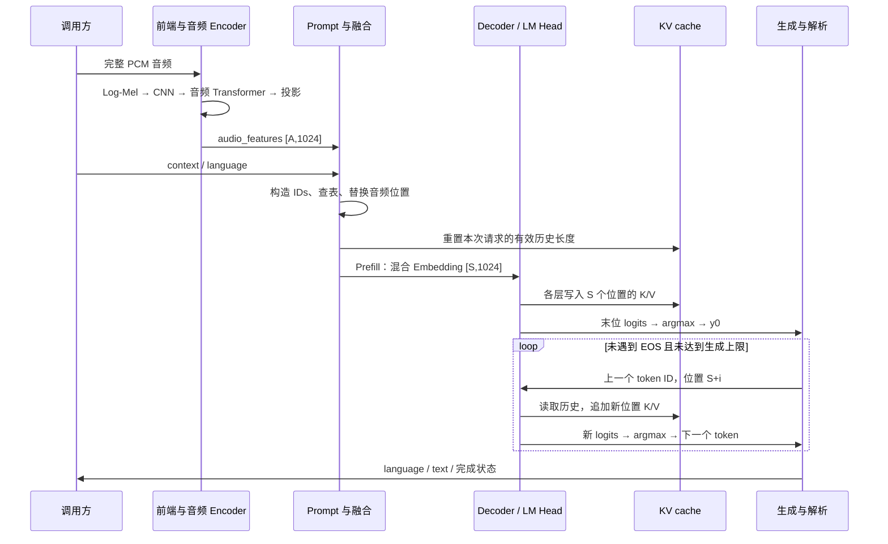

# Qwen3-ASR-0.6B 模型架构与推理流程

本文围绕三个问题展开：模型由哪些模块组成、音频如何变成文字、离线与流式推理有哪些运行边界。先看架构图，再看数据流；完整参数表和具体版本的代码实现不在本文重复展开。

- [模型资源与固定版本](Qwen3-ASR-0.6B_Resource.md)：权重、官方源码和参考环境。
- [架构与配置详解](Qwen3-ASR-0.6B_Model_Architecture_And_Configs.md)：配置字段、逐层尺寸、权重布局和后端差异。
- [ASR 版本规划与验收记录](../asr/design_asr.md)：已实现能力、后续版本和验收要求。

本文以单条完整音频、`B=1` 为主线。模型结构、官方封装行为与本工程实现状态分别说明；图中的完整链路不表示 C++ 已全部实现。

## 一、整体架构：音频编码器与文本 Decoder 如何连接

Qwen3-ASR-0.6B 由 **音频 Encoder + 连续特征融合 + 自回归文本 Decoder** 组成。音频和文本沿两条支路处理，在 Decoder 输入处汇合。



读图时需要明确四点：

1. **没有 Cross-Attention。**音频特征直接进入 Decoder 的输入序列，与文本位置一起参与因果 Self-Attention。
2. **音频特征不是文字 token ID。**Encoder 输出 A 个 1024 维连续向量，不是一个句向量，也不是先识别好的文字。
3. **复用 Decoder 代码，不复用聊天模型权重。**ASR 使用自己的文本权重、LM Head 和词表；`thinker` 模块名不代表需要 Thinking 前缀。
4. **ASR 负责转写，不负责回答。**“今天天气怎么样”的录音应转写为这句话；语音助手还需串接 `ASR 文字 → LLM → 回答 / Tool Call`。

| 记号 | 含义 |
| --- | --- |
| T | 有效 Mel 帧数，不包含 padding |
| A | 音频编码后的有效位置数，也是音频占位符数量 |
| P | Prompt 中除音频占位符外的位置数，包含模板、context 和可选语言前缀 |
| S | Decoder prefill 长度，`S = P + A` |

## 二、核心模块：音频编码、特征融合与 Decoder

### 2.1 音频前端与 Encoder

音频前端是信号处理，Encoder 是带权重的神经网络，两者不要混为一层。

**音频前端。**官方输入封装可接收路径、URL、Base64 或 `(np.ndarray, sample_rate)`，最终都需转成波形。标准化包括解码、多声道取均值、实际重采样到 16 kHz 和 float32 幅度处理；官方对峰值超过 1 的输入做保守归一化，并裁剪至 `[-1,1]`。

C++ 初始输入范围按版本规划限定为单声道 16 kHz PCM，WAV 示例规划支持 PCM16，按 `float32(pcm16) / 32768` 转换。不能只改采样率标签，也不能把官方封装支持的格式直接当成本工程已支持的格式。VAD、降噪、回声消除是可选前置模块，不属于本文模型主体。

```text
16 kHz PCM
 → 周期 Hann 窗，400 点 FFT，160 点 hop
 → STFT 功率谱 |X|²，201 个单边频率 bins
 → 128 维 Slaney Mel，0～8000 Hz，Slaney normalization
 → log10(max(mel, 1e-10))
 → max(log_mel, 当前样本 log_mel 最大值 - 8)
 → (log_mel + 4) / 4
 → 有效 Mel [128,T]
```

参考 [WhisperFeatureExtractor](https://github.com/huggingface/transformers/blob/v4.57.6/src/transformers/models/whisper/feature_extraction_whisper.py) 时，必须对齐居中 STFT、reflect padding、末时间帧删除和有效长度。不要额外增加预加重、逐帧归一化或 dither。官方 Processor 使用 `truncation=False`，30 秒配置不是硬截断上限。

前端带 padding 的输出为 `[1,128,T_pad]`，T 来自 `feature_attention_mask`。整秒标准音频约有 `100 × 秒数` 个有效帧；极短音频、非 hop 整数倍输入必须以实际输出为准。先对整段提取 Mel 再切块，与每秒独立提取 Mel 不等价。

**音频 Encoder。**以有效帧数恰为 300 的约 3 秒音频为例：

| 模块 | 形状变化，采用 PyTorch 轴顺序 |
| --- | --- |
| 每 100 帧切一个 CNN 块 | `[128,300] → [3,1,128,100]` |
| Conv2d1 + GELU | `→ [3,480,64,50]` |
| Conv2d2 + GELU | `→ [3,480,32,25]` |
| Conv2d3 + GELU | `→ [3,480,16,13]` |
| channel/frequency 展平 + conv_out | `→ [3,13,7680] → [3,13,896]` |
| 加局部正弦位置、去 padding、按时间拼接 | `→ [39,896]` |
| 音频 Transformer × 18 | `→ [39,896]` |
| LayerNorm + proj1 + GELU + proj2 | `→ [39,1024]` |

三层卷积均为 `kernel=3, stride=2, padding=1`，同时压缩频率和时间维。每个 CNN 块重新使用局部正弦位置，完整块为 0…12；这不是 Decoder 的 RoPE。尾块先按参考行为 padding，卷积后根据有效长度去掉无效位置。

因为先分块再卷积，音频位置数必须按下式计算，不能使用整段 `ceil(T/8)`：

```text
A(T) = 13 × floor(T / 100) + ceil((T mod 100) / 8)
T=300  → A=39
T=3000 → A=390
```

### 2.2 两种 Transformer Block 的区别

下面画出各自的一层；音频侧重复 18 次，文本侧重复 28 次。两侧都有残差连接，但归一化、注意力、位置编码和 FFN 不同。



- 音频侧使用 LayerNorm、带 bias 的注意力投影和 GELU；没有文本侧的 QK-Norm、RoPE。
- 文本侧 Q 的内部宽度为 `16×128=2048`，K/V 各为 `8×128=1024`；`head_dim=128` 不能用 `1024/16` 替代。RoPE 只旋转 Q/K，不旋转 V。
- 原始 ASR 默认三轴位置相同，可退化为一维 NEOX RoPE；这不适用于任意多模态位置输入。左 padding、位置偏移和 cache position 仍需正确处理。
- 音频注意力按参考窗口构造非因果可见关系，Decoder 始终使用因果 mask。固定官方源码存在跨窗口后端差异，不能把“非因果”直接理解为任意长度全局可见，详见第四节。

### 2.3 Prompt 与融合：两条支路的交汇点

单音频自动语言模板如下。`\n` 表示真实换行；代码块分行只为阅读，不应额外增加空白。context 默认空，但保留 system 消息。

```text
<|im_start|>system\n{context}<|im_end|>\n
<|im_start|>user\n<|audio_start|>{A 个连续的 <|audio_pad|>}<|audio_end|><|im_end|>\n
<|im_start|>assistant\n
```

花括号中的占位描述不是字面量。指定 `language="Chinese"` 时，在 assistant 前缀后追加 `language Chinese<asr_text>`；不能改成“请用中文回答”，也不添加 `<think>`。语言使用官方支持列表中的规范名称，`zh` 等代码需上层显式映射。



核心操作只有两步：

```python
inputs_embeds = embed_tokens(input_ids)
inputs_embeds[input_ids == audio_token_id] = audio_features
```

`audio_token_id=151676` 对应 `<|audio_pad|>`。这是**替换而非相加**；音频起止标记保留文本 Embedding。必须保证占位符数量等于 A，特征顺序与占位顺序一致。音频占位是有效位置，不是需要屏蔽的 batch padding。

Tokenizer 需加载 ASR 的 vocab、merges 和 Added Tokens；相同词表大小不保证 token 内容相同。`<asr_text>` 是 `special=false` 的 Added Token，不能只按 special token 表处理。模板来源见 [chat_template.json](https://huggingface.co/Qwen/Qwen3-ASR-0.6B/raw/5eb144179a02acc5e5ba31e748d22b0cf3e303b0/chat_template.json)。

## 三、一次离线推理：Prefill、Decode 与输出

### 3.1 执行时序



**Prefill：**输入整个混合序列，无 padding 单样本位置为 `0…S-1`。28 层 Decoder 为文本和音频位置共同建立 KV，最后位置的 logits 用于选择第一个输出 token。

**Decode：**后续只输入上一步 token ID，查文本 Embedding 表并复用 KV，每步新增一个位置。同一次完整音频离线生成中，音频 Encoder 只运行一次，不随文本 token 反复执行。

官方基线为 `do_sample=false`，使用 argmax；不必为 argmax 先算全词表 Softmax。ASR 基线关闭重复惩罚，EOS 集合为 `[151643,151645]`。`<|audio_end|>` 不是生成 EOS；达到 `max_new_tokens` 是截断，不应伪装自然完成。

### 3.2 输出内容与解析边界

自动语言模式的示意结果：

```text
原始输出：language Chinese<asr_text>今天天气怎么样？<|im_end|>
解析结果：language = Chinese
          text = 今天天气怎么样？
```

这是协议示例，不代表实际录制或识别了该语句。指定语言模式的语言前缀已在输入中，新生成部分通常只有正文，解析时沿用请求语言，不能强求输出再次包含 `<asr_text>`。

官方 `parse_asr_output` 还处理无分隔符、`language None<asr_text>` 空结果，并做过度重复字符/模式的启发式修整。这些是后处理，不是模型结构；调试需保留原始 IDs、原始文本和处理后结果，不能用文字修整掩盖 logits 偏差，也不能把它当成可靠 VAD。

文本流式回调需缓冲不完整 UTF-8 和被切碎的语言协议。ASR 使用独立解析器，不经过聊天模型的 Thinking / Tool Call splitter。

## 四、运行边界：流式、长音频与资源

### 4.1 三种调用模式不等价

| 模式 | 输入 | 用户看到的结果 | 关键区别 |
| --- | --- | --- | --- |
| 离线阻塞 | 调用前已有完整音频 | 一次返回最终文字 | 等待全部生成完成 |
| 文本流式 | 调用前已有完整音频 | Decoder 逐步生成并展示文字 | 不是边录边识别 |
| 音频流式 | 持续送入 PCM | 录音结束前出现暂定文字，结束后定稿 | 后续结果可以回改尾部 |

固定版本的 [官方音频流式封装](https://github.com/QwenLM/Qwen3-ASR/blob/7c6daf77a2421100f5fb066495372c00129d39ff/qwen_asr/inference/qwen3_asr.py) 默认每累计 2 秒触发处理，每次提交从开始到当前的累计音频；前 2 块不使用历史转写前缀，之后回退上次转写末尾 5 个 token，以保留前缀继续生成，结束时刷新尾音频。

这属于上层调度策略，**不代表 Encoder 和 Decoder 全部严格增量且永不重算**。新音频可能改变窗口特征和转写之前的位置，不能在旧文本 KV 后直接追加新音频。应用应接收带版本号的当前完整文本或明确替换范围，区分 partial/final，不能只追加 delta。

上述官方流式接口在固定版本中限制为 vLLM、单流、无时间戳；这是工具限制，不是所有引擎的模型能力上限。C++ 流式方案和性能目标以版本规划为准。

### 4.2 四种分块与时间戳

| 分块层级 | 参考行为 | 解决的问题 |
| --- | --- | --- |
| CNN 分块 | 每 100 个 Mel 帧，约 1 秒 | 卷积下采样与局部位置编码 |
| 音频注意力窗口 | 完整块条件下约 104 个编码位置，约 8 秒 | 定义 Encoder 的注意力可见范围 |
| 流式输入触发块 | 官方默认 2 秒 | 何时刷新暂定转写 |
| 超长音频离线切分 | 以 1200 秒为目标，在附近找低能量边界 | 上层切段、分别转写再组合 |

这些不是同一个“chunk size”。1200 秒是切分目标，不是每段严格时长上限，更不是本工程已经验证的输入长度。

固定官方源码的 FlashAttention varlen 路径使用窗口边界，自定义 eager 路径存在未消费这些边界的差异，跨窗口时可能退化为全局双向注意力。此处是静态源码观察，不是多后端实测结论。先对齐单窗口短音频，再固定参考后端验证块对角双向 mask；更换源码版本后需重新核验。

字词时间戳需额外的 `Qwen3-ForcedAligner-0.6B`：先转写，再将音频和文字送入对齐模型。报告中的 300 秒模型能力与固定工具包采用的 180 秒 ASR+对齐切分目标需分开记录。不能用“音频位置索引 × 80 ms”直接推导文字时间戳，因为音频位置与文字 token 并不一一对应。

### 4.3 内存与性能如何理解

所有音频位置都占 Decoder 的各层 KV。按 28 层、8 个 KV 头、每头 128 维、K/V 两份、F16 估算：

```text
每位置 KV = 28 × 8 × 128 × 2 × 2 字节 = 112 KiB
分配 KV   = n_ctx × 112 KiB
总时延    = 前处理 + 音频编码 + Decoder prefill + decode + 后处理
RTF       = 处理耗时 / 原始音频时长
```

30 秒约有 390 个音频位置；20 分钟约有 15600 个音频位置，仅这些位置的 KV 就约 1706.25 MiB，尚未包含模板、context、输出位置、模型权重和激活。这只是容量估算，不是支持承诺；实际分配取决于 n_ctx。

自回归生成只需要末位 logits，因此可仅对末位执行 LM Head，避免 prefill 的完整 `[151936,S]` F32 输出；若对 390 个位置全量输出，仅 logits 就约 226 MiB。分批 prefill 还需同步 Embedding 切片、位置、mask 与 `n_past`，不能改变音频 Encoder 的窗口语义。

统计时区分首模型 token 与首可见文字，前者可能只是 `language` 协议。`RTF<1` 不等于低首字延迟；报告还需明确是否包含录音等待，并测量峰值内存。batch padding 下应比较批处理与逐条推理结果，不能假设音频塔可任意混合打包。
