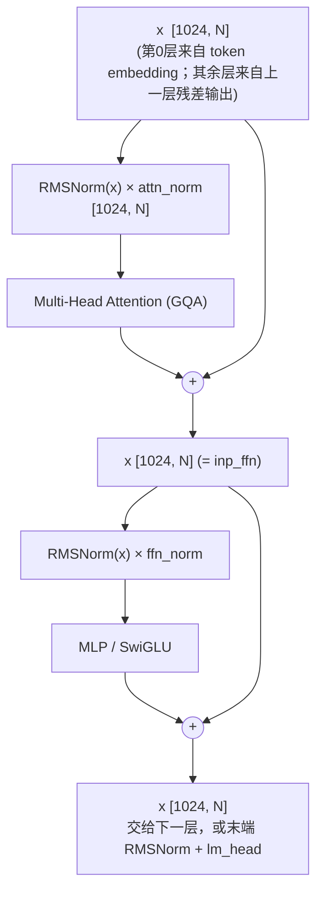
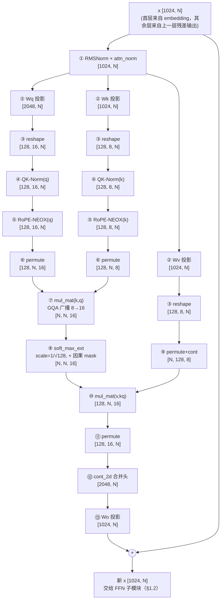

# Qwen3 Attention（GQA + QK-Norm + RoPE）详解

## 目录

1. 前置知识：ggml 形状约定、Block 结构与关键超参数
   - 1.1 ggml 张量形状约定
   - 1.2 Attention 在 Transformer Block 中的位置
   - 1.3 Qwen3-0.6B 关键超参数
2. 图级输入：`tokens` / `positions` / `kq_mask` 与 embedding
3. Q / K / V 投影与拆分多头
   - 3.1 投影
   - 3.2 拆分多头（reshape）
4. Q/K 的归一化与位置编码：QK-Norm + RoPE
   - 4.1 QK-Norm（Qwen3 专有，最容易被忽略的一步）
   - 4.2 RoPE：为什么必须是 NEOX 变体
5. 多头维度重排与 GQA 广播
   - 5.1 permute：把“头”换到批量维
   - 5.2 GQA：`ggml_mul_mat` 自动广播代替 `repeat_kv`
6. Attention Score 到上下文向量
   - 6.1 Attention Score：scale + 因果 mask + softmax
   - 6.2 Attention × V，以及为什么 V 需要 `ggml_cont`
7. 合并多头 + 输出投影 + 残差
8. 完整数据流图与源码对照
   - 8.1 完整数据流图
   - 8.2 对照 `graph.cpp` 源码通读一遍
9. KV Cache：当前实现现状 vs. 设计规划（重要更正）
10. 易错点、横向对比与自测
    - 10.1 易错点 / 常见坑
    - 10.2 与 Qwen2 / Llama2 Attention 的差异一览
    - 10.3 自测问题

---

## 1. 前置知识：ggml 形状约定、Block 结构与关键超参数

### 1.1 ggml 张量形状约定

ggml 里一个张量的形状写作 `ne = [ne0, ne1, ne2, ne3]`，**`ne0` 是内存中变化最快的“最内层”维度**，
通常就是“一个 token 的向量维度”；这与 PyTorch/NumPy 习惯把 hidden 维写在最后（如 `(batch, seq, hidden)`）正好相反。

例如 token embedding 矩阵 `token_embd.weight` 的 ggml 形状是 `[1024, 151936]`：
读作“每一行（词表里的一个 token）是 1024 维向量，一共 151936 行”；如果照搬 PyTorch 习惯会写成 `(151936, 1024)`，
意思相同，只是维度顺序相反。

### 1.2 Attention 在 Transformer Block 中的位置

Qwen3 每个 Transformer Block 的结构：



对应代码骨架：

```cpp
struct ggml_tensor * inp_attn = x;         // 保存残差分支
cur = /* ... §2~§7 ... */;
x = ggml_add(ctx, inp_attn, cur);          // Attention 残差

struct ggml_tensor * inp_ffn = x;
cur = /* SwiGLU */;
x = ggml_add(ctx, inp_ffn, cur);           // FFN 残差
```

Attention 子模块**输入是 `[1024, N]`，输出也是 `[1024, N]`**——形状不变，这是残差连接 `x = x + attn` 能成立的前提。

### 1.3 Qwen3-0.6B 关键超参数

| 记号 | 含义 | 实际值 | GGUF 元数据 key | `qwen3_hparams` 字段 |
| --- | --- | --- | --- | --- |
| `n_embd` | hidden_size | 1024 | `qwen3.embedding_length` | `hp.n_embd` |
| `n_layer` | Transformer block 数 | 28 | `qwen3.block_count` | `hp.n_layer` |
| `n_head` | Query 头数 | 16 | `qwen3.attention.head_count` | `hp.n_head` |
| `n_head_kv` | KV 头数（GQA） | 8 | `qwen3.attention.head_count_kv` | `hp.n_head_kv` |
| `n_embd_head`（head_dim） | 每个头的维度 | 128 | `qwen3.attention.key_length` | `hp.n_embd_head` |
| `rms_norm_eps` | RMSNorm epsilon | 1e-6 | `qwen3.attention.layer_norm_rms_epsilon` | `hp.rms_norm_eps` |
| `rope_freq_base`（theta） | RoPE 频率基数 | 1000000 | `qwen3.rope.freq_base` | `hp.rope_freq_base` |
| `n_vocab` | 词表大小 | 151936 | 不直接读 key，从 `tok_embd->ne[1]` 推导 | `hp.n_vocab` |

```cpp
int32_t n_embd_head_all() const { return n_embd_head * n_head; }    // 128*16 = 2048，Q 投影展平维度
int32_t n_embd_kv_all()   const { return n_embd_head * n_head_kv; } // 128*8  = 1024，K/V 投影展平维度
```

> **为什么 `16 × 128 = 2048 ≠ hidden_size(1024)`？**
> 这不是笔误——Qwen3 的 Attention **内部计算维度（2048）本来就大于 hidden_size（1024）**：
> 数据流是 `1024 → 2048（内部多头计算）→ 1024`，而不是像 GPT-2 那样全程保持 1024。
> Llama2/Qwen2 通常 `head_dim × n_head == hidden_size`，Qwen3 把 `head_dim` 变成了一个**独立超参**，
> 这是本文档最容易让人困惑、也必须最先建立的认知。

---


## 2. 图级输入：`tokens` / `positions` / `kq_mask` 与 embedding

`qwen3_build_graph()` 一开始建立三个“图级输入”张量，
以及一次 embedding 查表，得到进入第 0 层的 `x`：

| 输入张量 | 名字宏 | 形状 | 类型 | 由谁、怎么填（`main.cpp`） |
| --- | --- | --- | --- | --- |
| `tokens` | `QWEN3_TENSOR_NAME_TOKENS` | `[N]` | I32 | 当前完整序列的 token id（prompt + 已生成部分） |
| `positions` | `QWEN3_TENSOR_NAME_POS` | `[N]` | I32 | 恒为 `0..N-1`（原因见 §9） |
| `kq_mask` | `QWEN3_TENSOR_NAME_MASK` | `[N, N]` | F32 | 下三角（含对角线）= 0，其余（未来位置）= `-INFINITY` |

```cpp
struct ggml_tensor * x = ggml_get_rows(ctx, model.tok_embd, tokens); // [1024, N]
```

`ggml_get_rows(a, b)`：`a` = `tok_embd` `[1024, 151936]`，`b` = `tokens` `[N]`（存的是行号/token id），
按 `b` 里的每个 id 把 `a` 对应的“行”（一个 1024 维向量）取出来，拼成 `[1024, N]`——这是整个 28 层 Transformer 唯一的入口。

`kq_mask` 的具体取值（`ne0=k` 是列/快维，`ne1=q` 是行/慢维），以 `N=4` 为例：

```text
        k=0   k=1   k=2   k=3
q=0:    0.0  -inf  -inf  -inf     <- q=0 只能看 k=0
q=1:    0.0   0.0  -inf  -inf     <- q=1 能看 k=0,1
q=2:    0.0   0.0   0.0  -inf     <- q=2 能看 k=0,1,2
q=3:    0.0   0.0   0.0   0.0     <- q=3 能看全部
```

即 `k > q`（未来位置）填 `-inf`，其余填 `0`。这份 mask 会在 §6.1 加到注意力分数上，实现“预测第 q 个位置时只能看
`token[0..q]`”的因果（causal）约束——训练时“未来” token 恰好是标准答案，推理时“未来” token 根本还不存在，
两种场景都不能让 Attention 看到它们。

`positions`、`kq_mask` 不属于某一层专属，而是**每一层内部**（RoPE、Attention Score）都要重新引用的同一份图级输入。

---

## 3. Q / K / V 投影与拆分多头

### 3.1 投影

```cpp
cur = ggml_mul(ctx, ggml_rms_norm(ctx, x, hp.rms_norm_eps), layer.attn_norm); // [1024, N]

struct ggml_tensor * qcur = ggml_mul_mat(ctx, layer.wq, cur); // [head_dim*n_head,    n_tokens]
struct ggml_tensor * kcur = ggml_mul_mat(ctx, layer.wk, cur); // [head_dim*n_head_kv, n_tokens]
struct ggml_tensor * vcur = ggml_mul_mat(ctx, layer.wv, cur); // [head_dim*n_head_kv, n_tokens]
```

| 步骤 | 权重 ggml 形状 | 输出形状 | 说明 |
| --- | --- | --- | --- |
| 输入 RMSNorm | `attn_norm` `[1024]` | `[1024, N]` | 无 bias，乘 `attn_norm` 权重（`ggml_mul`），记作 `cur` |
| Q 投影 | `wq` `[1024, 2048]` | `qcur` `[2048, N]` | `2048 = head_dim(128) × n_head(16)` |
| K 投影 | `wk` `[1024, 1024]` | `kcur` `[1024, N]` | `1024 = head_dim(128) × n_head_kv(8)` |
| V 投影 | `wv` `[1024, 1024]` | `vcur` `[1024, N]` | 同上 |

`ggml_mul_mat(w, cur)` 要求 `w->ne0 == cur->ne0`（都是 1024，做内积的维度），结果 `ne0 = w->ne1`——
也就是说 ggml 里权重张量的形状是 `[输入维度, 输出维度]`，跟 PyTorch `nn.Linear.weight` 的 `[out_features, in_features]`
正好是转置关系。`wq` 因为要覆盖 16 个 Query 头，输出维度是 2048；`wk`/`wv` 只需要覆盖 8 个 KV 头，输出维度是 1024——
这正是 Q 和 K/V 投影“不对称”的来源。

### 3.2 拆分多头（reshape）

```cpp
qcur = ggml_reshape_3d(ctx, qcur, n_embd_head, n_head,    n_tokens); // [128, 16, N]
kcur = ggml_reshape_3d(ctx, kcur, n_embd_head, n_head_kv, n_tokens); // [128,  8, N]
vcur = ggml_reshape_3d(ctx, vcur, n_embd_head, n_head_kv, n_tokens); // [128,  8, N]
```

`ggml_reshape_3d` 只是重新解释同一块连续内存（不拷贝数据），要求元素总数不变：`2048 = 128×16`，`1024 = 128×8`。
拆分之后：`ne0` = 头内维度（head_dim=128），`ne1` = 头数，`ne2` = token 数——“头”这个维度目前在 `ne1`，

---

## 4. Q/K 的归一化与位置编码：QK-Norm + RoPE

### 4.1 QK-Norm（Qwen3 专有，最容易被忽略的一步）

这是 Qwen3 相对 Qwen2/Llama2 最重要、却最容易被忽略的差异。

```cpp
// QK-Norm（Qwen3 专有）：对每个头的 head_dim 向量单独做 RMSNorm，必须在 RoPE 之前。
qcur = ggml_rms_norm(ctx, qcur, hp.rms_norm_eps);
qcur = ggml_mul(ctx, qcur, layer.attn_q_norm); // attn_q_norm: [128]

kcur = ggml_rms_norm(ctx, kcur, hp.rms_norm_eps);
kcur = ggml_mul(ctx, kcur, layer.attn_k_norm); // attn_k_norm: [128]
```

要点：

- **形状不变**：`qcur`/`kcur` 仍是 `[128, 16, N]` / `[128, 8, N]`。因为 `ggml_rms_norm` 只沿着 `ne0`（这里是
  head_dim=128）做归一化，意味着**每一个 (头, token) 组合都独立算一次 RMSNorm**，头与头、token 与 token 互不影响。
- **权重形状 `[128]`**：对照 GGUF 张量名 `blk.{i}.attn_q_norm.weight` / `blk.{i}.attn_k_norm.weight`，同一层内所有头共用一份 `[128]` 权重。
- **为什么需要**：Q/K 投影后不同头、不同层的数值尺度可能漂移很大，直接做 RoPE + 点积容易数值不稳定；
  在每个头内部再做一次 RMSNorm，相当于给 Q、K 的方向向量重新“定标”，训练更稳定——这是 Qwen3 引入、Qwen2 没有的设计。
- **顺序不能颠倒——必须先 QK-Norm 再 RoPE**：RoPE 是对 head_dim 内的数值做“保范数”的旋转，
  如果先 RoPE 再做 Norm，相当于用归一化重新调整了本该由 RoPE 编码的相对位置信息的尺度，顺序反了模型行为就会跟真实
  Qwen3 不一致（但不会报错，是最隐蔽的一类 bug）。

### 4.2 RoPE：为什么必须是 NEOX 变体

```cpp
// RoPE（NEOX 变体，Qwen/LLaMA 系用这个，不能用 NORMAL，否则输出乱码）
qcur = ggml_rope_ext(ctx, qcur, positions, nullptr, (int) n_embd_head, GGML_ROPE_TYPE_NEOX,
                      hp.n_ctx_train, hp.rope_freq_base, 1.0f, 0.0f, 1.0f, 0.0f, 0.0f);
kcur = ggml_rope_ext(ctx, kcur, positions, nullptr, (int) n_embd_head, GGML_ROPE_TYPE_NEOX,
                      hp.n_ctx_train, hp.rope_freq_base, 1.0f, 0.0f, 1.0f, 0.0f, 0.0f);
```

- **形状不变**：`[128, 16, N]` / `[128, 8, N]`——RoPE 只旋转每个头内部的 128 维向量，不改变形状。只作用于 Q、K，
  **不作用于 V**（`vcur` 全程没有调用 `ggml_rope_ext`）。
- `positions` 是长度为 `N` 的 I32 张量（ggml 要求它的长度等于 `a->ne[2]`，即 token 维），取值见 §2、§9。
- 关键参数：`n_dims = head_dim = 128`（完整 128 维都旋转）；`mode = GGML_ROPE_TYPE_NEOX`；
  `freq_base = rope_freq_base = 1000000`（即 config.json 的 `rope_theta`）；其余 `freq_scale/ext_factor/attn_factor/
  beta_fast/beta_slow` 都是 YaRN 长上下文扩展参数，Qwen3-0.6B 没开 RoPE scaling，全部取“关闭”默认值。
- **NORMAL 与 NEOX 的区别**（头内 8 个数、`c`=cos 分量、`s`=sin 分量、`0`=未旋转）：

  ```text
  GGML_ROPE_TYPE_NORMAL  n_dims = 8 --> [cscscscs]   # 相邻两个数一组: (x0,x1) (x2,x3) ...
  GGML_ROPE_TYPE_NEOX    n_dims = 8 --> [ccccssss]   # 前半/后半配对:   (x0,x4) (x1,x5) ...
  ```

  两种模式的区别只是“哪两个维度被当成同一个旋转平面”：NORMAL 是相邻配对（GPT-J 风格），
  NEOX 是隔 `head_dim/2` 配对（GPT-NeoX/LLaMA/Qwen 风格，等价于 HuggingFace 里常见的 `rotate_half`）。
  Qwen3 官方实现用的是 NEOX 配对方式——**用错 mode 不会报错，只会让输出变成语法通顺但语义错乱的“乱码”**，
  因为形状、数值范围都合法，只是配对关系错了。
- 直觉回顾：RoPE 把“位置”编码为对向量的一次旋转，两个 token 的 `Q·K` 点积结果只依赖它们的**相对**位置差
  （例如“今天吃苹果” vs “苹果今天吃”，没有位置编码时 Attention 会认为二者相同），这是 RoPE 比可学习绝对位置编码
  （GPT-2 的 `wpe`）更适合长上下文外推的原因。

---

## 5. 多头维度重排与 GQA 广播

### 5.1 permute：把“头”换到批量维

```cpp
struct ggml_tensor * q = ggml_permute(ctx, qcur, 0, 2, 1, 3); // [128, 16, N] -> [128, N, 16]
struct ggml_tensor * k = ggml_permute(ctx, kcur, 0, 2, 1, 3); // [128,  8, N] -> [128, N,  8]
```

`ggml_permute(ctx, a, axis0, axis1, axis2, axis3)` 的含义：**源张量第 `i` 个维度被放到目标张量的第 `axis_i` 个位置**。
对 `qcur`（`ne0=head_dim, ne1=n_head, ne2=N`）调用 `permute(0,2,1,3)`：源 `ne0`→目标 `ne0`（不变），
源 `ne1`(n_head)→目标 `ne2`，源 `ne2`(N)→目标 `ne1`，结果形状 `[head_dim, N, n_head]`。

为什么要换：`ggml_mul_mat` 把 `ne2`/`ne3` 当作“批量”维（batched matmul），要让每个头内部独立做 `Q·Kᵀ`，
就必须把“头”这个维度挪到 `ne2`，让 `ne0`(head_dim) 继续是做点积的那一维，`ne1` 变成“同一头内、不同 token 两两配对”的维度。

> **重要**：`ggml_permute` **不拷贝数据**，只是重新解释 `ne`/`nb`（步长），返回一个“view”。
> 这里 q、k permute 之后可以**不加 `ggml_cont()`** 直接喂给 `ggml_mul_mat`，是因为 `permute(0,2,1,3)` 没有移动 `ne0`，
> `nb0` 仍然等于元素大小（“连续”）——ggml 的 CPU 实现只要求参与乘法的张量 `ne0` 这一维连续
> （`GGML_ASSERT(nb00 == ggml_type_size(...))`，见 `ggml-cpu/ggml-cpu.c` 的 `ggml_compute_forward_mul_mat`），
> `ne1`/`ne2` 是否“紧凑”并不要求。§6.2 讲 V 的转置时会看到必须 `ggml_cont` 的反例。

### 5.2 GQA：`ggml_mul_mat` 自动广播代替 `repeat_kv`

GQA 的核心目的：让 Key/Value 只用 Q 头数的一半就够，从而减少需要**计算、搬运**（未来做增量 KV cache 后还包括**缓存**）
的 K/V 数据量。具体到 Qwen3-0.6B：

- 传统 Multi-Head Attention：Q=16、K=16、V=16，三者头数相同。
- Qwen3 的 GQA：Q=16、K=8、V=8——K、V 头数只有 Q 的一半，`wk`/`wv` 的输出维度（1024）也只有 `wq`（2048）的一半。

> 这一节讲的是“计算/数据量减半”本身；它和“要不要用增量 KV cache”是两个独立的优化维度——本仓库当前 v0.1
> 还没有做增量 KV cache（§9 详细展开），但 GQA 带来的减半效果从第一行投影代码开始就已经生效。

```cpp
// kq = K^T Q：[n_tokens(kv), n_tokens(q), n_head]
// n_head_kv < n_head 时，ggml_mul_mat 按 ne2 自动 broadcast（GQA：每组 Q 头共享一组 KV）。
struct ggml_tensor * kq = ggml_mul_mat(ctx, k, q); // k:[128,N,8]  q:[128,N,16] -> kq:[N,N,16]
```

`ggml_mul_mat(a=k, b=q)` 的约束（`ggml_can_mul_mat`，见 `third_party/ggml/src/ggml.c`）：
`a->ne0 == b->ne0`（128==128 ✓）且 `b->ne2 % a->ne2 == 0`（16 % 8 == 0 ✓）。满足后者时，`a` 在 `ne2` 维会被广播：
CPU 实现里对应的下标公式是 `i02 = i12 / r2`（`r2 = b->ne2 / a->ne2 = 2`，见 `ggml-cpu.c`），也就是**第 `i` 个 Query 头
使用第 `i/2` 个 KV 头**——每连续 2 个 Q 头复用同一组 K/V：

| Query 头 | 对应 KV 头（`= i / 2`） |
| --- | --- |
| Q0, Q1 | KV0 |
| Q2, Q3 | KV1 |
| Q4, Q5 | KV2 |
| Q6, Q7 | KV3 |
| Q8, Q9 | KV4 |
| Q10, Q11 | KV5 |
| Q12, Q13 | KV6 |
| Q14, Q15 | KV7 |

这和 HuggingFace 实现里 `repeat_kv()` 达到的效果完全一致，但 ggml **不需要真的把 K/V 在内存里复制 2 份**，
计算时用步长/索引运算直接复用同一份数据——省内存、省带宽、省一次显式复制。

结果形状：`kq` 的 `ne = [a->ne1, b->ne1, b->ne2, b->ne3] = [N, N, 16, 1]`——`ne0`=k 的位置（kv 维），
`ne1`=q 的位置（query 维），`ne2`=16（已按 Q 头数展开，每个头都对应到自己该用的 KV）。

---

## 6. Attention Score 到上下文向量

### 6.1 Attention Score：scale + 因果 mask + softmax

```cpp
const float kq_scale = 1.0f / sqrtf((float) n_embd_head); // 1/√128 ≈ 0.0884

struct ggml_tensor * kq = ggml_mul_mat(ctx, k, q);            // [N, N, 16]
kq = ggml_soft_max_ext(ctx, kq, kq_mask, kq_scale, 0.0f);     // [N, N, 16]
```

`ggml_soft_max_ext(a, mask, scale, max_bias)` 是一个**融合算子**：一次调用内部完成
$\text{softmax}(a \cdot \text{scale} + \text{mask})$（`max_bias=0` 表示不启用 ALiBi 位置偏置，Qwen3 不需要），
而不是像“教学伪代码”那样把 scale、mask、softmax 拆成三步单独的算子——这也是为什么 §8.2 的真实代码里看不到单独的
“除以 √128”或“加 mask”语句，它们都被塞进了这一次调用里。

- 形状约束：`a`(`kq`，`[N,N,16]`) 与 `mask`(`kq_mask`，`[N,N]`) 的 `ne0`/`ne1` 要匹配，且 `a` 的 `ne2`（16 个头）
  对 `mask` 的 `ne2`（恒为 1）取余必须为 0——即**同一份因果 mask 会自动广播到全部 16 个头**，这符合直觉：
  “谁能看见谁”跟“是哪个注意力头”无关。
- mask 具体取值见 §2 的表格：`k > q`（未来）填 `-inf`，其余为 `0`；加到 `kq*scale` 上后，未来位置的分数变成 `-inf`，
  `softmax` 之后这些位置的权重精确为 0——即“未来 token 的信息权重为 0，完全不参与下一步的加权求和”。
- softmax 之后 `kq` 每一行（固定 q，遍历 k）自身和为 1，是对 V 做加权平均的权重。

### 6.2 Attention × V，以及为什么 V 需要 `ggml_cont`

```cpp
// V 转置成 [n_tokens(kv), head_dim, n_head_kv]，方便下一步 mul_mat
struct ggml_tensor * v = ggml_cont(ctx, ggml_permute(ctx, vcur, 1, 2, 0, 3)); // [128,8,N] -> [N,128,8]

// kqv = V^T * softmax(kq)：[head_dim, n_tokens(q), n_head]
struct ggml_tensor * kqv = ggml_mul_mat(ctx, v, kq); // v:[N,128,8]  kq:[N,N,16] -> [128,N,16]
```

- `vcur` 原本形状 `[head_dim=128, n_head_kv=8, N]`。`permute(vcur, 1,2,0,3)` 的映射：源 `ne0`(128)→目标 `ne1`，
  源 `ne1`(8)→目标 `ne2`，源 `ne2`(N)→目标 `ne0`，结果形状 `[N, 128, 8]`。
- 这次跟 §5.1 的 q/k permute **不同**：**源 `ne0`（原来的 head_dim）被换到了目标 `ne1`，原来的 `ne2`(N) 被换到了
  目标 `ne0`**——新张量的 `ne0` 不再是原来“连续”的那一维，它的步长等于原来的 `nb2`（跨度是一整个
  `head_dim×n_head_kv` 那么大），不满足 `ggml_mul_mat` 要求“`ne0` 必须连续”的前提（`ggml-cpu.c` 里
  `GGML_ASSERT(nb00 == ggml_type_size(...))`），所以必须先 `ggml_cont()` 把这个 permute 视图真正拷贝成一块新的连续
  内存，才能作为 `mul_mat` 的输入。这正是 §5.1 里 q、k 为什么不需要 `cont`、这里 V 却需要的原因——
  q/k 的 permute 恰好没有移动 `ne0`，V 的 permute 移动了。
- `ggml_mul_mat(v, kq)`：`v`(a)=`[N,128,8]`，`kq`(b)=`[N,N,16]`；`a->ne0==b->ne0`（N==N ✓），
  `b->ne2 % a->ne2`（16%8==0 ✓，同样的 GQA 广播）。结果 `[a->ne1, b->ne1, b->ne2] = [128, N, 16] = kqv`：
  每个 (头, query 位置) 对应一个 128 维向量，即“用 §6.1 算出的 attention 权重对 V 做加权求和”之后的上下文向量。

---

## 7. 合并多头 + 输出投影 + 残差

```cpp
kqv = ggml_permute(ctx, kqv, 0, 2, 1, 3);                    // [128, N, 16] -> [128, 16, N]
cur = ggml_cont_2d(ctx, kqv, n_embd_head * n_head, n_tokens); // -> [2048, N]

cur = ggml_mul_mat(ctx, layer.wo, cur); // wo: [2048, 1024] -> [1024, N]
x   = ggml_add(ctx, inp_attn, cur);      // 残差：[1024, N]
```

- 先把 `kqv` 的头维从 `ne2` 换回 `ne1`（`[128, N, 16] -> [128, 16, N]`），再用 `ggml_cont_2d` **一步完成
  “物理拷贝成连续内存” + “reshape 成 2 维”**：把 `[head_dim, n_head, N]` 拉平成 `[head_dim*n_head, N] = [2048, N]`——
  这就是“Concat 所有 Head”，本质是内存布局的重新排列，而不是逻辑上的拼接操作。
- `wo`（`attn_output.weight`）形状 `[2048, 1024]`（`ne0=2048` 对应输入，`ne1=1024` 对应输出），
  `ggml_mul_mat(wo, cur)` 把 2048 维压回 1024 维，这样才能跟残差分支 `inp_attn`（`[1024,N]`）相加。
- `ggml_add(inp_attn, cur)`：两个张量形状都是 `[1024, N]`，得到本层 Attention 子模块的最终输出，
  同时也是 FFN 子模块的输入 `inp_ffn`（回到 §1.2 的整体 Block 视角）。

---

## 8. 完整数据流图与源码对照

### 8.1 完整数据流图



### 8.2 对照 `graph.cpp` 源码通读一遍

以下是仓库当前实现里 Attention 部分的完整代码（[src/graph.cpp](../../src/graph.cpp) 第 43~94 行），
把 §2~§7 的每一步在源码里的确切位置对照一遍：

```cpp
// ==================== 自注意力 ====================              (graph.cpp:43)
struct ggml_tensor * inp_attn = x;                                   // §1.2 残差分支，[1024, N]

// 输入 RMSNorm                                                      (§3.1)
cur = ggml_rms_norm(ctx, x, hp.rms_norm_eps);
cur = ggml_mul(ctx, cur, layer.attn_norm);                            // [1024, N]

// QKV 投影：注意展平维度是 head_dim*n_head(_kv)，不是 n_embd          (§3.1)
struct ggml_tensor * qcur = ggml_mul_mat(ctx, layer.wq, cur);        // [2048, N]
struct ggml_tensor * kcur = ggml_mul_mat(ctx, layer.wk, cur);        // [1024, N]
struct ggml_tensor * vcur = ggml_mul_mat(ctx, layer.wv, cur);        // [1024, N]

qcur = ggml_reshape_3d(ctx, qcur, n_embd_head, n_head,    n_tokens); // §3.2 [128, 16, N]
kcur = ggml_reshape_3d(ctx, kcur, n_embd_head, n_head_kv, n_tokens); // §3.2 [128,  8, N]
vcur = ggml_reshape_3d(ctx, vcur, n_embd_head, n_head_kv, n_tokens); // §3.2 [128,  8, N]

// QK-Norm（Qwen3 专有）：对每个头的 head_dim 向量单独做 RMSNorm，必须在 RoPE 之前。 (§4.1)
qcur = ggml_rms_norm(ctx, qcur, hp.rms_norm_eps);
qcur = ggml_mul(ctx, qcur, layer.attn_q_norm);

kcur = ggml_rms_norm(ctx, kcur, hp.rms_norm_eps);
kcur = ggml_mul(ctx, kcur, layer.attn_k_norm);

// RoPE（NEOX 变体，Qwen/LLaMA 系用这个，不能用 NORMAL，否则输出乱码）             (§4.2)
qcur = ggml_rope_ext(ctx, qcur, positions, nullptr, (int) n_embd_head, GGML_ROPE_TYPE_NEOX,
                      hp.n_ctx_train, hp.rope_freq_base, 1.0f, 0.0f, 1.0f, 0.0f, 0.0f);
kcur = ggml_rope_ext(ctx, kcur, positions, nullptr, (int) n_embd_head, GGML_ROPE_TYPE_NEOX,
                      hp.n_ctx_train, hp.rope_freq_base, 1.0f, 0.0f, 1.0f, 0.0f, 0.0f);

// 把“头”维度换到第 3 维，方便 mul_mat 在头维上做 batched 矩阵乘：                 (§5.1)
//   q: [head_dim, n_tokens, n_head]      k: [head_dim, n_tokens, n_head_kv]
struct ggml_tensor * q = ggml_permute(ctx, qcur, 0, 2, 1, 3);
struct ggml_tensor * k = ggml_permute(ctx, kcur, 0, 2, 1, 3);

// kq = K^T Q：[n_tokens(kv), n_tokens(q), n_head]                                (§5.2)
// n_head_kv < n_head 时，ggml_mul_mat 按 ne2 自动 broadcast（GQA：每组 Q 头共享一组 KV）。
struct ggml_tensor * kq = ggml_mul_mat(ctx, k, q);
kq = ggml_soft_max_ext(ctx, kq, kq_mask, kq_scale, 0.0f);                        // (§6.1)

// V 转置成 [n_tokens(kv), head_dim, n_head_kv]，方便下一步 mul_mat                (§6.2)
struct ggml_tensor * v = ggml_cont(ctx, ggml_permute(ctx, vcur, 1, 2, 0, 3));

// kqv = V^T * softmax(kq)：[head_dim, n_tokens(q), n_head]                       (§6.2)
struct ggml_tensor * kqv = ggml_mul_mat(ctx, v, kq);

// 合并回 [head_dim*n_head, n_tokens]，供输出投影使用                             (§7)
kqv = ggml_permute(ctx, kqv, 0, 2, 1, 3); // -> [head_dim, n_head, n_tokens]
cur = ggml_cont_2d(ctx, kqv, n_embd_head * n_head, n_tokens);

// 输出投影 + 残差（wo 把 head_dim*n_head 映射回 n_embd）                         (§7)
cur = ggml_mul_mat(ctx, layer.wo, cur);
x = ggml_add(ctx, inp_attn, cur);                                                // graph.cpp:94
```

---

## 9. KV Cache：当前实现现状 vs. 设计规划（重要更正）

`main.cpp` 的主循环里，每生成一个新 token，都会：

1. 把 `ids`（prompt + 目前为止生成的全部 token）整体重新丢进 `qwen3_build_graph()`；
2. `n_tokens = ids.size()`（也就是本文的 `N`），重新构建一张**全新的**计算图；
3. §3.1~§7 里出现的 `kcur`/`vcur`/`v` 等张量只是这一次前向的中间结果，随着 `ggml_free(ctx)` 一起被释放，
   **不会跨 step 保留**。

也就是说，第 `step` 步实际上是对 `token[0..step]` 完整重新做了一遍 §2~§7 的所有计算，复杂度是 $O(N^2)$——
这是 [design.md](../design.md) 路线图里 v0.1 阶段刻意选择的简化（“最简单、最不容易写错”），
真正的增量 KV cache 排在 v0.2。

那 §5.2 讲的“GQA 减少 KV 数据量”是不是没有意义？不是——GQA 省的是**“需要计算/搬运的 K、V 数据量”**这件事本身，
跟“有没有做增量缓存”是两个维度的优化：

- **没有 KV cache 时**（当前 v0.1）：GQA 仍然让每一步的 `wk`/`wv` 投影输出、以及参与 Attention 计算的 K/V 张量
  数据量减半（`n_head_kv=8` 而不是 16），减少的是这一步的计算量和内存带宽。
- **未来做了增量 KV cache 后**（v0.2 规划）：GQA 额外让**缓存本身**的显存/内存占用减半——因为需要长期保存的是 K/V。

真正的增量 KV cache（[design.md §6.2](../design.md)）的规划是：

- 为每层预分配 `cache_k`/`cache_v`，形状 `[head_dim*n_head_kv, n_ctx]`；
- prefill 阶段一次性写入 `[0, n_tokens)`；
- decode 阶段每步只对 **1 个新 token** 跑一遍 §2~§7（`n_tokens=1`），把新算出的 K、V 用 `ggml_view` + `ggml_cpy`
  追加写到 `cache_k[:, n_past]` / `cache_v[:, n_past]`；
- Attention 时 K/V 取 `[0, n_past+1)` 的有效区间，而不是重新计算历史部分。

在这之前，理解 §2~§7 时请把 `n_tokens`（本文的 `N`）读作“**当前完整序列长度**”，而不是“新增的 token 数”；
`positions` 也因此每一步都要重新生成完整的 `0..N-1`，而不是只给新 token 编号。

---

## 10. 易错点、横向对比与自测

### 10.1 易错点 / 常见坑

- **RoPE mode 用错**：必须 `GGML_ROPE_TYPE_NEOX`，用 `GGML_ROPE_TYPE_NORMAL` 不报错但输出乱码（§4.2）。
- **QK-Norm 顺序颠倒**：必须“先 QK-Norm 再 RoPE”，反过来不会报错，但模型效果会跟真实 Qwen3 不一致（§4.1）。
- **GQA 广播条件**：`ggml_mul_mat(k, q)` 要求 `q->ne2 % k->ne2 == 0`（这里 16%8==0）；如果自己实现别的模型、
  `n_head` 不是 `n_head_kv` 的整数倍，这一步会直接断言失败（§5.2）。
- **permute 之后忘记 `ggml_cont`**：只有当 permute **没有移动 `ne0`** 时才能跳过 `ggml_cont` 直接喂给 `mul_mat`
  （q、k 的情况）；一旦 `ne0` 被换成别的维度（V 的情况），必须先 `ggml_cont`，否则触发
  `nb00 == ggml_type_size(...)` 断言（§5.1、§6.2）。
- **不要从 `config.json` 反推权重形状**：`head_dim(128) × n_head(16) = 2048 ≠ hidden_size(1024)`，
  Q/K/V 投影输出维度都应以 GGUF 里 `attn_q.weight`/`attn_k.weight`/`attn_v.weight` 的真实 `ne` 为准
  （`model.cpp` 的 `get_tensor()` 只按名字取指针，不会拿 hparams 反过来校验或推导形状，见 §1.3）。
- **mask 方向搞反**：`kq_mask` 的 `ne0=k`(kv 位置)、`ne1=q`(query 位置)，`k > q`（未来）才是 `-inf`；
  q/k 维度弄反会变成“看不到过去、只能看到未来”，数值会完全错乱（§2、§6.1）。
- **`positions` 在 v0.1 里恒等于 `0..N-1`**：不要以为它是“新增 token 的位置”，因为没有 KV cache，
  每一步都要给整条重建的序列重新编一遍完整位置号（§2、§9）。

### 10.2 与 Qwen2 / Llama2 Attention 的差异一览

| 维度 | GPT-2 | Llama2 / Qwen2（一般情况） | Qwen3-0.6B |
| --- | --- | --- | --- |
| 归一化 | LayerNorm | RMSNorm | RMSNorm |
| 位置编码 | 可学习绝对位置 `wpe` | RoPE | RoPE（NEOX，theta=1e6） |
| KV 头数 | = Q 头数（MHA） | Llama2 视规格 MHA/GQA 皆有；Qwen2 常用 GQA | GQA，`n_head=16`，`n_head_kv=8` |
| head_dim 与 hidden_size 关系 | `head_dim = hidden/n_head` | 通常也满足 `head_dim × n_head = hidden` | **独立超参**：`128 ≠ 1024/16 = 64` |
| QK-Norm | 无 | 无 | **有**（本文 §4.1，Qwen3 专有） |
| Attention 内部维度 | = hidden_size | 通常 = hidden_size | 2048 ≠ hidden_size(1024) |
| Q/K/V 投影 bias | 有 | Llama2 无；Qwen2 的 Q/K/V 通常带 bias | 无（`attention_bias=false`） |

Qwen3 最反直觉的两点，也是本文反复强调的：**Attention 内部维度（2048）比 hidden_size（1024）还大**，
以及**QK-Norm 是 Qwen2 没有、Qwen3 独有的一步**。

### 10.3 自测问题

若不看正文、能直接回答下面问题，说明已经真正吃透 Attention 这部分：

1. `wq`、`wk`、`wv` 的 ggml 形状分别是什么？为什么 `wq` 和 `wk`/`wv` 不一样？
2. QK-Norm 在哪一步做？归一化是沿着哪个维度（`ne` 几）？为什么必须在 RoPE 之前？
3. 为什么 RoPE 必须用 `GGML_ROPE_TYPE_NEOX` 而不是 `GGML_ROPE_TYPE_NORMAL`？用错会有什么现象？
4. `ggml_mul_mat(k, q)` 能自动实现 GQA 广播，需要满足什么条件？如果 `n_head` 不是 `n_head_kv` 的整数倍会怎样？
5. 为什么 V 在 permute 之后必须 `ggml_cont`，而 Q、K 不需要？
6. `kq_mask` 的 `ne0`/`ne1` 分别对应什么？`k > q` 为什么要填 `-inf`？
7. v0.1 现在到底有没有做增量 KV cache？`n_tokens` 在当前实现里代表什么？

